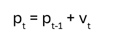

# 粒子群优化（PSO）从零开始。用 Python 实现的最简单解释

> 原文：[`towardsdatascience.com/what-the-hell-is-particle-swarm-optimization-pso-simplest-explanation-in-python-be296fc3b1ab?source=collection_archive---------3-----------------------#2024-02-16`](https://towardsdatascience.com/what-the-hell-is-particle-swarm-optimization-pso-simplest-explanation-in-python-be296fc3b1ab?source=collection_archive---------3-----------------------#2024-02-16)

## 如何实现 PSO

[](https://medium.com/@alexroz?source=post_page---byline--be296fc3b1ab--------------------------------)[](https://towardsdatascience.com/?source=post_page---byline--be296fc3b1ab--------------------------------) [Aleksei Rozanov](https://medium.com/@alexroz?source=post_page---byline--be296fc3b1ab--------------------------------)

·发布于 [Towards Data Science](https://towardsdatascience.com/?source=post_page---byline--be296fc3b1ab--------------------------------) ·7 分钟阅读·2024 年 2 月 16 日

--


图片来自 [James Wainscoat](https://unsplash.com/@tumbao1949?utm_source=medium&utm_medium=referral) 在 [Unsplash](https://unsplash.com/?utm_source=medium&utm_medium=referral)

在谈论 *群体* 和 *粒子* 之前，让我们简要讨论一下**优化**本身。基本上，优化是寻找某个函数的最小值或最大值的过程。例如，当你急于赶到办公室，并思考哪条路最快时，你正在优化你的路线（在这种情况下，它是一个函数）。在数学中，有数百种优化方法，其中有一类叫做自然启发式方法。

**自然启发式算法**基于从自然现象或过程汲取灵感的现象。其中最受欢迎的包括遗传算法、布谷鸟搜索、蚁群算法和**粒子群优化** [**[1]**](https://www.marksmannet.com/RobertMarks/Classes/ENGR5358/Papers/pso_bySHI.pdf) **或 PSO**。

本教程使用仅包含 *numpy* 和 *matplotlib* 的 Python 实现。你可以使用 [这个笔记本](https://github.com/alexxxroz/Medium/blob/main/PSO_explained.ipynb)进行后续学习。

# 让我们从创建一个我们将用 PSO 优化的函数开始。

如果有人让我思考函数，首先浮现在我脑海中的（几乎是下意识的😂）就是抛物线。那么我们先画出它。

```py
import numpy as np
import numpy.random as rnd
import matplotlib.pyplot as plt

x = np.arange(-10,10, 0.01)
y = x**2
plt.plot(x,y, lw=3)
plt.xlabel('x')
plt.ylabel('y')
plt.grid(True)
plt.show()
```


图片来自 [作者](https://medium.com/@alexroz)。

对于这个函数，y=x²，优化的目标是找到点 x=0，使得 y 的值尽可能低——即为 0。但这太简单了。让我们把一切弄得更复杂一些，但仍然保持在**二维**空间。我决定使用以下方程组：


图片来源：[作者](https://medium.com/@alexroz)。

或者用代码表示：

```py
def function(x):
  y = []
  for i in x:
    if i>-3:
      y.append(i**2-4*i+i**3)
    else:
      y.append(0.2*i**2)
  return y
x = np.arange(-10,3, 0.001)
y = function(x)
plt.plot(x,y, lw=3)
plt.title('Function to optimize')
plt.xlabel('x')
plt.ylabel('y')
plt.grid(True)
plt.show()
```


图片来源：[作者](https://medium.com/@alexroz)。

如你所见，我故意设置了两个极小值：全局（左）和局部（右）。在优化一个函数时，我们通常需要找到最小（最大）值，即全局最小值（最大值），因此我希望 PSO 算法面临两个极值的挑战。

# 现在让我们讨论一下算法本身。

基本思想是基于两个术语：**种群**和**群体**。群体由包含粒子的种群组成。

# particle — — — > population — — → swarm

那么，粒子在这里是什么呢？粒子是一个可能的解。想象一下，你正在调查一起犯罪事件，一堆嫌疑人站在你面前。所有人都是“候选人”可以被定罪。但在粒子的情况下，这些候选人是合作的，并且具有社会影响。

粒子本身有两个特征——**位置**和**速度**（或者说是速度；我们的粒子在飞行，对吧？）。所以这些粒子通过逐步迭代，不断改变它们的位置。它们的速度由以下公式定义：


图片来源：[作者](https://medium.com/@alexroz)。

如你所见，这里有三个组成部分。第一个是**惯性**。它是上一轮迭代中粒子的速度与一个任意权重**w**的乘积。所以它基本上定义了粒子之前的速度对当前速度的影响。

第二个是**个人影响**。它有自己的系数：任意权重 *c*₁ 和随机数 *r*₁。在括号内我们有粒子在**种群**中的**最佳位置**与当前粒子的位置（**p**）之间的差异。

第三个部分是**社会影响**。它有类似的任意权重 *c*₂ 和随机数 *r*₂，以及粒子在**群体**中的**最佳位置**与当前粒子的位置（**p**）之间的差异。

计算速度后，我们通过简单的加法更新粒子的当前位置：



图片来源：[作者](https://medium.com/@alexroz)。

> *到目前为止，有一个大问题尚未解答：* ***这些群体和种群中的最佳位置是什么？***

为了计算这些，我们需要一个增益/奖励函数，来指示哪个解更接近最小值（最大值）。在我们的例子中，这个增益函数就是我们绘制的函数。因此，粒子是 X，通过将每个 X 代入函数，我们可以找出哪个 X 给出了最小（最大）值的 Y。

因此，在一个种群中，最佳位置是 X，它在**当前迭代**中给出了最低（最大）的 Y。而在一个群体中，最佳位置是 X，它在所有**先前的迭代**中给出了最低（最大）的 Y。

*简化来说，我们可以说算法的核心思想如下：*

> *一群粒子，每个粒子都有特定的位置和速度，它们一起飞行寻找全局最小值（最大值），形成一个种群。种群是迭代出现的，每个种群只存在一轮迭代，但它们会相互交换信息，因此每个后续的种群比前一个更接近找到解决方案。*

# **现在让我们回到编码，使用 Python 实现我们所讨论的内容。**

首先，让我们定义我们的超参数。像许多其他元启发式算法一样，这些变量应该在使用过程中进行调整，并且没有一组通用的值。不过，我们先使用这些值：

```py
POP_SIZE = 10 #population size 
MAX_ITER = 30 #the amount of optimization iterations
w = 0.2 #inertia weight
c1 = 1 #personal acceleration factor
c2 = 2 #social acceleration factor
```

现在让我们创建一个生成随机种群的函数：

```py
def populate(size):
  x1,x2 = -10, 3 #x1, x2 = right and left boundaries of our X axis
  pop = rnd.uniform(x1,x2, size) # size = amount of particles in population
  return pop
```

如果我们将其可视化，我们会得到如下的结果：

```py
x1=populate(50) 
y1=function(x1)

plt.plot(x,y, lw=3, label='Func to optimize')
plt.plot(x1,y1,marker='o', ls='', label='Particles')
plt.xlabel('x')
plt.ylabel('y')
plt.legend()
plt.grid(True)
plt.show()
```


图片由[作者](https://medium.com/@alexroz)提供。

在这里你可以看到，我随机初始化了 50 个粒子的种群，其中一些粒子已经接近解。

现在让我们实现 PSO 算法本身。我对代码中的每一行都做了注释，如果你有任何问题，请随时在下方评论区提问。

```py
"""Particle Swarm Optimization (PSO)"""
particles = populate(POP_SIZE) #generating a set of particles
velocities = np.zeros(np.shape(particles)) #velocities of the particles
gains = -np.array(function(particles)) #calculating function values for the population

best_positions = np.copy(particles) #it's our first iteration, so all positions are the best
swarm_best_position = particles[np.argmax(gains)] #x with with the highest gain
swarm_best_gain = np.max(gains) #highest gain

l = np.empty((MAX_ITER, POP_SIZE)) #array to collect all pops to visualize afterwards

for i in range(MAX_ITER):

    l[i] = np.array(np.copy(particles)) #collecting a pop to visualize

    r1 = rnd.uniform(0, 1, POP_SIZE) #defining a random coefficient for personal behavior
    r2 = rnd.uniform(0, 1, POP_SIZE) #defining a random coefficient for social behavior

    velocities = np.array(w * velocities + c1 * r1 * (best_positions - particles) + c2 * r2 * (swarm_best_position - particles)) #calculating velocities

    particles+=velocities #updating position by adding the velocity

    new_gains = -np.array(function(particles)) #calculating new gains

    idx = np.where(new_gains > gains) #getting index of Xs, which have a greater gain now
    best_positions[idx] = particles[idx] #updating the best positions with the new particles
    gains[idx] = new_gains[idx] #updating gains

    if np.max(new_gains) > swarm_best_gain: #if current maxima is greateer than across all previous iters, than assign
        swarm_best_position = particles[np.argmax(new_gains)] #assigning the best candidate solution
        swarm_best_gain = np.max(new_gains) #assigning the best gain

    print(f'Iteration {i+1} \tGain: {swarm_best_gain}')
```

经过 30 次迭代，我们得到了这个结果：


PSO（w=0.2，c1=1，c2=2）。图片由[作者](https://medium.com/@alexroz)提供。

正如你所看到的，算法陷入了局部最小值，这是我们不希望发生的。因此，我们需要调整超参数并重新开始。这一次，我决定将惯性权重设置为**w=0.8**，因此，之前的速度对当前状态的影响更大。


PSO（w=0.9，c1=1，c2=2）。图片由[作者](https://medium.com/@alexroz)提供。

然后，瞧，我们达到了函数的全局最小值。我强烈建议你尝试调整 POP_SIZE、c₁ 和 c₂，这将帮助你更好地理解代码和粒子群优化（PSO）背后的理念。如果你感兴趣，可以让任务更复杂一些，优化一个三维函数并制作一个漂亮的可视化。

===========================================

[1]Shi Y. 粒子群优化 //IEEE connections. — 2004 年 — 第 2 卷 — 第 1 期 — 第 8-13 页。

===========================================

***我在 Medium 上的所有文章都是免费的，公开访问的，所以如果你能在这里关注我，我将不胜感激！***

附言：我对（地理）数据科学、机器学习/人工智能和气候变化充满热情。如果你有兴趣共同参与项目，请通过[LinkedIn](https://www.linkedin.com/in/alexxxroz/)与我联系。

🛰️更多内容请关注🛰️
