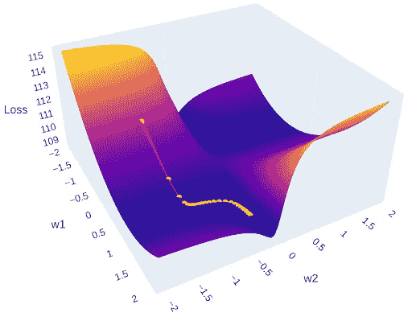
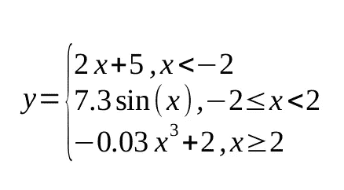
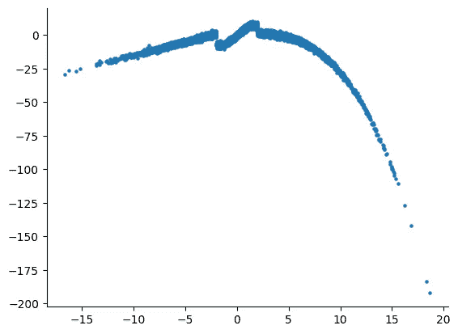
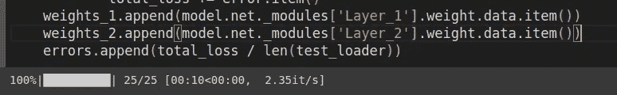
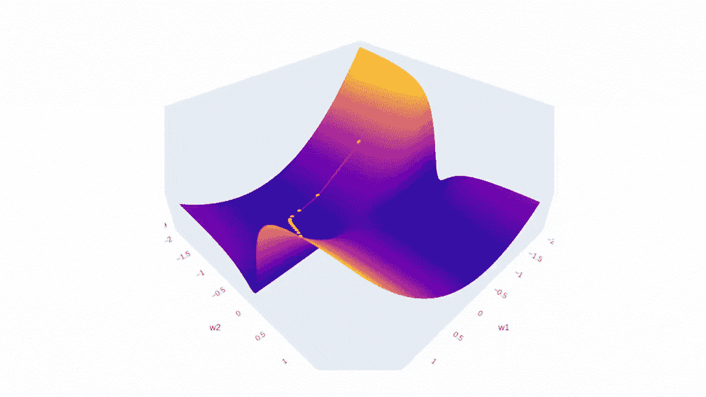

# 神经网络内部是什么？  

> 原文：[`towardsdatascience.com/whats-inside-a-neural-network-799daf235463?source=collection_archive---------1-----------------------#2024-09-29`](https://towardsdatascience.com/whats-inside-a-neural-network-799daf235463?source=collection_archive---------1-----------------------#2024-09-29)

## 使用 PyTorch🔥绘制 3D 误差曲面

[](https://medium.com/@alexroz?source=post_page---byline--799daf235463--------------------------------)[](https://towardsdatascience.com/?source=post_page---byline--799daf235463--------------------------------) [Aleksei Rozanov](https://medium.com/@alexroz?source=post_page---byline--799daf235463--------------------------------)

·发表于 [Towards Data Science](https://towardsdatascience.com/?source=post_page---byline--799daf235463--------------------------------) ·阅读时长 6 分钟·2024 年 9 月 29 日

--



图片来源：[作者](https://medium.com/@alexroz)。

在我本科的最后一年，就像许多其他学生一样，我需要为我的毕业论文选择一个课题。我的专业是水文气象学，因此我最初考虑研究与气候建模相关的问题。幸运的是，我的导师，[Dr. Gribanov](https://scholar.google.com/citations?user=RpUAogkAAAAJ&hl=en)，建议我探索一个我当时完全陌生的全新方向——应用神经网络来放大陆地碳通量。那时，“神经”这个词让我想到了外科手术，而“网络”则让我联想到交通网络。然而，他给了我一个我听过的最清晰、最直观的神经网络解释之一。亮点之一是他对优化过程的描述。

想象一下这样一张空白的纸：


图片来源：[GPT](https://openai.com/index/gpt-4/)。

现在，我请你猛烈地（很重要）把它揉成一个球：


图片来源：[GPT](https://openai.com/index/gpt-4/)。

把它拉直后，你会看到类似地球表面或某种具有峰谷的地貌：


图片来源：[GPT](https://openai.com/index/gpt-4/)。

现在，如果我们引入三维——权重 1、权重 2 和均方误差（MSE），而不是纬度、经度和海拔——我们可以将此图像视为表示神经网络的误差曲面。优化的目标是**找到这个曲面上的最低点**，即最小误差。如图所示，这里有多个局部最小值和最大值，这就是为什么它总是一个具有挑战性的任务。

因此，在本文中，我们将创建一个**3D**的误差曲面，并使用[*plotly*](https://plotly.com/) Python 库来交互式地展示它，同时展示随机梯度下降（SGD）的步骤。

> *像往常一样，本文的代码可以在我的* [***GitHub***](https://github.com/alexxxroz/Medium/blob/main/Error_surface_NN.ipynb)*.* 

# **数据**

首先，我们需要一些合成数据来进行处理。数据应展示某种非线性依赖关系。我们可以这样定义它：



图片由[作者](https://medium.com/@alexroz)提供。

在 Python 中，它将具有以下形状：

```py
np.random.seed(42)
X = np.random.normal(1, 4.5, 10000)
y = np.piecewise(X, [X < -2,(X >= -2) & (X < 2), X >= 2], [lambda X: 2*X + 5, lambda X: 7.3*np.sin(X), lambda X: -0.03*X**3 + 2]) + np.random.normal(0, 1, X.shape)
```

可视化之后：



图片由[作者](https://medium.com/@alexroz)提供。

# 神经网络

由于我们正在可视化一个三维空间，我们的神经网络将只有两个权重。这意味着该 ANN 将由一个隐藏神经元组成。在 PyTorch 中实现这一点非常直观：

```py
class ANN(nn.Module):
    def __init__(self, input_size, N, output_size):
        super().__init__()
        self.net = nn.Sequential()
        self.net.add_module(name='Layer_1', module=nn.Linear(input_size, N, bias=False))
        self.net.add_module(name='Tanh',module=nn.Tanh())
        self.net.add_module(name='Layer_2',module=nn.Linear(N, output_size, bias=False))

    def forward(self, x):
        return self.net(x)
```

> **重要！** 别忘了关闭层中的偏置，否则你会得到**x2**倍的参数。

# **更改权重**


图片由[作者](https://medium.com/@alexroz)提供。

为了构建误差曲面，我们首先需要创建 W1 和 W2 的可能值网格。然后，对于每种权重组合，我们将更新网络的参数并计算误差：

```py
W1, W2 = np.arange(-2, 2, 0.05), np.arange(-2, 2, 0.05)
LOSS = np.zeros((len(W1), len(W2)))
for i, w1 in enumerate(W1):
    model.net._modules['Layer_1'].weight.data = torch.tensor([[w1]], dtype=torch.float32)

    for j, w2 in enumerate(W2):
        model.net._modules['Layer_2'].weight.data = torch.tensor([[w2]], dtype=torch.float32)

        model.eval()
        total_loss = 0
        with torch.no_grad():
            for x, y in test_loader:
                preds = model(x.reshape(-1, 1))
                total_loss += loss(preds, y).item()

        LOSS[i, j] = total_loss / len(test_loader)
```

这可能需要一些时间。如果你将此网格的分辨率设置得过于粗糙（即，可能的权重值之间的步长），你可能会错过局部最小值和最大值。记得学习率通常是随时间逐渐减小的吗？当我们这样做时，权重值的绝对变化可能小到 1e-3 或更小。步长为 0.5 的网格根本无法捕捉到误差曲面的这些细微细节！

# **训练模型**

在这一点上，我们完全不关心训练模型的质量。然而，我们确实希望关注学习率，所以我们将其保持在 1e-1 和 1e-2 之间。我们将简单地收集训练过程中的权重值和误差，并将它们存储在不同的列表中：

```py
model = ANN(1,1,1)
epochs = 25
lr = 1e-2

optimizer = optim.SGD(model.parameters(),lr =lr)

model.net._modules['Layer_1'].weight.data = torch.tensor([[-1]], dtype=torch.float32)
model.net._modules['Layer_2'].weight.data = torch.tensor([[-1]], dtype=torch.float32)

errors, weights_1, weights_2 = [], [], []

model.eval()
with torch.no_grad():
    total_loss = 0
    for x, y in test_loader:
        preds = model(x.reshape(-1,1))
        error = loss(preds, y)
        total_loss += error.item()
weights_1.append(model.net._modules['Layer_1'].weight.data.item())
weights_2.append(model.net._modules['Layer_2'].weight.data.item())
errors.append(total_loss / len(test_loader))

for epoch in tqdm(range(epochs)):
    model.train()

    for x, y in train_loader:
        pred = model(x.reshape(-1,1))
        error = loss(pred, y)
        optimizer.zero_grad()
        error.backward()
        optimizer.step()

    model.eval()
    test_preds, true = [], []
    with torch.no_grad():
        total_loss = 0
        for x, y in test_loader:
            preds = model(x.reshape(-1,1))
            error = loss(preds, y)
            test_preds.append(preds)
            true.append(y)

            total_loss += error.item()
    weights_1.append(model.net._modules['Layer_1'].weight.data.item())
    weights_2.append(model.net._modules['Layer_2'].weight.data.item())
    errors.append(total_loss / len(test_loader))
```



图片由[作者](https://medium.com/@alexroz)提供。

# **可视化**

最后，我们可以使用 plotly 可视化我们收集的数据。该图将有两个场景：表面和 SGD 轨迹。实现第一部分的一种方法是创建一个包含 plotly *表面*的图形。之后，我们将稍微调整一下布局。

第二部分简单得很——只需使用*Scatter3d*函数并指定所有三个坐标轴。

```py
import plotly.graph_objects as go
import plotly.io as pio

plotly_template = pio.templates["plotly_dark"]
fig = go.Figure(data=[go.Surface(z=LOSS, x=W1, y=W2)])

fig.update_layout(
    title='Loss Surface',
    scene=dict(
        xaxis_title='w1',
        yaxis_title='w2',
        zaxis_title='Loss',
        aspectmode='manual',
        aspectratio=dict(x=1, y=1, z=0.5),
        xaxis=dict(showgrid=False), 
        yaxis=dict(showgrid=False), 
        zaxis=dict(showgrid=False), 
    ),
    width=800,
    height=800
)

fig.add_trace(go.Scatter3d(x=weights_2, y=weights_1, z=errors,
                               mode='lines+markers',
                              line=dict(color='red', width=2),
                              marker=dict(size=4, color='yellow') ))
fig.show()
```

在 Google Colab 或本地的 Jupyter Notebook 中运行它，将允许你更仔细地研究错误面。老实说，我花了很多时间仅仅是在看这个图：）



图片来自[作者](https://medium.com/@alexroz)。

我很希望看到你的表面，所以请随时在评论中分享。我坚信表面越不完美，它就越有趣，值得研究！

===========================================

*我在 Medium 上的所有出版物都是免费的，且开放访问的，所以如果你在这里关注我，我将非常感激！*

附言：我对（地理）数据科学、机器学习/人工智能以及气候变化充满热情。如果你想一起合作做某个项目，请通过[LinkedIn](https://www.linkedin.com/in/alexxxroz/)与我联系，并查看[我的网站](https://alexxxroz.github.io/)！

🛰️关注获取更多内容🛰️
