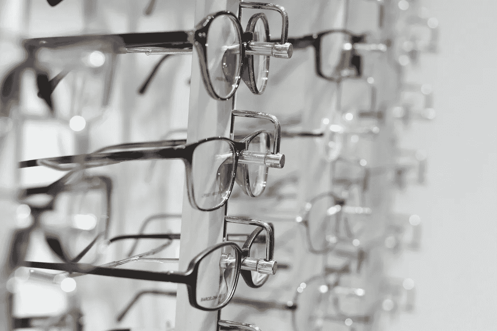

# 计算机视觉和物体检测领域有哪些新进展？

> 原文：[`towardsdatascience.com/whats-new-in-computer-vision-and-object-detection-8e586c4429e3?source=collection_archive---------6-----------------------#2024-07-11`](https://towardsdatascience.com/whats-new-in-computer-vision-and-object-detection-8e586c4429e3?source=collection_archive---------6-----------------------#2024-07-11)

 [TDS 编辑](https://towardsdatascience.medium.com/?source=post_page---byline--8e586c4429e3--------------------------------)

·发表于 [Towards Data Science](https://towardsdatascience.com/?source=post_page---byline--8e586c4429e3--------------------------------) ·发送至 新闻简报 ·阅读时间：4 分钟·2024 年 7 月 11 日

--

> 想要写你的第一篇 TDS 文章吗？[我们始终欢迎新作者的投稿](http://bit.ly/write-for-tds)。

在进入本周精选的精彩文章之前，我们想花一点时间感谢所有读者、作者以及我们更广泛社区的成员，感谢你们的支持帮助我们达成了一个重要里程碑——我们的[Medium](https://medium.com/u/504c7870fdb6?source=post_page---user_mention--8e586c4429e3--------------------------------)粉丝数刚刚达到了…

我们无比激动，并且感谢所有支持我们的人，使得 TDS 成为了如今这个充满活力、以学习为核心的出版物。未来我们期待更多的成长和探索！

回到我们的常规内容，我们本周精选了三篇文章，重点介绍计算机视觉和物体检测领域的前沿工具和方法。随着多模态模型的不断发展以及自动驾驶、医疗保健和农业等应用逐渐走向主流，数据和机器学习从业者保持与最新进展同步变得尤为重要。（如果你此刻对其他话题更感兴趣，我们也有相关内容！向下滚动，查看我们精心挑选的神经科学、音乐与人工智能、环保意识的机器学习工作流程等推荐文章。）

+   **掌握视频中的物体计数**与静态图像中的相同过程相比，视频中的物体检测面临许多新的挑战。[Lihi Gur Arie, 博士](https://medium.com/u/418175cbf131?source=post_page---user_mention--8e586c4429e3--------------------------------)提供了一篇清晰简明的教程，展示了如何依然能够完成这一任务，并通过一个有趣的例子——数树上的移动蚂蚁来说明她的观点。

+   **用 AI 点燃冰球：通过计算机视觉进行球员追踪**对于任何寻找深入且引人入胜的项目讲解的人，我们强烈推荐[Raul Vizcarra Chirinos](https://medium.com/u/3da7d5d185b5?source=post_page---user_mention--8e586c4429e3--------------------------------)关于他最近尝试从（或多或少）零开始构建冰球球员追踪器的文章。通过使用 PyTorch、计算机视觉技术和卷积神经网络（CNN），Raul 开发了一个原型，可以跟踪球员并收集基本的表现统计数据。

+   **自动驾驶感知工程师规划速成课程**虽然我们可能还需要几年时间才能看到自动驾驶汽车主导我们的道路，但近年来研究人员和行业参与者已取得了显著进展。那些希望扩展在自动驾驶背景下的规划和决策知识的从业者，不应错过[Patrick Langechuan Liu](https://medium.com/u/d875946648f7?source=post_page---user_mention--8e586c4429e3--------------------------------)关于该主题的全面“速成课程”。

图片由[Harpreet Singh](https://unsplash.com/@harpreetkaka?utm_source=medium&utm_medium=referral)提供，来源于[Unsplash](https://unsplash.com/?utm_source=medium&utm_medium=referral)

如承诺的，以下是我们推荐的其他主题、问题和挑战阅读，我们认为你可能会喜欢探索：

+   在他的首篇 TDS 文章中，[Jonathan R. Williford, 博士](https://medium.com/u/cf4e7e8445b0?source=post_page---user_mention--8e586c4429e3--------------------------------)探讨了当前多模态变压器工作的有趣联系，并与我们大脑处理视觉信息的方式进行了对比。

+   从过度防御自己的弱点到未能完全承担自己的项目，[Mandy Liu](https://medium.com/u/b49a6ee6ebe0?source=post_page---user_mention--8e586c4429e3--------------------------------)反思了她作为初级数据科学家的错误经历，并分享了她对刚刚入门的人的可操作建议。

+   [为什么跟踪在机器学习项目中如此重要](https://tracking-in-practice-code-data-and-ml-model-6787a881609c)，以及你该如何有效实施它？[Chayma Zatout](https://medium.com/u/f7da1c34b82e?source=post_page---user_mention--8e586c4429e3--------------------------------)在她的 MLOps 入门中给出了答案。

+   如果你对了解一种新的前沿提示框架感兴趣，不要错过[Anand Subramanian](https://medium.com/u/c82db321a03f?source=post_page---user_mention--8e586c4429e3--------------------------------)对 Medprompt 的[详细且实用的介绍](https://understanding-and-implementing-medprompt-77bbd2777c91)。

+   在她最新的专注于 LLM 的教程中，[Yanli Liu](https://medium.com/u/f80094072ee0?source=post_page---user_mention--8e586c4429e3--------------------------------)介绍了一种[结合两种新技术的对齐优化方法](https://combining-orpo-and-representation-fine-tuning-for-efficient-llama3-alignment-77f6a2e3af8c)：使用 ORPO（比值比优化）进行表示微调。

+   机器学习模型日益增长的环境足迹是一个及时且至关重要的话题；[Sydney Nye](https://medium.com/u/8a83f11e92c5?source=post_page---user_mention--8e586c4429e3--------------------------------)提供了一份[以可持续实践为中心的务实指南](https://eco-friendly-ai-how-to-reduce-the-carbon-and-water-footprints-of-your-ml-models-8a03d3158a94)，旨在模型训练和部署过程中减少碳足迹和水足迹。

+   在音乐分析和人工智能的交集处工作，[Emmanouil Karystinaios](https://medium.com/u/9d63e988ed0c?source=post_page---user_mention--8e586c4429e3--------------------------------)带我们走进他的研究，介绍了[灵感来自感知的图卷积在音乐理解任务中的应用](https://perception-inspired-graph-convolution-for-music-understanding-tasks-4d2ba1be48e7)。

+   [Hesam Sheikh](https://medium.com/u/6eafeacbe5b8?source=post_page---user_mention--8e586c4429e3--------------------------------)超越了代理人工智能系统所产生的炒作，提供了一份[关于构建 AI 代理团队的详细实践教程](https://a-comprehensive-guide-to-collaborative-ai-agents-in-practice-1f4048947d9c)，帮助改进和定制求职材料。

+   当[你给 LLM 的提示包含矛盾指令时会发生什么](https://dealing-with-cognitive-dissonance-the-ai-way-1f182a248d6d)？[Yennie Jun](https://medium.com/u/12ca1ab81192?source=post_page---user_mention--8e586c4429e3--------------------------------)在她的“AI 认知失调”实验中探讨了这个有趣的难题。

感谢您支持我们作者的工作！我们喜欢发布新作者的文章，如果你最近写了一篇有趣的项目 walkthrough、教程或关于我们核心话题的理论反思，别犹豫，[与我们分享](http://bit.ly/write-for-tds)吧。

直到下一个变量，

TDS 团队
