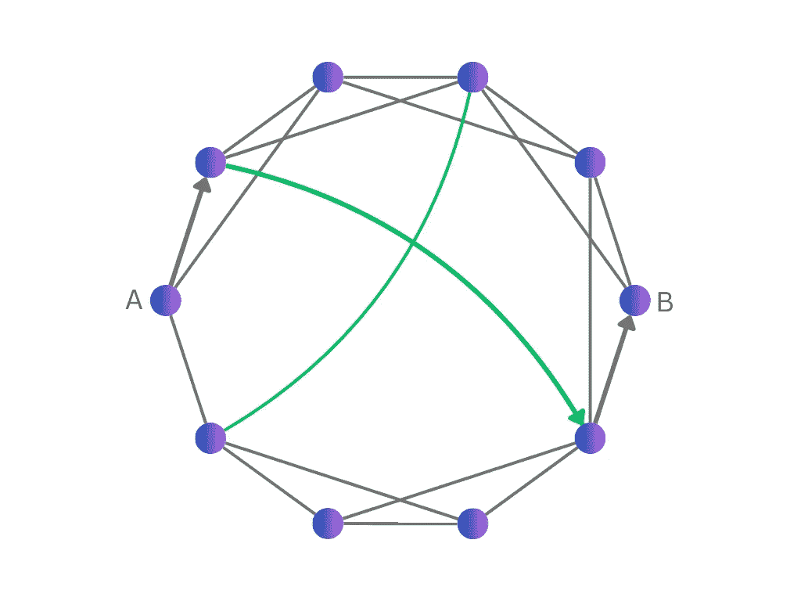
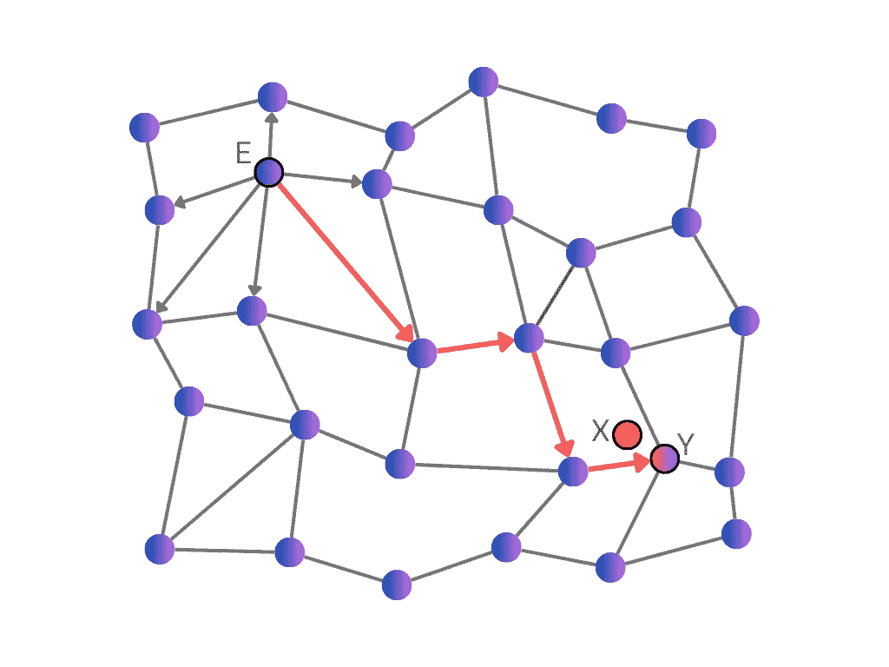
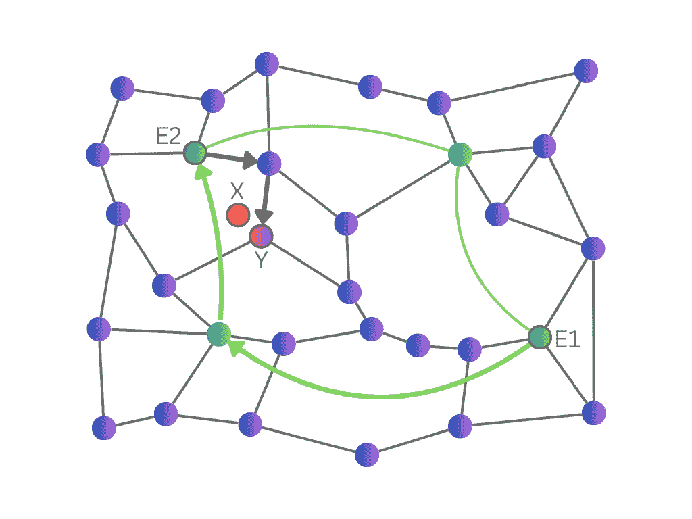
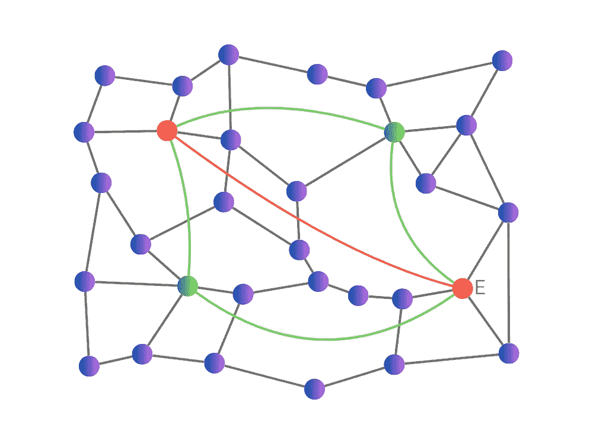
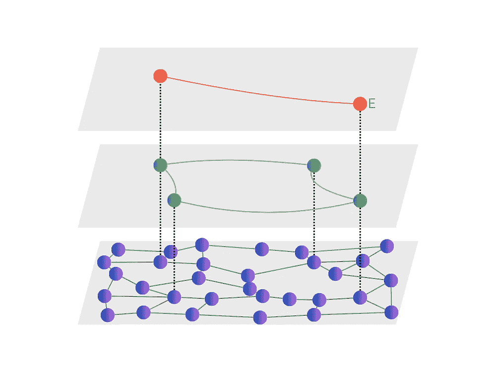

# HNSW 的故事是什么？

> 原文：[`towardsdatascience.com/whats-the-story-with-hnsw-d1402c37a44e?source=collection_archive---------0-----------------------#2024-02-25`](https://towardsdatascience.com/whats-the-story-with-hnsw-d1402c37a44e?source=collection_archive---------0-----------------------#2024-02-25)

## 探索使用层次化可导航小世界（HNSW）进行快速最近邻搜索的路径

 [Ryan McDermott](https://medium.com/@ryan.mcdermott.000?source=post_page---byline--d1402c37a44e--------------------------------)

·发表于[数据科学之路](https://towardsdatascience.com/?source=post_page---byline--d1402c37a44e--------------------------------)·阅读时间 13 分钟·2024 年 2 月 25 日

--

由 DALL·E 2 创作的图像，提示词为“由点和线条连接的层次网络的明亮抽象表现主义画作”。

层次化可导航小世界（HNSW）已经成为近似最近邻搜索中最具性能的算法之一。不过，HNSW 略显复杂，且相关描述通常缺乏完整且直观的解释。本文将带您走过 HNSW 概念的历史，帮助解释“层次化可导航小世界”到底意味着什么，以及它为何如此有效。

# 目录

+   近似最近邻搜索

+   小世界

+   可导航小世界

+   层次化可导航小世界

+   总结

+   附录

    - 改进的搜索

    - HNSW 搜索与插入

    - 改进的插入

+   参考文献

# 近似最近邻搜索

机器学习的一个常见应用是*最近邻搜索*，即找到与目标最相似的项*——例如，推荐与用户偏好相似的项，或者搜索与用户查询相似的项。

简单方法是计算每个项与目标的相似度，并返回最接近的项。然而，如果项的数量非常庞大（可能有百万个），这一方法将会很慢。

取而代之的是，我们可以使用一种叫做*索引*的结构来大大加速查找过程。

然而，这里存在一个权衡。与简单方法不同，索引只给出近似结果：我们可能无法检索到所有的最近邻（即召回率可能低于 100%）。

存在多种不同类型的索引（例如局部敏感哈希；倒排文件索引），但 HNSW 在各种数据集上表现特别有效，能够在保持高召回率的同时实现高速。

**通常，项目被表示为* [嵌入](https://www.pinecone.io/learn/vector-embeddings/)*，这些嵌入是由机器学习模型生成的向量；项目之间的相似性对应于嵌入之间的*距离*。这篇文章通常会讨论向量和距离，尽管一般来说，HNSW 可以处理任何类型的项目，只要它们具有某种相似度度量。*

# 小世界

*小世界实验的示意图。*

小世界现象在斯坦利·米尔格伦（Stanley Milgram）的“小世界实验”中得到了著名的研究[[1]](https://snap.stanford.edu/class/cs224w-readings/travers69smallworld.pdf)。

参与者收到一封信，信中包含一个随机选择的目标个体的地址及其他基本信息，以及实验的说明。如果他们不太可能个人认识目标，他们被指示将信转交给更可能认识目标的人。

令人惊讶的结论是，信件通常只被转发约六次便能到达目标，证明了著名的“六度分隔”理论——任何两个人通常可以通过一小链条的朋友相互连接。

在图论的数学领域，[图](https://en.wikipedia.org/wiki/Graph_(discrete_mathematics))是一组点，其中一些点是相互连接的。我们可以将社交网络看作是一个图，其中人们是点，友谊是连接。小世界实验发现，这个图中的大多数点对是通过短路径连接的，路径上的步骤很少。（从技术上讲，这是指图的*直径*很小。）

*小世界的示意图。大多数连接（灰色）是局部的，但也有长程连接（绿色），这些长程连接在各个点之间创建了短路径，例如指示箭头的 A 和 B 之间的三步路径。*

拥有短路径本身并不那么令人惊讶：大多数图都有这一特性，包括通过随机连接点对所创建的图。但社交网络并非随机连接，它们是高度*局部化*的：朋友通常住得很近，而且如果你认识两个人，他们很可能也彼此认识。（从技术上讲，这是指图具有高*聚类系数*。）小世界实验令人惊讶的地方在于，尽管连接通常是短程的，但两个遥远的点之间竟然只通过一条短路径相隔。

在像这样的情况下，当一个图有许多局部连接，但也有短路径时，我们称这个图为**小世界**。

另一个很好的小世界例子是全球机场网络。同一地区的机场之间高度互联，但通过利用主要枢纽机场，通常可以在几个停靠点之间完成长途旅行。例如，从英国曼彻斯特到日本大阪的旅行通常从曼彻斯特到伦敦的短途航班开始，然后是从伦敦到东京的长途航班，最后是从东京到大阪的另一个短途航班。长程枢纽是实现小世界特性的常见方式。

另一个具有小世界特性的图的有趣例子是生物神经网络，比如人脑。

# *可导航的小世界*

在小世界图中，我们可以在几步之内快速到达目标。这为最近邻搜索提供了一个有前景的想法：也许如果我们以某种方式在向量之间创建连接，使其形成一个小世界图，我们可以通过从任意“入口点”向量开始，然后通过图进行导航快速找到靠近目标的向量。

这一可能性由克莱因伯格探索过[[2](https://www.stat.berkeley.edu/users/aldous/Networks/swn-1.pdf)]。他指出，短路径的存在并不是米勒实验中唯一有趣的地方：更令人惊讶的是，人们能够*找到*这些短路径，而无需使用任何关于图的全局知识。相反，人们是遵循一种简单的[贪心算法](https://en.wikipedia.org/wiki/Greedy_algorithm)。在每一步中，他们检查每一个直接连接，并将信息发送到他们认为最接近目标的连接。我们可以使用类似的算法来搜索连接向量的图。

*贪心搜索算法的示意图。我们正在寻找距离目标 X 最近的向量。从入口点 E 开始，我们检查与 E 相连的每个向量到 X 的距离（由从 E 出发的箭头表示），并前往最近的一个（由从 E 出发的红色箭头表示）。我们在后续的向量上重复这个过程，直到到达 Y。由于 Y 没有比 Y 本身更接近 X 的连接，我们停止并返回 Y。*

克莱因伯格想知道这个贪心算法是否总能找到一条短路径。他进行了简单的小世界模拟，在这些模拟中，所有点都连接到它们的邻居，并且在随机点之间创建了额外的长连接。他发现，贪心算法只会在特定条件下找到短路径，这些条件取决于长程连接的长度。

如果长距离连接过长（例如当它们连接完全随机位置的点对时），贪心算法可能会通过长距离连接迅速到达目标的大致区域，但之后这些长距离连接就无用，路径必须通过局部连接来进一步靠近目标。另一方面，如果长距离连接过短，则需要太多步骤才能到达目标区域。

然而，如果长距离连接的长度刚好合适（准确来说，如果它们是均匀分布的，所有长度的概率相等），则贪心算法通常可以在特别少的步骤中到达目标的邻域（更具体地说，这个步骤数与 *log(n)* 成比例，其中 *n* 是图中的点数）。

在这种贪心算法能够在少数步骤内找到目标的情况下，我们称这种小世界为 **可导航** 小世界（NSW）。

NSW 听起来像是一个理想的向量索引，但对于高维复杂空间中的向量，如何实际构建一个 NSW 还不清楚。幸运的是，Malkov 等人 [[3](https://publications.hse.ru/mirror/pubs/share/folder/x5p6h7thif/direct/128296059)] 发现了一种方法：我们每次随机选择一个向量插入图中，并将其连接到已插入的少数 *m* 个最近邻。

*构建 NSW 的示意图。向图中随机插入向量，并将其连接到最接近的 m = 2 个已插入向量。注意，最早插入的向量形成长距离连接，而后插入的向量形成局部连接。*

这种方法非常简单，无需对向量在空间中的分布进行全局理解。它也非常高效，因为我们可以利用已构建的图来执行每个向量的最近邻搜索。

实验确认这种方法能产生一个 NSW。由于最早插入的向量是随机选择的，它们通常相隔较远。因此，它们形成了小世界所需的长距离连接。虽然为什么小世界是可导航的并不那么显而易见，但随着我们插入更多向量，连接会逐渐变短，因此可以推测连接长度的分布会相当均匀，如所要求的那样。

# 层次化可导航小世界

可导航小世界在近似最近邻搜索中表现良好，但进一步的分析揭示了可以改进的地方，这促使 Markov 等人 [[4](https://arxiv.org/ftp/arxiv/papers/1603/1603.09320.pdf)] 提出了 HNSW。

一个典型的 NSW 路径从入口点到目标分为两个阶段：“缩小”阶段，连接长度从短到长；以及“放大”阶段，连接长度发生相反的变化。

第一个简单的改进是使用一个长程中心节点（例如第一个插入的向量）作为入口点。这样，我们可以跳过缩小阶段，直接进入放大阶段。

其次，尽管搜索路径较短（步骤数与*log(n)*成正比），但整个搜索过程并不十分快速。在路径上的每个向量处，贪婪算法必须检查每个连接的向量，计算它们与目标的距离，以选择最近的一个。虽然大多数本地连接的向量只有少数连接，但大多数长程中心节点有很多连接（同样与*log(n)*成正比）；这是有道理的，因为这些向量通常在构建过程中较早插入，并且有更多机会与其他向量连接。因此，在搜索过程中总的计算量相当大（与*log(n)²*成正比）。

为了改进这一点，我们需要限制在每个中心节点检查的连接数量。这引出了 HNSW 的主要思想：明确区分短程连接和长程连接。在搜索的初始阶段，我们只考虑中心节点之间的长程连接。一旦贪婪搜索找到了接近目标的中心节点，我们就切换到使用短程连接。

*通过 HNSW 进行搜索的示意图。我们正在搜索最接近目标 X 的向量。长程连接和中心节点是绿色的；短程连接是灰色的。箭头显示了搜索路径。从入口点 E1 开始，我们在长程连接中执行贪婪搜索，达到 E2，这是离 X 最近的长程中心节点。从那里我们继续在短程连接中进行贪婪搜索，最终到达 Y，这是离 X 最近的向量。*

由于中心节点的数量相对较少，因此它们应该检查的连接较少。我们还可以在构建索引时，明确为每个向量强加一个长程连接和短程连接的最大数量。这将导致较快的搜索时间（与*log(n)*成正比）。

将短程和长程连接分开的思想可以推广到包括多个中间层次的连接长度。我们可以将其可视化为一个**层次结构**，每一层只使用下层中部分向量进行连接。

***左**：一个具有三种连接长度的 HNSW 示意图——短程连接是灰色的，长程连接是绿色的，最长的连接是红色的。*E*是入口点。***右**：将 HNSW 可视化为三层堆栈。虚线表示同一向量在下层的位置。*

最佳层数（以及每个向量最大连接数等其他参数）可以通过实验找到；HNSW 论文中也提出了一些启发式方法。

顺便提一下，HNSW 还推广了一种名为 [跳表](https://en.wikipedia.org/wiki/Skip_list) 的数据结构，它可以快速搜索排序的一维值（而不是多维向量）。

构建 HNSW 使用的思想与 NSW 类似。向量是逐个插入的，通过连接随机向量创建长距离连接——尽管在 HNSW 中，这些向量是在整个构建过程中随机选择的（而在 NSW 中，它们是按随机顺序插入的第一个向量）。

精确来说，每当插入一个新的向量时，我们首先使用随机函数选择它将出现的最高层级。所有向量都出现在最底层；其中一部分向量也出现在第一层；其中一部分向量又出现在第二层，依此类推。

与 NSW 类似，我们将插入的向量连接到它在每个层次中出现的 *m* 个最近邻；我们可以利用迄今为止构建的索引高效地搜索这些邻居。随着向量在更高层次上的稀疏性增加，连接通常变得更长。

# 总结

这部分完成了关于导致 HNSW 的主要思想的讨论。总结如下：

小世界是一个连接局部点的图，但也有短的路径连接远距离的点。这可以通过具有长距离连接的枢纽来实现。

以正确的方式构建这些长距离连接，会导致一个小世界图，具有可导航性，这意味着贪心算法可以迅速找到最短路径。这使得快速的最近邻搜索成为可能。

构建连接的一种方法是按随机顺序插入向量，并将其连接到最近邻。然而，这会导致具有大量连接的长距离枢纽，并导致较慢的搜索时间。

为了避免这一点，更好的方法是通过选择随机向量作为枢纽，单独构建不同长度的连接。这就给我们带来了 HNSW 索引，显著提高了最近邻搜索的速度。

# 附录

上面的帖子概述了 HNSW 索引及其背后的思想。本附录讨论了 HNSW 算法的一些额外有趣细节，供那些寻求完整理解的读者参考。更多细节和伪代码请参见参考文献。

## 改进的搜索

可导航的小世界方法只能为最近邻搜索提供近似结果。有时，贪心搜索算法会在找到距离目标最近的向量之前停止。这种情况发生在搜索路径遇到“虚假的局部最优”时，即向量的直接连接都离目标更远，尽管在图的其他地方可能有一个更接近的向量。

可以通过从不同的入口点执行多个独立的搜索来改进此过程，这些搜索的结果可以为我们提供几个好的 *候选* 向量作为最近邻。然后我们计算所有候选向量与目标的距离，并返回最近的一个。

如果我们想找到多个最近邻（例如 *k* 个），我们可以首先通过添加它们的所有直接连接来扩展候选集，然后计算与目标的距离并返回最近的 *k* 个。

这种简单的候选查找方法存在一些不足。每个贪婪搜索路径仍然有可能陷入一个错误的局部最优解；通过探索每个向量的直接连接之外的区域可以改进这一点。此外，搜索路径可能会在结束时遇到几个靠近目标的向量，但这些向量不会被选为候选（因为它们不是路径中的最终向量或它的直接连接之一）。

与其独立地跟踪多个贪婪路径，更有效的方法是跟踪一个 *向量集*，并以贪婪的方式更新整个集合。

精确来说，我们将维护一个集合，包含到目前为止遇到的离目标最近的向量以及它们到目标的距离。该集合最多包含 *ef* 个向量，其中 *ef* 是期望的候选数量。最初，该集合包含入口点。接下来，我们通过贪婪过程继续，评估集合中的每个向量并检查它的连接。

集合中的所有向量最初标记为“未评估”。在每一步，我们评估离目标最近的未评估向量（并将其标记为“已评估”）。评估向量意味着检查其每个连接向量，计算该向量与目标的距离，如果比集合中某些向量更近，就将其插入集合（并将最远的向量移出集合，如果集合已达到最大容量）。(我们还会追踪已经计算过距离的向量，以避免重复工作。)

该过程在集合中的所有向量都被评估过并且没有插入新的向量时结束。最终的集合作为候选集返回，我们可以从中选取离目标最近的向量或 *k* 个最近的向量。

（注意，对于 *ef = 1*，该算法只是基本的贪婪搜索算法。）

## HNSW 搜索与插入

上述描述了一个 NSW 的搜索算法，或 HNSW 的单层搜索算法。

要搜索整个 HNSW 结构，建议的方法是从顶部层开始，在每一层使用基本的贪婪搜索找到最近邻，直到到达感兴趣的层，此时我们使用层搜索算法并考虑多个候选。

对于在完成的索引上进行 k 最近邻搜索（包括 *k = 1*），这意味着使用基本的贪心搜索，直到到达底层，此时我们使用带有 *ef = efSearch* 候选向量的层搜索算法。*efSearch* 是一个需要调优的参数；较高的 *efSearch* 值虽然速度较慢，但精度更高。

对于将向量插入 HNSW，我们使用基本的贪心搜索，直到找到新向量出现的第一层。在这一层，我们使用带有 *ef = efConstruction* 候选向量的层搜索来寻找 *m* 个最近邻。我们还将这些候选向量作为进入下一层继续处理的入口点。

## 改进的插入方法

NSW 引入了一种简单的构建图的方法，其中每个插入的向量都与其 *m* 个最近邻连接。虽然这种选择连接的方法也适用于 HNSW，但引入了一种改进的方法，显著提升了生成的索引的性能。

一如既往，我们首先找到 *efConstruction* 候选向量。然后我们按照与插入向量的距离从小到大遍历这些候选向量并连接它们。然而，如果某个候选向量距离一个新连接的候选向量比插入向量还近，我们就跳过它而不进行连接。我们在连接了 *m* 个候选向量后停止。

这个想法是，我们已经可以通过新连接的候选向量从插入向量到达该候选向量，因此增加一个直接连接是没有必要的；连接一个更远的点会更好。这样可以增加图中连接的多样性，帮助连接相邻的向量簇。

# 参考文献

[1] J. Travers 和 S. Milgram, [小世界问题的实验研究](https://snap.stanford.edu/class/cs224w-readings/travers69smallworld.pdf)（1969），《社会计量学》

[2] J. Kleinberg, [小世界现象：一种算法视角](https://www.stat.berkeley.edu/users/aldous/Networks/swn-1.pdf)（2000），《第三十二届年度 ACM 计算理论会议论文集》

[3] Y. Malkov, A. Ponomarenko, A. Logvinov 和 V. Krylov, [基于可导航小世界图的近似最近邻算法](https://publications.hse.ru/mirror/pubs/share/folder/x5p6h7thif/direct/128296059)（2014），《信息系统》，第 45 卷

*(有几篇类似的论文；这篇是最新且最完整的，并且包含了更先进的 k 最近邻搜索算法。)*

[4] Y. Malkov 和 D. Yashunin, [使用分层可导航小世界图进行高效且稳健的近似最近邻搜索](https://arxiv.org/ftp/arxiv/papers/1603/1603.09320.pdf)（2016），《IEEE 模式分析与机器智能学报》

所有图片均由作者创作，可以在注明出处的情况下免费使用。
