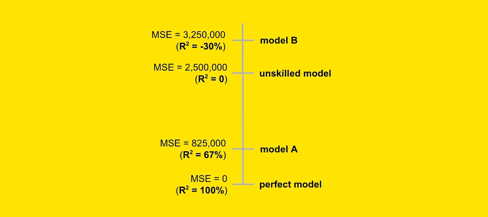

# R 平方的问题在哪里（以及如何修复它）

> 原文：[`towardsdatascience.com/whats-wrong-with-r-squared-and-how-to-fix-it-7362c5f26c53?source=collection_archive---------0-----------------------#2024-08-07`](https://towardsdatascience.com/whats-wrong-with-r-squared-and-how-to-fix-it-7362c5f26c53?source=collection_archive---------0-----------------------#2024-08-07)

## 即使你认为自己在使用样本外的 R 平方，你也没有做到。原因如下：

 [Samuele Mazzanti](https://medium.com/@mazzanti.sam?source=post_page---byline--7362c5f26c53--------------------------------)

·发表于[Towards Data Science](https://towardsdatascience.com/?source=post_page---byline--7362c5f26c53--------------------------------) ·阅读时长：10 分钟·2024 年 8 月 7 日

--

[图片来源：作者]

*R-Squared*是评估回归模型的最流行指标之一。它在任何统计学课程中都有教授，也是[Scikit-learn](https://scikit-learn.org/stable/modules/model_evaluation.html#regression-metrics)中实现的评估指标之一。

然而，这一指标的可靠性已经引发了一些疑问。在[卡内基梅隆大学的课程笔记](https://www.stat.cmu.edu/~cshalizi/mreg/15/lectures/10/lecture-10.pdf)中，**科斯马·沙利齐教授声称*R-Squared*是无用的**。

那么，我们应该完全抛弃*R-Squared*吗？

我不这么认为。

我承认这个指标有一个主要缺陷，但我也认为我们不应忽视它的优点。在本文中，我将解释*R-Squared*的问题，并提出一种修改方法，使其完全可靠。

# R 平方的深层含义是什么？

要理解*R-Squared*的问题，我们首先需要了解它的含义。我指的是**深层含义，而不是大多数资源中随意定义的含义**。

让我们从一个例子开始。假设我们有一个预测模型（“模型 A”），用于预测房屋的售价。
