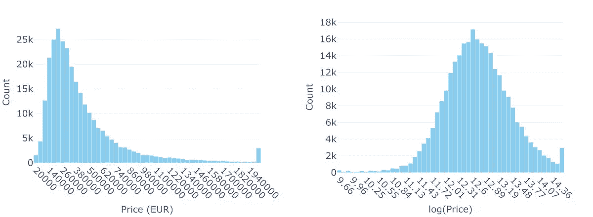
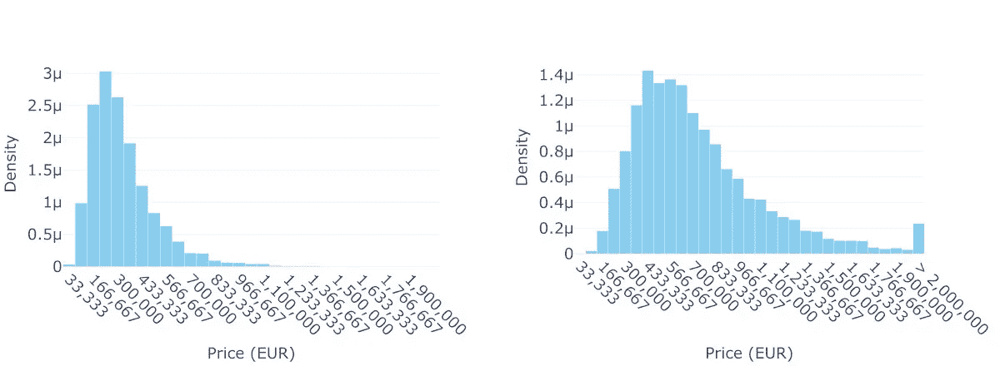
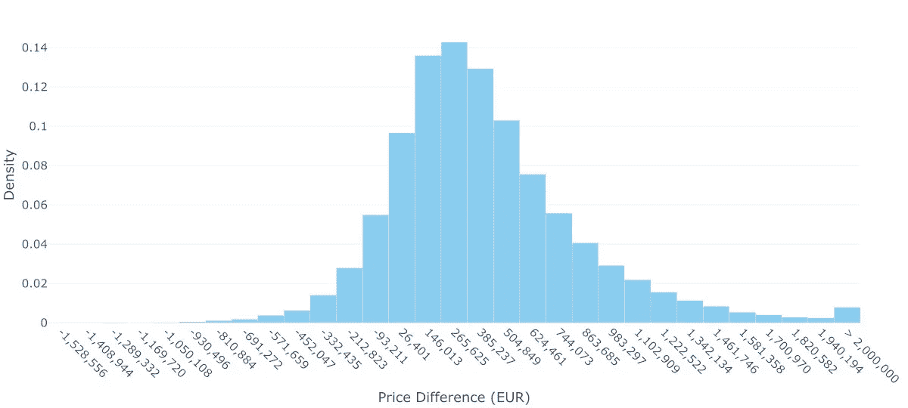
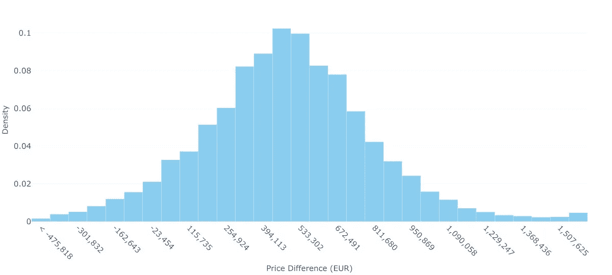

# 当平均值说谎：超越单点预测

> 原文：[`towardsdatascience.com/when-averages-lie-moving-beyond-single-point-predictions-23201e8c04c8?source=collection_archive---------1-----------------------#2024-12-17`](https://towardsdatascience.com/when-averages-lie-moving-beyond-single-point-predictions-23201e8c04c8?source=collection_archive---------1-----------------------#2024-12-17)

## 在决策中预测完整的概率分布的必要性

 [Loic Merckel](https://medium.com/@loic.merckel?source=post_page---byline--23201e8c04c8--------------------------------)

·发表于[Towards Data Science](https://towardsdatascience.com/?source=post_page---byline--23201e8c04c8--------------------------------) ·阅读时间 14 分钟·2024 年 12 月 17 日

--

有些人喜欢热咖啡，有些人喜欢冰咖啡，但没有人喜欢温吞的咖啡。然而，基于咖啡温度训练的简单模型可能会预测下次提供的咖啡应该是……温吞的。这揭示了预测建模中的一个根本问题：过度关注单点估计（例如平均值）可能会导致我们得出无意义甚至误导性的结论。

在《[水晶球谬误](https://medium.com/@loic.merckel/the-crystal-ball-fallacy-what-perfect-predictive-models-really-mean-aa843067ee30)》(Merckel, 2024b)中，我们探讨了即使是完美的预测模型也无法准确告诉我们会发生什么——它告诉我们可能发生什么以及每个结果的可能性有多大。换句话说，它揭示了一个随机变量的真实分布。尽管这种完美模型仍然是理论上的，但现实世界中的模型仍应努力接近这些真实分布。

然而，许多在企业界使用的预测模型做的恰恰相反：它们仅仅关注点估计——通常是均值或众数——而不是尝试捕捉所有可能性。这不仅仅是预测用途的问题；这一局限性还根植于许多传统机器学习算法的设计中。随机森林、广义线性模型（GLM）、人工神经网络（ANN）和梯度提升机器等，都设计为在回归任务中预测分布的期望值（均值）。在分类问题中，虽然逻辑回归和其他广义线性模型自然会尝试估计类别成员的概率，但像随机森林和梯度提升这样的基于树的方法，产生的是原始分数，这些分数需要额外的校准步骤（如等距回归或 Platt 缩放）才能转换为有意义的概率。然而在实践中，这种校准很少进行，即使有不确定性信息（即概率），也通常会被抛弃，取而代之的是单一最可能的类别，即众数。

这种过度简化有时不仅不够充分；它甚至可能导致根本错误的结论，就像我们那个平淡无奇的咖啡预测模型一样。一个典型的例子是 2008 年金融危机前用于定价担保债务凭证（CDOs）的高斯 copula 公式。通过将复杂的按揭违约关系简化为一个单一的相关系数，这个模型在多个方面存在问题，导致它灾难性地低估了同时违约的可能性（MacKenzie & Spears，2014）。这种系统性低估极端风险的现象非常普遍，以至于一些投资基金，比如纳西姆·塔勒布（Nassim Taleb）所建议的 Universa Investments，专门采用策略来利用这一点。他们认识到市场总是低估极端事件的概率和影响（Patterson，2023）。当我们将一个复杂的可能结果分布简化为一个数字时，我们失去了关于不确定性、风险和可能极端事件的关键信息，这些信息可能会对决策产生深远影响。

另一方面，一些量化交易公司正是通过正确建模这些复杂分布而取得成功。当被问及文艺复兴技术公司（Renaissance Technologies）的做法时——据称其 Medallion 基金在 1988 年至 2018 年间的年均回报率为 66%（Zuckerman，2019）——创始人吉姆·西蒙斯（Jim Simons）强调，他们仔细考虑市场风险“通常不是正态分布，分布的尾部更重，内部则较轻”（Simons，2013，47:41），突显了超越简单平均值看待问题的重要性。

那么，为什么我们在明知单点估值存在明显局限的情况下，仍然坚持使用这种方法呢？原因可能既有实际的，也有文化的。预测分布在技术上比预测单一值更具挑战性，需要更复杂的模型和更强大的计算资源。但更根本的是，大多数商业流程和工具根本没有设计来处理分布式思维。你不能将概率分布放入电子表格的单元格中，而且许多决策框架要求的是具体数字，而非可能性的范围。此外，正如 Kahneman（2011）在其关于人类决策分析中指出的那样，我们天生倾向于从具体场景而非统计分布的角度来思考——我们的直觉思维更偏好简单、具体的答案，而非概率性的答案。

让我们通过实际的住房市场数据来说明单点估值可能存在的问题，以及一些可能的建模技巧，旨在捕捉可能值的完整分布。

# 深入探讨物业定价

在本节中，我们使用由法国政府（gouv.fr，2024）提供的法国房地产交易（DVF）数据集，该数据集包含了法国各地房地产交易的全面记录。在这次分析中，我们关注的是销售价格、物业面积以及房间数量，时间范围为 2014 年至 2024 年。值得注意的是，我们排除了诸如地理位置等关键信息，因为我们的目标不是预测房价，而是展示预测分布的好处，避免仅依赖单点估值。

首先，我们将通过一个虚构的——但很可能是暗指现实的——案例研究，展示一种常见的机器学习技巧如何用于规划一项雄心勃勃的房地产操作。随后，我们将对此案例采取批判性立场，并提供许多人可能更倾向于采用的替代方案，以便更好地为执行交易做准备。

## 案例研究：Homer 与 Lisa 在房地产交易中对 AI 的依赖

Homer 和 Lisa 住在巴黎。他们预计家庭会扩大，计划卖掉两居室公寓来资助购买四居室的房产。考虑到运营和维护成本，以及他们新买的配备所有选项的高科技 Roomba 吸尘器的容量，他们认为 90 平方米的面积最适合他们。他们想估算自己需要储蓄或借款多少，以弥补出售房产所得的差额。Homer 在去年毕业于高级法语文学之前，参加了一门关于机器学习的 MOOC 课程，随后立即通过他的网络找到了一个数据科学家职位，加入了一家大型有声望的传统公司，该公司正在大力投资扩展其人工智能能力（说实话，几乎是从零开始）。如今，作为一名首席高级数据科学家，经过近一年的经验，他已经知道了不少！(他甚至 [在动物园做副业](https://medium.com/@loic.merckel/data-driven-or-data-derailed-lessons-from-the-hello-world-classifier-764fdf4dbb60)，他的表现得到了关注 — Merckel, 2024a.)

经过一些谷歌搜索，他找到了政府免费提供的房地产数据集。他做了一些清理、筛选和汇总，获得了完美的材料来构建他的普通最小二乘模型（OLS，对于懂行的人来说）。现在，他可以自信地根据房间数量和面积预测巴黎地区的房价。他们那套两居室、40 平方米的公寓价值 365,116€。而一套四居室、90 平方米的公寓则达到 804,911€。这不难看出；他们必须计算差额，即 439,795€。

## Homer 和 Lisa：那个玩飞镖的… 不知情地！

Homer 和 Lisa 需要储蓄/借款 439,795€ 吗？模型确实建议如此。但真的是这样吗？

也许 Homer，如果他知道的话，早就可以提供置信区间了？使用 OLS，置信区间可以通过自助法（bootstrapping）经验性估算，或者使用基于标准误差的方法进行解析计算。

此外，早在那之前，他本可以查看价格分布，并意识到默认的最小二乘法（OLS）可能不是最佳选择…

**图 1：巴黎周边房地产价格（2014–2024 年）：** 左侧图表展示了巴黎市中心 7 公里半径内的房地产价格分布。右侧图表展示了这些价格的自然对数分布。在这两个直方图中，最后一根柱子表示价格超过 2,000,000€（或者在对数坐标系中的 log(2,000,000)）的房产的累计数量。图片由作者提供。

带有长尾的右偏分布形状是很容易识别的。对于预测建模（与例如解释性建模相对），OLS 的主要关注点不一定是误差的正态性（和同方差性），而是长尾中极端值可能对模型产生不成比例的影响——OLS 最小化平方误差，这使得它对极端观测值特别敏感，尤其是那些显著偏离假定误差高斯分布的值。

广义线性模型（GLM）通过直接为响应变量指定一个分布（来自指数族），并使用“连接函数”将线性预测变量与该分布的均值连接，从而扩展了线性模型框架。虽然线性模型假设误差服从正态分布，并通过线性预测量直接估计期望响应 E(Y)，但 GLM 允许不同的响应分布，并通过连接函数转化线性预测量与 E(Y)之间的关系。

让我们用一种更简单但相关的方法重新审视霍默和丽莎的情况。我们可以通过对价格取自然对数来转换数据，然后应用线性模型，而不是实现广义线性模型(GLM)。这意味着我们假设价格遵循对数正态分布（图 1 展示了价格的分布以及对数版本）。当将预测值转换回原始尺度时，我们需要通过杜安的涂抹估计量（Duan, 1983）来考虑由对数变换引入的偏差。使用这种校正偏差的对数正态模型，并将其拟合于巴黎周围的房地产数据，他们目前的 2 室 40 平米公寓估计价值 337,844 欧元，而他们目标的 4 室 90 平米房产预计价格为 751,884 欧元，因此需要额外的 414,040 欧元。

具有涂抹校正的对数正态模型特别适用于这种情况，因为它不仅反映了乘法关系，例如当房间数量或面积增加时，价格按比例增加（乘上一个因子）而不是按固定金额增加，而且还正确地考虑了反变换偏差，否则会导致价格的系统性低估。

为了更好地理解这些预测的不确定性，我们可以检查它们的置信区间。95%的自助法置信区间[400,740€ — 418,618€]表示，如果我们重复这个抽样过程多次，约 95%的这样的区间将包含真实的平均价格差异。在这个背景下，这个区间比基于标准误差的 95%置信区间更可靠，因为它不依赖于对模型的严格参数假设，如误差分布或模型规格的适用性。相反，它捕捉了观察数据的变异性和复杂性，考虑了未建模的因素和可能的偏离理想假设的情况。例如，我们的模型只考虑了房间数量和面积，而巴黎的房地产价格还受到许多其他因素的影响——如靠近地铁站的距离、建筑风格、楼层、建筑状况、当地社区动态，甚至更广泛的经济条件，如现行利率。

根据这一分析，对数正态模型为价格差提供了一个新的、可以说是更为现实的点估计值，即 414,040€。然而，尽管置信区间在统计上是严格的，但对荷马和丽莎的实际规划需求来说，可能并不是最有用的。相反，为了更好地理解可能的价格范围，并为他们的规划提供更具可操作性的洞察，我们可以转向贝叶斯建模。这种方法将使我们能够估计潜在价格差异的完整概率分布，而不仅仅是点估计和置信区间。

## 先验、后验与不确定性

贝叶斯建模提供了一种更全面的理解预测不确定性的方法。贝叶斯方法不仅计算单一的“最佳猜测”价格差异或置信区间，还提供了可能价格的完整概率分布。

该过程首先是表达我们对房产价格的“先验信念”——基于现有知识，我们认为哪些是合理的。在实践中，这涉及为模型参数（例如房间数量和面积的权重）定义先验分布，并指定我们认为数据是如何通过似然函数生成的（它给出的是在给定我们模型参数的情况下观察到价格的概率）。然后，我们将实际销售数据（我们的“证据”）纳入模型。通过贝叶斯定理将这些信息结合起来，我们得出“后验分布”，它提供了对参数和预测的更新视角，反映了在数据的基础上我们估计中的不确定性。这一后验分布正是荷马和丽莎真正会觉得有价值的内容。

鉴于价格数据的右偏特性，对数正态分布似乎是一个合理的假设。这一假设应通过后验预测检验进行验证，以确保它能充分捕捉数据的特征。对于参数，半高斯分布的正值约束可以反映我们的假设，即价格随着房间数量和面积的增加而上升。这些先验分布的宽度反映了可能影响的范围，捕捉了我们对房间或面积增加时价格变化的不确定性。

**图 2：2 室（40m²）和 4 室（90m²）房产的预测价格分布：** 左侧图展示了 2 室、40m²房产的预测价格分布，而右侧图展示了 4 室、90m²房产的预测价格分布。图像由作者提供。

贝叶斯方法与我们之前的模型方法形成了鲜明对比。尽管普通最小二乘法（OLS）和*伪*广义线性模型（之所以称为“伪”，是因为对数正态分布并不属于指数家族分布）为我们提供了带有一定不确定范围的单一预测值，但贝叶斯模型则为两种房产类型揭示了完整的概率分布。图 2 展示了这些预测价格分布，不仅仅给出了点估计值，还展示了每种房产类型可能的价格区间。两者分布之间的重叠区域表明，房价并非完全由面积和房间数量决定——未建模的因素如地理位置、建筑状况或市场时机，有时会使较小的房产比较大的房产更贵。

**图 3：2 室（40m²）和 4 室（90m²）房产的预测价格差异分布：** 该图展示了通过蒙特卡洛模拟获得的预测价格差异分布，捕捉了模型参数中的不确定性。平均价格差异约为 405,697 欧元，而中位数为 337,281 欧元，反映出分布略微向右偏斜。关键百分位数显示了较大的波动范围：第 10 百分位为-53,318 欧元，第 25 百分位为 126,602 欧元，第 75 百分位为 611,492 欧元，第 90 百分位为 956,934 欧元。标准差为 448,854 欧元，突出了这些预测中的显著不确定性。图像由作者提供。

要理解这对霍默和丽莎的情况意味着什么，我们需要估算两种房产价格差异的分布。通过蒙特卡洛模拟，我们反复从两个预测分布中抽取样本，并计算它们的差异，最终构建出图 3 所示的分布。结果令人警醒：虽然平均差异表明他们可能需要额外的 405,697€，但这一数字存在较大的不确定性。事实上，大约 13.4%的模拟情境导致负价格差异，这意味着他们在交易中有一定的机会赚到钱。然而，他们也应做好准备，面对需要更多资金的可能性——有 25%的机会他们需要超过 611,492€——10%的机会需要超过 956,934€——才能完成升级。

这种更加完整的不确定性图景，为霍默和丽莎的决策提供了比我们早期分析所提供的看似精确的单一数字更为坚实的基础。

## 有时候，少即是多：直接使用原始数据

**图 4：2 室（40 平方米）与 4 室（90 平方米）房产价格差异的分布：** 该分布通过蒙特卡洛模拟获得，随机配对实际交易的 2 室（35–45 平方米）和 4 室（85–95 平方米）房产。平均价格差异为 484,672€（中位数：480,000€），90%的百分位区间从-52,810€到 1,014,325€，显示出较大的价格差异。低于零的阴影区域表示约 6.6%的情境，在这些情境中，4 室房产的价格可能低于 2 室房产的价格。分布的右偏表明，尽管大多数价格差异集中在中位数附近，但也存在较大的差异机会，5%的情境下价格差异超过 1,014,325€。图像由作者提供。

我们可以通过直接分析类似交易，获得比依赖复杂的贝叶斯建模更清晰的见解。在巴黎周边查看房产时，我们发现了 36,265 套 2 室公寓（35–45 平方米）和 4,145 套 4 室房产（85–95 平方米），提供了丰富的实际市场行为数据集。

数据显示了显著的价格波动。两室房产的平均价格为 329,080€，中位数价格为 323,000€，90%的价格区间在 150,000€到 523,650€之间。四室房产的价格波动更大，平均价格为 812,015€，中位数价格为 802,090€，90%的价格区间从 315,200€到 1,309,227€。

通过蒙特卡洛模拟随机配对房产，我们可以估算霍默和丽莎可能面临的情况。平均价格差异为 484,672€，中位数价格差异为 480,000€，50%中间的情境价格差异在 287,488€到 673,000€之间。此外，在 6.6%的情况下，他们可能会找到一处价格低于他们 2 室房产出售价格的 4 室房产，并且赚取差价。

这种直接的方法使用实际交易而不是模型预测，避免了关于价格关系的假设，同时能够捕捉到真实市场的波动性。对于霍默和丽莎的规划，信息是明确的：虽然他们应该准备大约**480,000€**，但也应做好准备应对需要更多或更少的情况。理解这些可能性的范围对他们的财务规划至关重要。

这种简单的技术在这里特别有效，因为我们拥有一个包含超过**40,000**个相关交易的密集数据集，涵盖了我们目标房地产类别。然而，在许多依赖预测建模的情况下，我们可能会面临稀疏数据。在这种情况下，我们需要在不同的数据点之间进行插值，或超出我们可用数据的范围进行外推。这正是贝叶斯模型特别强大的地方……

# 最后总结

通过这些分析方法——最小二乘法（OLS）、对数正态建模、贝叶斯分析和蒙特卡洛模拟——的历程，提供的不仅仅是价格预测范围。它突出了我们如何在预测建模中以越来越高的复杂度处理不确定性。从看似精确的最小二乘估计（**439,795€**）到细致的对数正态模型（**414,040€**），再到贝叶斯和蒙特卡洛方法所提供的分布性洞察（均值分别为**405,697€**和**484,672€**），每种方法都为同一个问题提供了独特的视角。

这一进程展示了何时分布思维变得有益。对于霍默和丽莎这样高风险的一次性决策，理解全部可能性的范围提供了明显的优势。相比之下，像在线广告投放这种低个体风险的重复性决策，通常可以依赖简单的点估计。然而，在尾部风险带来重大后果的领域——例如投资组合管理或重大财务规划——建模完整分布不仅有益，而且是非常明智的。

需要认识到，现实世界的复杂性在这个案例研究中有所简化。诸如利率、时间动态、交易成本和其他变量在房地产定价中起着重要作用。我们的目标不是开发一个全面的房价预测器，而是逐步展示从简单的单点估计到完整分布的进展过程。

值得注意的是，考虑到我们主要的目的是说明这一进程——从点估计到分布式思维——我们故意保持模型的简单性。使用了 OLS 和*伪*GLM 实现，且没有交互项——因此没有正则化或超参数调整——并且应用了最小的预处理。虽然房间数量与表面积之间的高度相关性在一般的预测建模中并不特别成问题，但它可能会通过在后验分布中创建较难高效探索的脊形结构，影响我们贝叶斯模型中使用的马尔可夫链蒙特卡洛（MCMC）方法的采样效率（事实上，我们观察到这两个参数之间有-0.74 的强相关，尽管有效样本量保持在大约总样本的 50%，这表明我们的推理对于示范目的来说应该是足够稳定的）。特别是对于贝叶斯方法，通过定义更有信息量的先验或包括额外的协变量，仍有大量改进空间。虽然这种优化可能会产生略有不同的数值结果，但它们可能不会从根本上改变关于考虑完整分布而非点估计的重要性这一关键见解。

最后，我们必须接受即使是我们对不确定性的理解也是不确定的。我们对分布式预测的信心取决于模型假设和数据质量。这种“关于不确定性的无知”不仅挑战我们改进模型，还挑战我们透明地传达模型的局限性。

接受分布式思维不仅仅是技术上的升级——它是一种思维方式的转变。单点预测可能看起来具有可操作性，但它们常常提供一种虚假的精确感，忽视了结果的固有变异性。通过考虑所有可能性的全貌，我们能够做出更为知情的决策，并制定出更好地应对现实世界随机性的策略。

# 来源

## 参考文献

- **Duan, N.**（1983 年）。*《涂抹估计：一种非参数反变换方法》*。美国统计学会期刊，78（383），605-610。可从[`www.jstor.org/stable/2288126`](https://www.jstor.org/stable/2288126)获取。

- **Kahneman, D.**（2011 年）。*《思考，快与慢》*。Kindle 版。ASIN B00555X8OA。

- **MacKenzie, D., & Spears, T.**（2014 年）。*《杀死华尔街的公式》：高斯 Copula 和投资银行中的建模实践*。社会科学研究，44（3），393-417。可从[`www.jstor.org/stable/43284238`](https://www.jstor.org/stable/43284238)获取。

- **Patterson, S.**（2023 年）。*《混沌之王：华尔街交易员如何在危机时代赚取数十亿》*。Kindle 版。ASIN B0BSB49L11。

- **Zuckerman, G.** (2019). *解决市场的男人：吉姆·西蒙斯如何启动量化革命*。Kindle 版。ASIN B07NLFC63Y。

## 注释

- **gouv.fr** (2024). *房地产价值请求（DVF）*，取自 [`www.data.gouv.fr/fr/datasets/5c4ae55a634f4117716d5656/`](https://www.data.gouv.fr/fr/datasets/5c4ae55a634f4117716d5656/)。

- **Merckel, L.** (2024a). *数据驱动还是数据偏离？来自 Hello-World 分类器的教训*。取自 [`619.io/blog/2024/11/28/data-driven-or-data-derailed/`](https://619.io/blog/2024/11/28/data-driven-or-data-derailed/)。

- **Merckel, L.** (2024b). *水晶球谬论：完美预测模型真正意味着什么*。取自 [`619.io/blog/2024/12/03/the-crystal-ball-fallacy/`](https://619.io/blog/2024/12/03/the-crystal-ball-fallacy/)。

- **Simons, J. H.** (2013). *数学、常识与好运：我的生活与职业生涯*。视频讲座。YouTube。 [`www.youtube.com/watch?v=SVdTF4_QrTM`](https://www.youtube.com/watch?v=SVdTF4_QrTM)。

艺术与文字由 Loic Merckel 提供。根据 [CC BY 4.0](https://creativecommons.org/licenses/by/4.0/) 许可授权。最初发布于 [619.io](https://619.io/)。有关讨论或互动，请随时参考 [LinkedIn 版本](https://www.linkedin.com/pulse/when-averages-lie-moving-beyond-single-point-loic-merckel-jptxe) 或 [Medium 版本](https://medium.com/@loic.merckel/when-averages-lie-moving-beyond-single-point-predictions-23201e8c04c8)。否则，在分享或重用时请注明 [原始来源](https://www.619.io/blog/2024/12/17/when-averages-lie/)。
