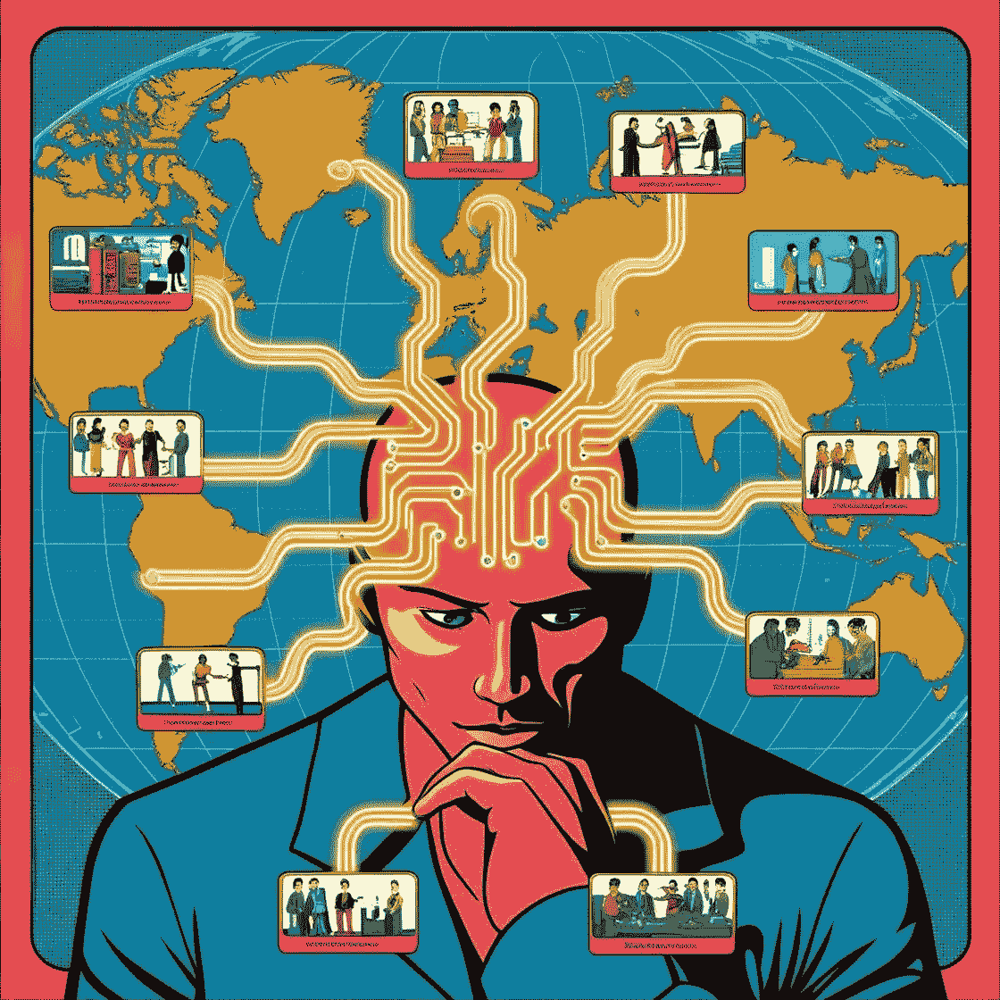

# 当机器开始思考未来：战略性人工智能的崛起

> 原文：[`towardsdatascience.com/when-machines-think-ahead-the-rise-of-strategic-ai-91052e4c5da9?source=collection_archive---------2-----------------------#2024-11-04`](https://towardsdatascience.com/when-machines-think-ahead-the-rise-of-strategic-ai-91052e4c5da9?source=collection_archive---------2-----------------------#2024-11-04)

## [战略性人工智能](https://medium.com/@hc.ekne/list/strategic-ai-72a460668137)

## 探讨战略性人工智能的进展，以及大型语言模型在大局中的角色

 [Hans Christian Ekne](https://medium.com/@hc.ekne?source=post_page---byline--91052e4c5da9--------------------------------)

·发表于[Towards Data Science](https://towardsdatascience.com/?source=post_page---byline--91052e4c5da9--------------------------------) ·阅读时间 27 分钟·2024 年 11 月 4 日

--

该图由作者使用 Canva Magic Studio 生成

# 序言

## 1997 年 5 月 11 日，纽约市。

那是一个美丽的春日，纽约市的天气格外宜人。天空湛蓝，气温逐渐上升，接近 20 摄氏度。洋基队准备在洋基体育场与堪萨斯城皇家队进行比赛，而纽约游骑兵队则在麦迪逊广场花园与魔鬼队展开对决。

一切看似平常，但聚集在曼哈顿中城 Equitable 大厦的人们即将经历一场真正独特的事件。他们将亲眼见证历史性时刻——一台计算机将在标准比赛条件下首次战胜现任世界冠军。

代表人类的是 Gary Kasparov，当时被广泛认为是世界顶级棋手。而代表机器的是 Deep Blue——一款由 IBM 开发的国际象棋计算机。在这场比赛的第六局决胜局之前，两位选手各自获得了 2.5 分。今天，胜负将最终揭晓。

Gary 最初执黑，但很快犯了一个错误，遭遇了 Deep Blue 的强烈、攻击性打法。仅仅 19 步后，比赛便结束了。Kasparov 感到气馁且承受着巨大压力，认为自己的位置已经无法维持，于是选择了认输。这一符号性时刻，被许多人视为人类与机器之间最重要的时刻之一。这个具有里程碑意义的事件标志着人工智能发展的转折点，突显了战略性人工智能的潜力和挑战。

# 介绍

图片由作者使用 Canva Magic Studio 生成

受最近生成式 AI 进展的启发——以及我自己对大型语言模型及其战略能力的实验——我越来越多地在思考战略性 AI。我们过去是如何尝试接近这个话题的？有哪些挑战，又有哪些问题仍需解决，才能拥有一个更具通用性的战略性 AI 代理？

作为数据科学家，我们越来越多地为客户和雇主实施 AI 解决方案。对于整个社会而言，随着与 AI 的互动日益增加，理解 AI 的发展，尤其是战略性 AI，变得至关重要。一旦我们拥有能够在战略背景中灵活操作的自主代理，这将对每个人产生深远的影响。

那么，当我们说*战略性 AI*时，究竟是什么意思呢？从本质上讲，战略性 AI 涉及机器做出决策，不仅考虑潜在的行动，还要预测和影响他人的反应。这是关于在复杂、不确定的环境中最大化期望结果的。

在本文中，我们将定义战略性 AI，探讨它是什么，以及自从 1997 年 IBM 的深蓝战胜卡斯帕罗夫以来它是如何发展的。我们将尝试理解一些模型的一般架构，并且还会考察大型语言模型（LLMs）如何融入其中。通过理解这些趋势和发展，我们可以更好地为一个自主 AI 代理融入社会的世界做好准备。

# 定义战略性 AI

图片由作者使用 Canva Magic Studio 生成

对战略性 AI 的深入讨论始于对这一话题的明确定义。

当我们在商业环境中考虑战略时，我们通常会将其与长期思维、资源分配与优化、对组织中相互依赖关系的整体理解、决策与公司使命和目标的对齐等话题联系在一起。虽然这些话题值得考虑，但在涉及 AI 和自主代理时，我通常更喜欢使用博弈论的战略定义。在这种情况下，我们将“战略性”定义为：

> 选择一个行动方案，最大化你的期望收益，不仅要考虑你自己的潜在行动，还要考虑他人如何回应这些行动，以及你的决策如何影响环境的整体动态。

这个定义的关键部分是，战略选择是那些并非在真空中做出的选择，而是在其他参与者的背景下做出的，这些参与者可以是人类、组织或其他 AI。这些其他实体可能有相似的或相互冲突的目标，并可能尝试采取战略行动以进一步推动自身利益。

此外，战略选择总是力图**最大化期望回报**，无论这些回报是以金钱、效用还是其他价值衡量标准为基础。如果我们想要融入更多传统的与战略相关的“商业”话题，可以想象我们希望最大化一家公司的价值，目标是 10 年后的情况。在这种情况下，为了制定出好的战略，我们需要采取“长期”的视角，可能还会考虑公司的“使命和目的”，以确保与战略的一致性。然而，追求这些目标只是采取战略性行动的一个结果。

游戏理论中的战略视角捕捉了战略决策的本质，因此使我们能够清晰地定义什么是战略人工智能。从定义中我们可以看出，如果一个人工智能系统或代理要进行战略性行动，它需要具备几个核心能力。具体而言，它需要能够：

+   **模拟其他代理**（使用预测技术或概率推理；这些代理可以是人类、人工智能或组织）。

+   **基于预期效用优化行动**。

+   **动态适应**，随着收集到其他代理策略的新信息。

当前没有一个广为人知或已发布的系统，能够在现实世界中以自主方式执行这些所有操作。然而，考虑到人工智能系统的最新进展以及大型语言模型（LLMs）的快速崛起，这种情况可能即将发生变化！

# 游戏理论中的其他重要概念

图片由作者使用 Canva Magic Studio 生成

在进一步讨论战略人工智能之前，回顾一些游戏理论中的概念和思想可能会有所帮助。许多关于战略人工智能的工作都基于游戏理论的概念，使用游戏理论中的定理可以揭示某些性质，使得某些游戏和情境比其他情境更容易处理。这也有助于突出游戏理论在应对现实世界情境时的局限性，并强调我们可能更适合从其他方向寻找灵感。

## 什么是游戏？

我们将游戏定义为一个包含三个关键组件的数学模型：

1.  **玩家**：做出决策的个人或实体。

1.  **策略**：每个玩家可以采取的可能行动或计划。

1.  **回报**：每个玩家根据选择的策略所获得的奖励或结果。

这种正式的结构使得战略互动和决策过程的系统性研究成为可能。

## 有限游戏与无限游戏

在讨论游戏时，区分有限游戏和无限游戏也是有意义的。

有限游戏有一组固定的玩家，定义的规则和明确的终点。目标是获胜，例子包括象棋、围棋、跳棋和大多数传统棋盘游戏。

另一方面，无限游戏没有预定的结束点，规则可以随着时间的推移而演变。其目标不是赢得胜利，而是继续游戏。像商业竞争或社会演变这样的现实世界情境可以看作是无限游戏。冷战可以作为无限游戏的一个例子。它是美国及其盟国（西方）与苏联及其盟国（东方）之间长期的地缘政治斗争。这场冲突没有固定的终点，战略和“规则”随着时间变化。

## 子博弈

有时我们可能会在一个更大的游戏背景中找到较小的游戏。从数学角度来看，子博弈是一个自成体系的游戏，并且需要满足一些不同的标准：

1.  子博弈从玩家清楚自己在游戏中的位置的时刻开始。

1.  它包含了从那个时刻开始可能发生的所有行动和结果。

1.  它包含了所有玩家的知识和与这些行动相关的不确定性。

我们可以通过想象一棵代表整个游戏的大树来可视化一个子博弈。子博弈就像从某个特定点（节点）开始选择这棵树的一条分支，并包括从该节点延伸出来的所有内容，同时确保该分支中的任何不确定性都被完全呈现。

子博弈背后的核心理念使它在我们讨论战略人工智能时变得有用。原因主要在于，一些玩家之间的无限游戏可能非常复杂且难以建模，而如果我们选择在这个游戏中查看较小的游戏，就能更成功地应用博弈理论分析。

回到我们以冷战作为无限游戏的例子，我们可以在这一背景中识别出几个子博弈。一些例子包括：

**古巴导弹危机（1962 年）**：

+   **玩家**：美国和苏联。

+   **策略**：美国考虑了从外交谈判到军事入侵的各种选项，而苏联则需要决定是否撤除导弹或升级对抗。

+   **回报**：避免核战争，维持全球形象，以及战略军事定位。

**柏林封锁与空运（1948–1949 年）**：

+   **玩家**：西方盟国和苏联。

+   **策略**：苏联封锁柏林以迫使盟国撤出，而盟国则必须决定是放弃这座城市还是通过空运进行供应。

+   **回报**：控制柏林，展示政治决心，影响欧洲的政治走向。

尽管当然非常困难和复杂，但这两个“子博弈”比整个冷战更容易分析和制定反应。它们有一组明确的玩家，有限的策略和回报，并且时间框架也更为清晰。这使得它们更适合进行博弈理论分析。

在战略人工智能的背景下，分析这些子博弈对开发能够在复杂动态环境中做出最优决策的智能系统至关重要。

## **双人博弈**

双人博弈指的是两名玩家之间的游戏。例如，这可以是两名国际象棋玩家之间的对局，或者回到我们的冷战例子，西方与东方的对抗。只有两个玩家的博弈简化了分析，但仍能捕捉到基本的竞争或合作动态。博弈论中的许多结果都是围绕双人博弈展开的。

## **零和博弈**

零和博弈是一类博弈，其中一个玩家的收益是另一个玩家的损失。总的支付保持不变，玩家之间是直接竞争的关系。

## 纳什均衡与最优行动

纳什均衡（NE）是指一组策略，在此状态下，没有玩家能够通过单方面改变自己的策略而获得额外的好处，前提是其他玩家保持不变。在这种状态下，每个玩家的策略都是对其他玩家策略的最佳回应，导致一个稳定的结果，其中没有玩家有动机偏离该策略。

例如，在剪刀石头布（RPS）游戏中，纳什均衡是所有玩家随机地以相等的概率选择石头、纸和剪刀的状态。如果你作为玩家选择纳什均衡策略，你可以确保没有其他玩家能够利用你的出招，并且在双人零和博弈中，可以证明你期望不会失败，最糟糕的结果是打平。

然而，选择纳什均衡策略可能并不总是最优策略，特别是当对手以可预测的次优方式进行游戏时。考虑一个有两个玩家 A 和 B 的场景。如果 B 玩家开始更多地选择“纸”，A 玩家可以识别这一点并增加“剪刀”的出场频率。然而，A 的这种偏离行为可能会再次被 B 利用，B 可能会改变策略，更多地选择“石头”。

## **关于战略人工智能的关键要点**

回顾博弈论的概念，子博弈的思想对于战略人工智能尤其有用。在更大范围的上下文中找到可能的小型且更易于分析的博弈，使得应用已经知道的解决方案和解算器变得更加容易。

例如，假设你正在发展自己的职业生涯，这可以被归类为一种无限博弈，并且很难“解决”，但突然间，你获得了谈判新合同的机会。这个谈判过程为你的职业生涯中提供了一个子博弈的机会，使用博弈论概念的战略人工智能会使这个过程更加易于接近。

事实上，人类在我们的生活中已经创造了数千年的子游戏。大约 1500 年前，在印度，我们创造了如今所知的象棋的起源。象棋证明对人工智能而言是一个相当大的挑战，但也促使我们开始开发更加成熟的工具和技术，这些工具和技术可以应用于更加复杂和困难的战略性情境。

# 战略人工智能在游戏中的简短历史

该图像由作者使用 Canva Magic Studio 生成

游戏为开发战略性人工智能提供了一个极佳的试验场。游戏的封闭性使得训练模型和开发解决方案比开放系统更为容易。游戏的规则明确；玩家已知，回报也已知。一个重要且早期的里程碑是深蓝（Deep Blue），这台机器击败了世界象棋冠军。

## **早期里程碑**：深蓝

深蓝是由 IBM 在 1990 年代开发的象棋超级计算机。如同序言中所述，1997 年 5 月，它通过在六局比赛中击败当时的世界象棋冠军加里·卡斯帕罗夫（Garry Kasparov）创造了历史。深蓝采用了专门的硬件和算法，能够每秒评估 2 亿个象棋局面。它将暴力搜索技术与启发式评估函数相结合，使其能够比任何先前的系统深入搜索潜在的走法序列。深蓝的特别之处在于它能够迅速处理大量局面，成功应对象棋的组合复杂性，标志着人工智能的一大里程碑。

然而，正如加里·卡斯帕罗夫在与莱克斯·弗里德曼（Lex Fridman）¹的采访中所指出的那样，深蓝更像是一台暴力机器，而非智能机器，因此很难将其归类为某种类型的智能。其搜索的核心基本上只是反复试错。说到错误，它比人类犯的错误要少得多，而根据卡斯帕罗夫的说法，这也是它很难被击败的一个特点。

## **复杂游戏的进展**：AlphaGo

在深蓝赢得象棋比赛的 19 年后，谷歌 DeepMind 团队开发出了另一款模型，这为人工智能历史上的一个特殊时刻做出了贡献。2016 年，AlphaGo 成为第一个击败世界围棋冠军李世石的人工智能模型。

围棋是一项源自亚洲的古老棋类游戏，以其深奥的复杂性和庞大的可能局面数而著称，远远超过象棋。AlphaGo 将深度神经网络与蒙特卡罗树搜索相结合，使其能够有效地评估局面并规划走法。AlphaGo 在推理时所给予的时间越多，它的表现就越好。

这个 AI 在人类专家的对局数据集上进行了训练，并通过自我对弈进一步提升。AlphaGo 的特别之处在于它能处理围棋的复杂性，利用先进的机器学习技术在这一被认为难以被 AI 掌握的领域实现了超人类的表现。

有人可能会认为 AlphaGo 比 Deep Blue 更具智能，因为它具有深度评估棋盘状态并选择走法的卓越能力。2016 年它与李世石的对局中的第 37 手就是一个经典例子。对于熟悉围棋的人来说，那是第五路的肩膀打击，最初让包括李世石本人在内的解说员都感到困惑。但后来证明，这一手是一次精彩的走法，展示了 AlphaGo 如何探索人类玩家可能忽视和忽略的策略。

## 结合国际象棋与围棋：AlphaZero

一年后，Google DeepMind 再次成为新闻焦点。这一次，他们从 AlphaGo 中汲取了许多经验，创造了 AlphaZero，这是一个更具通用性的 AI 系统，掌握了国际象棋、围棋和将棋。研究人员能够通过自我对弈和强化学习来构建这个 AI，而无需依赖人类的先验知识或数据。与依赖手工制作的评估函数和广泛开局库的传统国际象棋引擎不同，AlphaZero 使用了深度神经网络和一种结合蒙特卡洛树搜索与自我学习的新算法。

该系统从仅具备基本规则开始，通过与自己对弈数百万局来学习最佳策略。AlphaZero 的特别之处在于它能够发现创造性且高效的策略，展示了一个新的 AI 模式，利用自我学习而非人类工程化知识。

## 结合速度与策略：《星际争霸 II》

在继续主宰 AI 领域的过程中，Google DeepMind 团队将焦点转向了一个备受欢迎的电脑游戏——《星际争霸 II》。2019 年，他们开发了一个名为 AlphaStar² 的 AI，该 AI 能够达到大师级水平，并在竞争排行榜上超过 99.8% 的人类玩家。

《星际争霸 II》是一款实时战略游戏，给 DeepMind 团队带来了几个新颖的挑战。游戏的目标是通过收集资源、建造建筑物和积累能击败对手的军队，来征服对手玩家。游戏中的主要挑战来自于需要考虑的巨大动作空间、实时决策、由于战争迷雾而导致的部分可观察性，以及长期战略规划的需求，因为某些游戏可能会持续数小时。

通过借鉴先前 AI 技术的发展，如通过自我对弈的强化学习和深度神经网络，团队成功开发出了一个独特的游戏引擎。首先，他们使用监督学习和人类游戏数据训练了一个神经网络。接着，利用该网络启动了一个能够在多代理游戏框架中自我对弈的算法。DeepMind 团队创建了一个虚拟联赛，在这个联赛中，代理能够相互探索策略，成功的策略会得到奖励。最终，他们将联赛中的策略整合成一个超级策略，这个策略能够在面对不同对手和多种策略时保持有效。正如他们所言³：

> 最终的 AlphaStar 代理由[联盟的纳什分布](https://papers.nips.cc/paper/7588-re-evaluating-evaluation.pdf)组成——换句话说，就是发现的最有效策略的混合体——并运行在一台桌面 GPU 上。

## **深入探讨 Pluribus 和扑克**

我非常喜欢玩扑克，曾在特隆赫姆（Trondheim）生活和学习时，我们每周都会举行一次现金牌局，有时气氛相当紧张！战略性人工智能克服的最后一个里程碑便是在扑克游戏中。特别是，在扑克中最流行的形式之一——6 人无限注德州扑克。这个游戏使用的是一副包含 52 张牌的常规扑克牌，游戏遵循以下结构：

1.  **前翻牌阶段（The Preflop）：** 所有玩家被发放 2 张手牌（口袋牌），这些牌只有玩家自己知道其点数。

1.  **翻牌（The Flop）：** 三张牌被翻开，所有玩家都能看到这三张牌。

1.  **转牌（The Turn）：** 又一张牌被翻开，正面朝上。

1.  **河牌（The River）：** 最后一张第五张牌被翻开，正面朝上。

玩家可以利用桌面上的公共牌和自己手中的两张牌，组成一手 5 张牌的扑克组合。在每一轮游戏中，玩家轮流下注，游戏可以在任何一轮结束，如果有玩家下注而其他玩家不愿跟注。

尽管学习起来相对简单，只需了解各种扑克牌型的排名，这个游戏通过人工智能的努力，依然证明是非常难以解决的，尽管已有数十年的尝试。

解决扑克问题的难度由多个因素导致。首先，我们面临隐藏信息的问题，因为你并不知道其他玩家手中有哪几张牌。其次，我们有一个多人对战的局面，参与的玩家越多，可能的互动和策略就呈指数级增长。第三，扑克游戏有无限制的下注规则，这导致了一个复杂的下注结构，玩家可以突然决定将自己的所有筹码押上。第四，游戏树的复杂度巨大，这源于口袋牌、公共牌和下注顺序的不同组合。此外，还有因扑克牌的随机性、虚张声势的可能性和对手建模的复杂性带来的挑战！

直到 2019 年，研究人员 Noam Brown 和 Tuomas Sandholm 才最终破解了这个难题。在《科学》期刊上发表的论文中，他们描述了一种新型的扑克人工智能——Pluribus——它成功地击败了世界上最顶尖的玩家，在 6 人无限注德州扑克中获胜。⁴他们进行了两次不同的实验，每个实验都包括 10000 局扑克，而这两个实验都清楚地显示了 Pluribus 的优势。

在第一次实验中，Pluribus 与 5 位人类对手对战，取得了每局 48 mbb（毫大盲注）的平均胜率，标准差为 25 mbb/局。（mbb/局代表每 1000 局游戏中赢得的毫大盲注数量。）48 mbb/局被认为是一个非常高的胜率，尤其是在精英扑克玩家中，这意味着 Pluribus 比人类对手更强。

在第二次实验中，研究人员让 5 个版本的 Pluribus 与 1 位人类对战。他们设置了实验，使得 2 个不同的人类各自与这 5 台机器对战 5000 局。最终，Pluribus 以每局平均 32 mbb 的优势战胜了人类，标准误差为 15 mbb/局，再次展示了其战略上的优越性。

Pluribus 的优势非常惊人，特别是考虑到研究人员必须克服的所有复杂性。Brown 和 Sandholm 提出了几种聪明的策略，帮助 Pluribus 变得超越人类，并在计算上比以往的顶级扑克 AI 更高效。他们的一些技术包括：

1.  使用两种不同的算法来评估操作。他们首先使用所谓的“蓝图策略”，该策略是通过让程序与自己对战并采用一种称为蒙特卡罗反事实遗憾最小化的方法创建的。这个蓝图策略将用于第一轮投注，但在随后的投注回合中，Pluribus 会进行实时搜索，以找到更好、更精细的策略。

1.  为了使其实时搜索算法更加高效，他们采用了深度限制搜索，并评估对手可能选择的 4 种不同策略。首先，他们会评估每个策略 2 步之内的效果。此外，他们只评估对手的四种不同策略，包括原始的蓝图策略、一种偏向于弃牌的蓝图策略、一种偏向于跟注的蓝图策略和一种偏向于加注的最终蓝图策略。

1.  他们还使用了各种抽象技术来减少可能的游戏状态数量。例如，由于 9 高顺子本质上与 8 高顺子相似，因此可以将它们以类似的方式看待。

1.  Pluribus 将连续的投注空间离散化成一组有限的“桶”，使得考虑和评估各种投注大小变得更加容易。

1.  此外，Pluribus 还以一种平衡的方式调整它的策略，在每一局它所玩的手牌中，它还会考虑到在该情形下可能出现的其他手牌，并评估如何玩这些手牌，从而确保最终的玩法是平衡的，进而更难被反制。

从 Pluribus 中可以得出一些有趣的观察，但或许最有趣的是，它在面对不同对手时并不改变自己的玩法，而是发展出了一种对多种玩家都有效的稳健策略。由于许多扑克玩家认为他们必须根据不同的情况和人群调整自己的玩法，Pluribus 向我们展示了这一点是多余的，甚至可能不是最优策略，鉴于它击败了所有与之对战的玩家。

在我们对博弈论的简短探讨中，我们注意到，如果你在双人零和游戏中采用 NE 策略，那么在期望值上你可以保证不会输。然而，对于像 6 人扑克这样的多人游戏来说，并不存在这样的保证。Noam Brown 推测⁵，或许正是扑克等游戏的对抗性特征使得它仍然适合尝试用 NE 策略来接近。相反，在像《风险》这样玩家可以更多合作的游戏中，追求 NE 策略并不一定有效，因为如果你在与 6 人玩的《风险》游戏中，若你的 5 个对手决定联合起来攻击你并将你淘汰，那么你无能为力。

## 评估战略 AI 的趋势

总结战略 AI 在游戏中的历史，我们看到一个明显的趋势正在形成。游戏正逐渐但稳步地接近人类日常生活中所面临的现实战略情境。

首先，我们正在从双人游戏过渡到多人游戏。这可以从最初在双人游戏中的成功到 6 人扑克等多人游戏的出现中看出。其次，我们看到在掌握含有隐藏信息的游戏方面的进展。第三，我们还看到在掌握更多随机元素的游戏方面的进步。

隐藏信息、多玩家设置和随机事件在人类的战略互动中是常态，而非例外，因此，掌握这些复杂性对于实现能够在现实世界中导航的更为通用的超人类战略 AI 至关重要。

# 大型语言模型与战略 AI

图片由作者使用 Canva Magic Studio 生成

我最近进行了一项实验，让 LLM 相互对战桌面游戏《风险》。我的实验目标是评估 LLM 在战略环境中的表现，基本上是“开箱即用”的状态。当然，为了提供正确的上下文，给这些代理人做了大量详细的提示，但也许并不令人意外的是，LLM 的表现相当平庸。

你可以在这里找到关于这个实验的文章：

 ## 探索 LLM 在风险游戏环境中的战略能力

### 在一个模拟的风险环境中，Anthropic、OpenAI 和 Meta 的大型语言模型展示了不同的战略能力……

towardsdatascience.com

总结实验中的一些关键发现，目前一代的大型语言模型在处理像防御和识别制胜之举等基本战略概念时存在困难。它们也未能在战略上有利时消除其他玩家。

上述实验表明，尽管我们已看到 LLM 的快速进步，但它们仍然缺乏战略推理的复杂性。考虑到它们的训练数据非常通用，并且它们的构建方式，这一点并不令人惊讶。

那么，它们如何融入到战略 AI 的讨论中呢？为了理解这一点，我们需要了解 LLM 真正擅长的是什么。也许 LLM 最有前途的特性是它们能够处理和生成大量文本。现在，随着多模态模型的出现，它们还可以处理视频和音频。换句话说，LLM 非常适合与现实世界互动，无论是在人类还是其他背景下。最近，Meta 的一个 AI 团队成功将语言模型的通用语言能力与战略引擎的战略洞察结合起来。

## 案例研究：Cicero 与《外交》

《外交》是一款 2 至 7 人玩的策略游戏，Meta 将其描述为《风险》《扑克》和电视节目《幸存者》的混合体。玩家们从约 1900 年的欧洲地图开始，目标是控制大多数补给中心。具体来说，玩家需要控制 34 个补给中心中的 18 个才能获得胜利。通过这样做，玩家实际上支配了地图，代表了他们的国家在第一次世界大战前夕对欧洲的主导地位。

《外交》与我们迄今讨论的许多其他游戏不同之处在于它依赖于玩家之间的谈判。这是一种比扑克等游戏更具合作性的玩法形式。每位玩家在每回合之前使用自然语言与其他玩家进行交流，并制定结盟计划。当所有准备工作完成后，所有玩家同时揭示他们的计划，并执行回合。这种类型的游戏显然比大多数其他棋盘游戏更接近实际的外交和现实中的谈判，然而由于自然语言的因素，AI 很难掌握。

这种情况在 2022 年发生了变化，当时 Meta 的 AI 团队开发了 Cicero。利用最新的语言建模进展，并结合战略模块，Cicero 是一款能够“超越人类玩家平均得分两倍以上，并排名前 10%的多局游戏参与者”的游戏引擎⁶。正如 Meta 所描述的，他们的模型能够生成以策略为基础的对话，并且能够生成意识到策略的对话。

## Cicero 与其他战略 AI 模型的区别

《外交》与其他一些近期取得战略 AI 进展的游戏之间存在一些关键区别。最显著的是该游戏的合作性质——与其他游戏的对抗性质相比——以及它使用的开放式自然语言格式。我认为这些差异使得该游戏更像真实的人类互动，但它也对研究人员训练支撑 Cicero 的算法提出了限制。

与 Pluribus 和 AlphaZero 不同，Cicero 并非主要通过自我对弈和强化学习进行训练。相反，Meta 团队使用了一个包含超过 125,000 场游戏和 40,000,000 条消息的数据集来帮助训练算法。他们认为，考虑到游戏中的谈判、说服和建立信任等方面，如果让 AI 通过自我对弈进行谈判，可能会出现奇怪的行为，并且可能无法捕捉到人类互动的本质。引用他们的研究文章：

> “…我们发现，一个在 2p0s 版本的游戏中表现出超人类表现的自我对弈算法，在与多个真人玩家进行的游戏中表现较差，因为它学到的策略与潜在的人类盟友的规范和期望不一致。”

然而，强化学习确实被用来训练部分战略引擎，具体来说，它被用来训练 Cicero 的价值函数——即它预测行为效用所需要的函数。研究人员使用了修改版的行为克隆算法 piKL，该算法旨在最大化某一行为的预期效用，同时最小化与人类行为的差异⁶。简而言之，他们希望模型能够找到战略上合理的行动，同时尽量贴近人类的行为。

上述《外交》游戏的特点突显了一些与在真实世界人类环境中操作的战略 AI 创建相关的重要问题，在评估战略 AI 未来发展时需要加以考虑。

# 战略 AI 的未来

图片由作者使用 Canva Magic Studio 生成

预测未来总是充满挑战，但一种方法是利用当前的趋势并将其外推到未来情境。以下，我们探讨一些与之前讨论密切相关的主题，并评估它们如何影响战略 AI 的未来。

## **通用符号战略引擎与专门化模块**

如果我们回顾目前战略 AI 引擎的发展轨迹，一个显著的特点是每个游戏引擎的专门化程度。尽管这些架构可能相似——就像 AlphaZero 学习如何玩多种不同的游戏——但 AI 仍然会为每个特定游戏进行数百万次自我对弈。例如，对于国际象棋，AlphaZero 进行了 4400 万局游戏，对于围棋则进行了 1.3 亿局游戏！⁷ 一个自然的问题是，我们是否应该尝试构建更通用的战略引擎，还是继续专注于为特定任务提供专门化模块？

一个通用战略引擎的目标是理解并应用跨不同情境的广泛战略原则。也许通过创造能够捕捉人类战略互动各个方面的游戏，AI 可以通过与自己对弈来学习，并制定适用于现实世界场景的战略。这种方法可能有助于 AI 进行学习的泛化，使其在各种情境中都能发挥作用。

另一方面，专门化模块是为特定情境或任务设计的 AI 系统。我们可以设想，通过结合多个专门化代理，我们能够创建一个通用的战略 AI。AI 代理可以被训练在每个特定领域中表现卓越，在最需要的地方提供深度专业知识。尽管这种方法可能限制了 AI 的泛化能力，但它能确保在特定领域内的高性能，从而更快地推动实际应用。

鉴于在合作环境中使用 AI 进行自我对弈所面临的问题——正如我们在《外交》游戏中所观察到的——以及当前的趋势似乎更倾向于为不同的战略情境提供专门化模块，因此在短期内，我们很可能会拥有针对不同情境的专门化战略模块。然而，人们也可以设想一种混合系统，在这种系统中，我们使用通用战略引擎为更广泛的主题提供洞察，而专门化模块则处理复杂的具体挑战。通过这种平衡，AI 系统可以在适应特定情境细节的同时，应用通用战略洞察。

## **大型语言模型弥合战略模块与现实世界应用之间的差距**

大型语言模型改变了 AI 与人类语言的互动方式，提供了一种强大的方式，将战略 AI 模块与现实世界应用案例连接起来。LLMs 擅长理解和生成类人文本，使它们成为理想的中介，可以将现实世界的情境转化为战略引擎能够处理的结构化数据。正如 Meta 的 Cicero 所展示的那样，将 LLMs 与战略推理结合，允许 AI 理解人类沟通、进行谈判并在协作环境中制定行动计划。

鉴于目前向多模态模型发展的趋势，LLMs（大型语言模型）越来越能够将不仅仅是文本，而是任何现实世界的情境转化为机器可读的语法。这使得这些模型作为中介变得更加有用。

如果我们在 Cicero 开发的思想基础上继续发展，我们也许可以设想针对特定任务（如外交沟通）微调不同的语言模型——可能通过在历史外交信函上进行微调，然后训练独立的战略引擎来提出最佳行动方案。

## **人类-人工智能协作：半人马模型**

战略性人工智能的未来不仅仅是机器接管决策过程；在过渡期内，它也涉及人类与人工智能的有效合作。这种合作伙伴关系通常被称为“半人马模型”，即将人类的直觉与人工智能的计算能力相结合。在这种模型中，人类带来创造力、伦理判断和灵活性，而人工智能系统则提供强大的数据处理能力和战略原则的一致应用。

这一模型的现实世界应用包括那些人类-人工智能团队表现优于单独工作的人类或机器的领域。例如，在国际象棋中，Garry Kasparov 提出了与人工智能合作的想法，将人类的战略洞察力与人工智能的精准计算相结合。半人马模型在国际象棋中似乎运作良好，直到程序变得非常强大。此时，人类的贡献变得毫无价值，最糟糕的情况下甚至可能是有害的。

然而，在其他更开放、更多元化、且更接近现实世界的领域，半人马模型可能是一个较好的选择。只需考虑人类与现代大型语言模型（LLM）合作的方式，这种合作有潜力显著提升生产力。

这种协作方法通过将人类判断与人工智能分析相结合，改进了决策过程，可能导致更有依据和平衡的结果。它使得在面对新情况和意外情境时能够迅速适应，因为人类可以在人工智能的支持下实时调整策略。

## **超越游戏的现实世界应用**

游戏一直是开发战略性人工智能的一个重要测试平台，但真正的影响来自于将这些进展应用于现实世界的挑战。以下是一些例子。

近年来，一个取得巨大进展的领域是自动驾驶汽车，它们如何利用战略性人工智能安全地导航道路。自动驾驶汽车必须预测并应对其他驾驶员、行人和骑行者的行动。例如，一辆自动驾驶汽车需要预测是否有行人即将过马路，或是其他驾驶员是否即将无预警地变道。

就在今年，Waymo——一家开发自动驾驶汽车和共享出行服务的公司——在美国的三个城市启动了完全自动驾驶的出租车服务：亚利桑那州的凤凰城，加利福尼亚州的洛杉矶和旧金山。在未来几年，我们可能会看到由于战略性人工智能的进步，完全自动驾驶车辆的大幅增长。

在金融市场中，人工智能驱动的交易系统分析大量数据以做出投资决策。这些系统考虑到其他市场参与者（如交易员和机构）的可能行为，以预测市场波动。它们利用战略推理执行交易，以最大化回报并最小化风险，通常是在高度波动的环境中。

人工智能系统还通过考虑供应商、竞争者和客户的行为来优化供应链。它们可以根据预期需求和竞争者的行为，战略性地调整生产计划、库存水平和物流。例如，如果预计竞争者将推出新产品，人工智能可以建议增加库存量，以应对潜在的需求增加。

战略人工智能还被用于有效地管理能源分配。智能电网利用人工智能预测消费模式并相应调整供应。它们考虑消费者在价格信号或环境因素的影响下可能改变使用模式。人工智能战略性地分配资源，以平衡负载、预防停电并整合可再生能源。

以上例子清楚地展示了战略人工智能如何被整合到各个行业和领域中。通过考虑他人的行动，这些人工智能系统做出明智的决策，从而优化结果、提高效率，并常常提供竞争优势。随着战略人工智能的不断改进，这些系统也将不断进步，我们很可能会在许多其他领域看到它们的出现。

# 结论

由作者使用 Canva Magic Studio 生成的图像

自从深蓝战胜加里·卡斯帕罗夫以来，战略人工智能已经取得了长足进展。从掌握复杂的棋类游戏到进行类人化的谈判，人工智能系统越来越多地展现出战略推理能力。

在本文中，我们研究了战略人工智能的基础概念，强调了博弈论的重要性，以及该领域的一些概念如何应用于战略人工智能。我们还探讨了专门化的人工智能系统如何通过专注于狭窄领域和广泛的自我对弈，在特定游戏中实现超人类的表现。这引发了一个问题：战略人工智能的未来是发展能够广泛应用的通用符号战略引擎，还是继续开发针对特定任务量身定制的专门模块。

正如我们在 Cicero 中看到的那样，语言模型也可能在战略人工智能领域有一席之地。来自 OpenAI、Anthropic 和 Meta 等提供商的新模型使得将这些工具集成到自主智能体中比以往任何时候都更加容易，这些智能体能够利用它们将现实世界转化为人工智能系统可以处理的结构化数据。

然而，朝着能够应对现实世界复杂性的通用战略 AI 的旅程才刚刚开始。开发能够跨领域泛化、适应不可预见情况，并将伦理考量融入决策过程的系统仍然面临挑战。

感谢阅读！

**想要在我发布新文章时收到通知吗？ ➡️** [**点击这里订阅我的新闻通讯**](https://ekneconsulting.com/register_subscriber/) **⬅️。完全免费，您随时可以取消订阅！**

*如果您喜欢阅读这篇文章，并希望获取更多我的内容，欢迎在 LinkedIn 上与我联系* [*https://www.linkedin.com/in/hans-christian-ekne-1760a259/*](https://www.linkedin.com/in/hans-christian-ekne-1760a259/) *，或者访问我的网站* [*https://www.ekneconsulting.com/*](https://www.ekneconsulting.com/) *，了解我提供的部分服务。也欢迎通过电子邮件联系我，邮箱地址是 hce@ekneconsulting.com*

# 参考文献

1.  Lex Fridman. (2019 年 10 月 27 日). Garry Kasparov: Chess, Deep Blue, AI, and Putin | Lex Fridman Podcast #46 [视频文件]. Youtube. [`youtu.be/8RVa0THWUWw?si=1ErCnwlAn4myoK9W`](https://youtu.be/8RVa0THWUWw?si=1ErCnwlAn4myoK9W)

1.  Vinyals, O., Babuschkin, I., Czarnecki, W.M. *等人.* 使用多智能体强化学习在《星际争霸 II》中达到大师级水平。*Nature* 575, 350–354 (2019). [`doi.org/10.1038/s41586-019-1724-z`](https://doi.org/10.1038/s41586-019-1724-z)

1.  [`deepmind.google/discover/blog/alphastar-mastering-the-real-time-strategy-game-starcraft-ii/`](https://deepmind.google/discover/blog/alphastar-mastering-the-real-time-strategy-game-starcraft-ii/)

1.  Brown 等人. (2019 年 8 月 30 日). 超人类 AI 在多人扑克中的应用。*Science 365, 885–890, (2019).* [`www.science.org/doi/epdf/10.1126/science.aay2400`](https://www.science.org/doi/epdf/10.1126/science.aay2400)

1.  Lex Fridman. (2022 年 12 月 6 日). Noam Brown: AI 与人类在扑克和战略谈判游戏中的对抗 | Lex Fridman Podcast #344 [视频文件]. Youtube. [`youtu.be/2oHH4aClJQs?si=AvE_Esb42GNGIPRG`](https://youtu.be/2oHH4aClJQs?si=AvE_Esb42GNGIPRG)

1.  [Meta Fundamental AI Research Diplomacy Team (FAIR)†](https://www.science.org/action/doSearch?ContribAuthorRaw=Meta+Fundamental+AI+Research+Diplomacy+Team+FAIR) *等人,* 通过结合语言模型与战略推理，在游戏*外交*中实现人类级别的玩法。*Science* ***378**,1067 1074(2022).DOI：[10.1126/science.ade9097](https://doi.org/10.1126/science.ade9097)，[`noambrown.github.io/papers/22-Science-Diplomacy-TR.pdf`](https://noambrown.github.io/papers/22-Science-Diplomacy-TR.pdf)

1.  David Silver *等人，* 一种通用强化学习算法，通过自我对弈掌握国际象棋、将棋和围棋。*科学杂志* **362**，1140–1144（2018）。DOI：[10.1126/science.aar6404](https://doi.org/10.1126/science.aar6404) [`storage.googleapis.com/deepmind-media/DeepMind.com/Blog/alphazero-shedding-new-light-on-chess-shogi-and-go/alphazero_preprint.pdf`](https://storage.googleapis.com/deepmind-media/DeepMind.com/Blog/alphazero-shedding-new-light-on-chess-shogi-and-go/alphazero_preprint.pdf)
