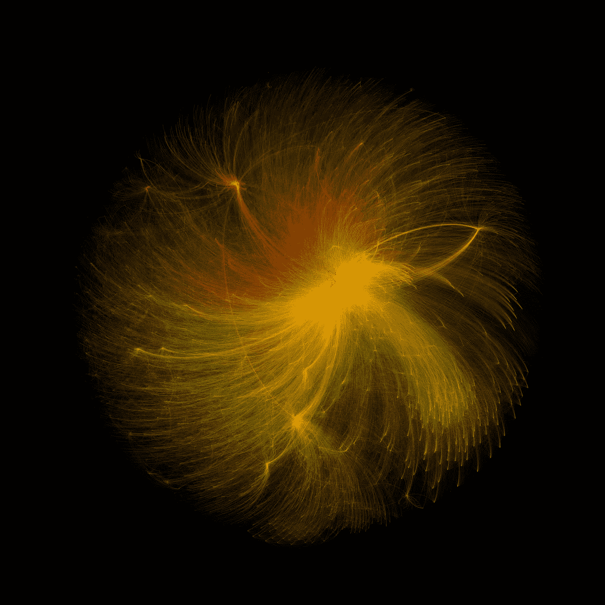

# 欧盟 Horizon H2020 资金流向何方？

> 原文：[`towardsdatascience.com/where-do-eu-horizon-h2020-fundings-go-79f31b59af7d?source=collection_archive---------5-----------------------#2024-03-28`](https://towardsdatascience.com/where-do-eu-horizon-h2020-fundings-go-79f31b59af7d?source=collection_archive---------5-----------------------#2024-03-28)

## 结合探索性数据分析、地理空间数据和网络科学，使用 Python 概述超过 35,000 个欧盟资助的项目。

 [Milan Janosov](https://medium.com/@janosovm?source=post_page---byline--79f31b59af7d--------------------------------)

·发表于[Towards Data Science](https://towardsdatascience.com/?source=post_page---byline--79f31b59af7d--------------------------------) ·11 分钟阅读·2024 年 3 月 28 日

--

*所有图片由作者创作。*

[Horizon 2020](https://research-and-innovation.ec.europa.eu/funding/funding-opportunities/funding-programmes-and-open-calls/horizon-2020_en)是欧盟 2014 至 2020 年的研究与创新资助计划，预算近 800 亿欧元，资助覆盖欧洲大陆的各种规模的研究项目，涉及从人类学到粒子物理学的各个主题。由于这些资助通常用于国际研究，许多项目都是由多个合作方共同参与的。

本文旨在探索一些关于 H2020 的基础数据切片，简要概述这些欧盟资金如何分配到成千上万的参与者和数百个研究主题中。为此，我将使用[CORDIS](https://cordis.europa.eu/projects)共享的数据集。这些数据集是[欧盟](https://cordis.europa.eu/about/legal/en)所有，授权使用[Creative Commons Attribution 4.0 International (CC BY 4.0)](https://creativecommons.org/licenses/by/4.0/)许可证，提供了一个极好的平台，供任何对探索性数据科学或欧盟资助（或两者）感兴趣的人使用。

在本文中，我首先进行探索性分析，捕捉数据集的主要趋势，如最受资助的主题和机构。然后，我将展示如何快速使用 Python…
