# 在 Power BI 中使用 RLS 处理关系时，可能出现哪些问题？

> 原文：[`towardsdatascience.com/while-using-rls-when-manipulating-relationships-in-power-bi-what-can-go-wrong-708c0996038a?source=collection_archive---------13-----------------------#2024-11-05`](https://towardsdatascience.com/while-using-rls-when-manipulating-relationships-in-power-bi-what-can-go-wrong-708c0996038a?source=collection_archive---------13-----------------------#2024-11-05)

## *当我们启用 RLS 时，在尝试操作关系时会有一些限制。然而，微软的文档对此主题并未提供很多细节。所以，让我们来详细拆解一下。你将会大吃一惊。*

[](https://medium.com/@salvatorecagliari?source=post_page---byline--708c0996038a--------------------------------)[](https://towardsdatascience.com/?source=post_page---byline--708c0996038a--------------------------------) [Salvatore Cagliari](https://medium.com/@salvatorecagliari?source=post_page---byline--708c0996038a--------------------------------)

·发布于 [Towards Data Science](https://towardsdatascience.com/?source=post_page---byline--708c0996038a--------------------------------) ·7 分钟阅读·2024 年 11 月 5 日

--


图片来自 [Joseph Corl](https://unsplash.com/@jcorl?utm_source=medium&utm_medium=referral) 在 [Unsplash](https://unsplash.com/?utm_source=medium&utm_medium=referral)

# 引言

在 DAX 中，当我们想要操作表之间的关系时，可以使用以下其中一个函数：

+   [CROSSFILTER()](https://learn.microsoft.com/en-us/dax/crossfilter-function-dax)

+   [USERELATIONSHIP()](https://learn.microsoft.com/en-us/dax/userelationship-function-dax)

我们可以在微软的文档中找到以下关于这两个函数与 RLS 之间交互的描述：

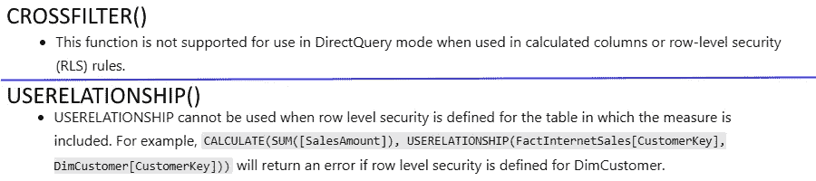

图 1 — MS 文档关于 CROSSFILTER() 和 USERELATIONSHIP() 及 RLS 的部分内容（图由作者提供）

虽然对于 [CROSSFILTER()](https://dax.guide/crossfilter/) 这个句子的解释并不清楚，但对于 [USERELATIONSHIP()](https://dax.guide/userelationship/) 来说，解释要清晰得多：

这些功能在处理受 RLS 规则影响的表之间的关系时无法正常工作。

那这是什么意思呢？

让我们更详细地看一下。

# 数据模型与报告

对于这个示例，我使用以下数据模型：

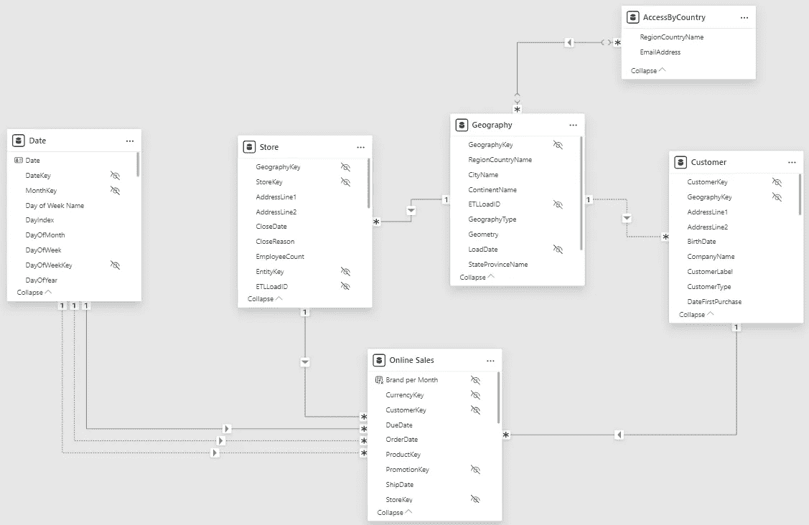

图 2 — 用于此示例的数据模型（图由作者提供）

有三个重要的点：

1.  “Date”表与“Online Sales”有三个关系：Order、Due 和 Ship Date。

1.  “Geography”表与“Store”和“Customer”表有关系，但只有与“Store”表的关系是激活的。

1.  “AccessByCountry”表包含一些分配了国家的用户，它控制每个用户的权限。

报告包含以下视觉对象：

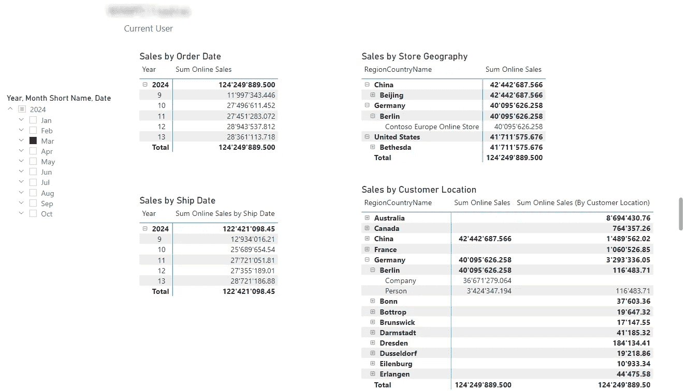

图 3 — 用于示例的报告（图由作者提供）

我向“AccessByCountry”表添加了 RLS 规则：

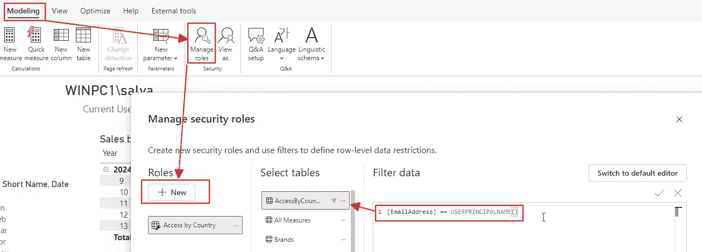

图 4 — 向“AccessByCountry”表添加 RLS 角色，以检查当前用户（图由作者提供）

# 操作关系

我使用 USERELATIONSHIP()函数为两个新度量“按发货日期的在线销售总和”和“按客户位置的在线销售总和”：

```py
Sum Online Sales by Ship Date =
                   CALCULATE(Sum Online Sales],
                             USERELATIONSHIP('Online Sales'[ShipDate]
                                            ,'Date'[Date])
                             )
```

并且：

```py
Sum Online Sales (By Customer Location) = 
    CALCULATE([Sum Online Sales]
                ,USERELATIONSHIP('Customer'[GeographyKey]
                                ,'Geography'[GeographyKey])
                )
```

这样，我在计算度量时激活禁用的关系。

稍后，我将使用 CROSSFILTER()函数创建一个度量。

现在，理解哪个度量使用了哪个关系，并且它是否受 RLS 角色影响是非常重要的：

+   度量“按发货日期销售额”操作与日期表的关系。没有在这些表上设置 RLS 角色。

+   度量“按客户位置的在线销售总和”操作了“Customer”和“Geography”之间的关系。

+   RLS 角色设置在“AccessByCountry”表上，该表筛选了“Geography”表。

+   RLS 通过“Store”和“Customer”表间接筛选“Online Sales”表。

# 使用 USERELATIONSHIP()测试带有 RLS 的度量

现在，我通过使用“查看为”功能测试 RLS 角色：

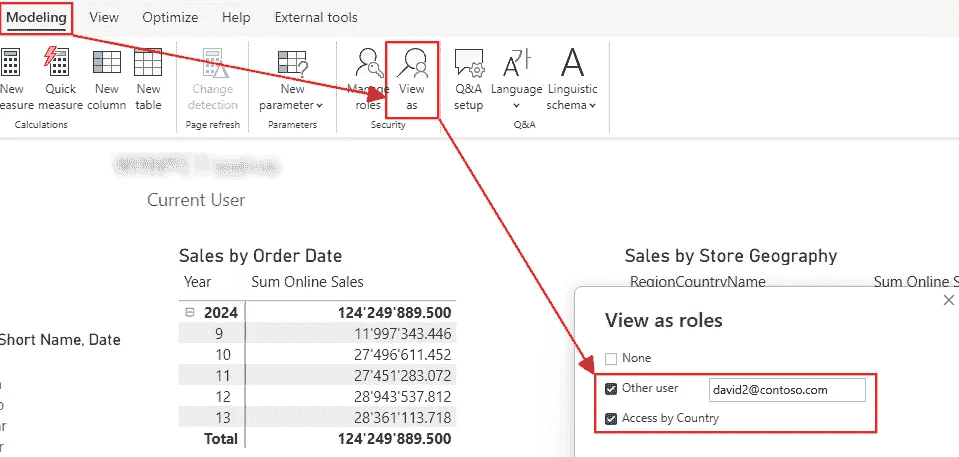

图 5 — 使用电子邮件地址 david2@contoso.com 测试 RLS 角色，该地址具有访问德国的权限（图由作者提供）

一旦我点击确定，RLS 角色被激活，我看到了发生了什么：

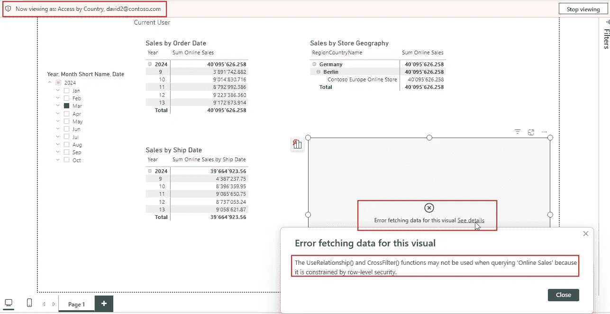

图 6 — 使用操作与 Geography 表关系的度量的可视化出现错误，但使用日期表的则没有错误（图由作者提供）

如你所见，使用发货日期的度量仍然有效，因为没有 RLS 角色影响日期表。

然而，操作与“Geography”表关系的度量不再有效。请注意，错误信息中提到了两个函数（USERELATIONSHIP()和 CROSSFILTER()）。

原因是 USERELATIONSHIP()函数有可能绕过 RLS 角色，使其无效。

这就是为什么不允许的原因。

有趣的是，操作与日期表的关系的度量仍然有效，即使该度量仍然影响“Online Sales”表中数据的筛选。Power BI 识别到没有 RLS 角色影响“Date”表。

# 使用 CROSSFILTER()测试带有 RLS 的度量

现在，让我们尝试一些不同的操作：

我想计算“按客户位置销售”的百分比，涉及所有区域的销售。

为此，我创建了以下度量：

```py
% Sales vs all Customer Type = 
    [Sum Online Sales]
    /
        CALCULATE([Sum Online Sales]
                ,REMOVEFILTERS(‘Geography‘)
                )
```

这是结果：

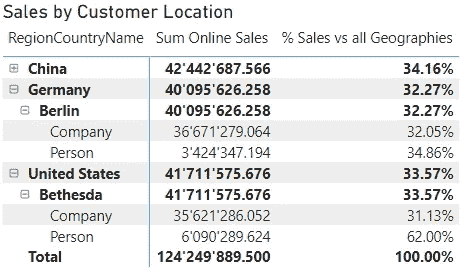

图 7 — 新度量的结果，用于计算所有区域和所有门店的销售比率，并且使用了客户表中的“客户类型”列（图由作者提供）

这个度量没有问题，即使在测试 RLS 角色时也能正常工作。

由于每个国家和城市只有一个门店，使用 RLS 角色时，结果总是返回 100%。

上述语法可以通过使用[CROSSFILTER()](https://dax.guide/crossfilter/)函数来改变。通过将“门店”和“地理”表之间的关系设置为“无”：

```py
% Sales vs all Geographies = 
    [Sum Online Sales]
    /
        CALCULATE([Sum Online Sales]
                ,CROSSFILTER('Geography'[GeographyKey]
                            ,'Store'[GeographyKey]
                            ,None)
                )
```

结果与之前完全相同。

但是，在测试 RLS 角色时，我们得到一个惊喜：

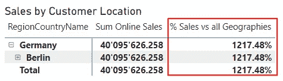

图 8 — 测试 RLS 角色时新度量的结果。（图由作者提供）

这个结果很奇怪！

为了理解发生了什么，让我们添加一个没有除法部分的度量，仅使用上面度量的第二部分：

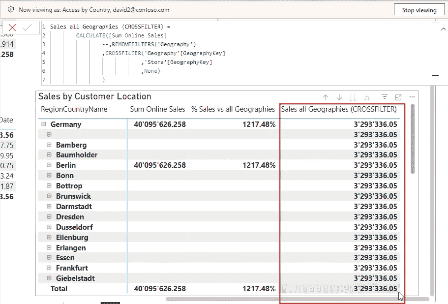

图 9 — 使用 CROSSFILTER()计算所有区域的所有销售并测试 RLS 角色时的度量结果。（图由作者提供）

当我们添加更多度量来比较结果时，我们可以看到发生了什么：

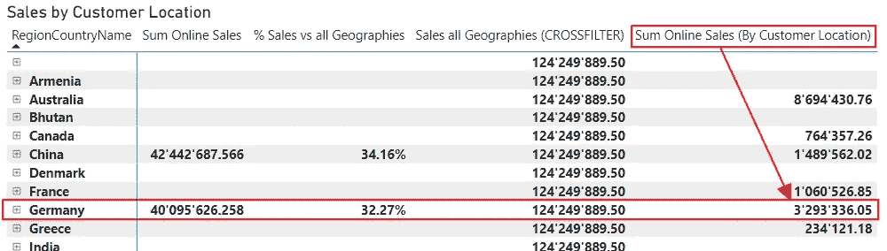

图 10 — 通过添加更多度量并不激活 RLS 测试来分析结果（图由作者提供）

如你所见，通过客户的“地理”计算出的德国销售（参见上文度量）与使用 CROSSFILTER()停用门店和地理关系的度量结果完全相同。

这意味着以下内容：

+   我使用 CROSSFILTER()禁用了“门店”和“地理”表之间的关系。

+   我测试了 RLS 角色。RLS 表达式过滤了“地理”表。

+   Power BI 检测到“地理”与“客户”之间的（非活动）关系，并激活它来计算结果。

这会导致意外、误导性和错误的结果，这必须避免。

虽然使用 USERELATIONSHIP()会导致错误，但使用 CROSSFILTER()可能会意外改变结果。

上面的例子并不太实际，因为使用 REMOVEFILTER()更加直观。我只是想给你一个例子，展示发生了什么。

# 解决这个问题

这种情况并不罕见，尽管我不推荐以这种方式构建数据模型。

在这种特定情况下，我建议将“地理”表中的列整合到“门店”和“客户”表中。

然而，将“AccessByCountry”表的关系添加到“门店”和“客户”表中是不可能的。这会产生歧义，Power BI 不允许这种情况。

因此，我必须复制这张表，并将它们分别连接到‘Store’和‘Customer’两个表：


图 11 — 修改后的数据模型（图由作者提供）

现在，我可以设置 RLS 角色来过滤这两个表格。我甚至可以设置不同的规则，以允许分别访问“Store”和“Customer”的地理信息。

我可以根据需要设置我的度量值，并且可以不受限制地操作筛选器。

我不再需要通过“Store Geography”或“Customer Geography”来分别设置度量值，因为我只需使用正确表格中的列。

好吧，现在我有相同的内容重复出现（两个表格中的“地理”列，分别是‘Store’和‘Customer’）。然而，它们分别在不同的表中，所以这不应该是一个问题。

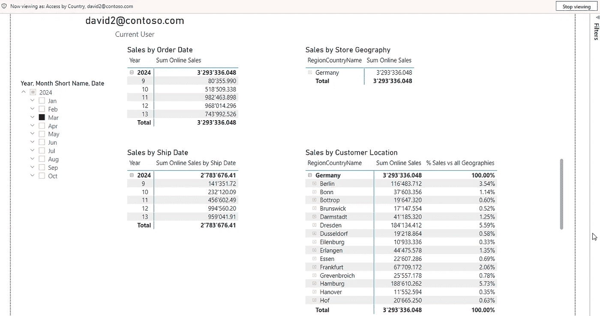

图 12 — 重新建模并测试 RLS 角色后的结果（图由作者提供）

# 结论

使用 RLS 角色时必须特别注意。

虽然在多个场景中使用 USERELATIONSHIP() 和 CROSSFILTER() 很常见，但在数据模型中设置 RLS 角色时，可能会导致问题。

正如您上面所见，当关系不受任何 RLS 角色影响时，使用它们是没有问题的。

但一旦您尝试操作受 RLS 角色影响的关系，尤其是在使用 CROSSFILTER() 时，可能会遇到问题。

奇怪的是，您可能会得到潜在的意外结果，而不是错误信息。这些结果可能很难解释。

在我的示例中，当移除地理和客户之间的（非激活）关系时，结果是正常的。上面显示的行为是特定于我的数据模型的。

但是，正如您所见，通过对数据模型进行一些调整，所有问题都消失了。

正如我在之前的文章中多次提到的，一个好的数据模型是 Power BI 中好解决方案的基础。


图片由[Jakub Żerdzicki](https://unsplash.com/@jakubzerdzicki?utm_source=medium&utm_medium=referral)拍摄，来自[Unsplash](https://unsplash.com/?utm_source=medium&utm_medium=referral)

# 参考文献

就像在我之前的文章中一样，我使用了 Contoso 示例数据集。您可以从 Microsoft 免费下载 ContosoRetailDW 数据集，链接在[这里](https://www.microsoft.com/en-us/download/details.aspx?id=18279)。

Contoso 数据可以在 MIT 许可下自由使用，详情请见[这里](https://github.com/microsoft/Power-BI-Embedded-Contoso-Sales-Demo)。

我更改了数据集，将数据移至当前日期。

[](https://medium.com/@salvatorecagliari/subscribe?source=post_page-----708c0996038a--------------------------------) [## 每当 Salvatore Cagliari 发布时，您将收到一封电子邮件。

### 每当 Salvatore Cagliari 发布时，您将收到一封电子邮件。通过注册，如果您还没有 Medium 账户，您将创建一个账户……

[medium.com](https://medium.com/@salvatorecagliari/subscribe?source=post_page-----708c0996038a--------------------------------)

尽管 Medium 有付费墙，我仍然让我的文章对所有人开放。这样，我每个读者都能赚取一点收入，但我关闭了付费墙，你可以免费阅读我的文章。

我在晚上和周末写这些文章，这其实是很多工作。

你可以通过以下方式支持我的工作

[`buymeacoffee.com/salvatorecagliari`](https://buymeacoffee.com/salvatorecagliari)

或者扫描这个二维码：


任何支持都非常感激，并帮助我找到更多时间为你创作更多内容。

非常感谢你。
