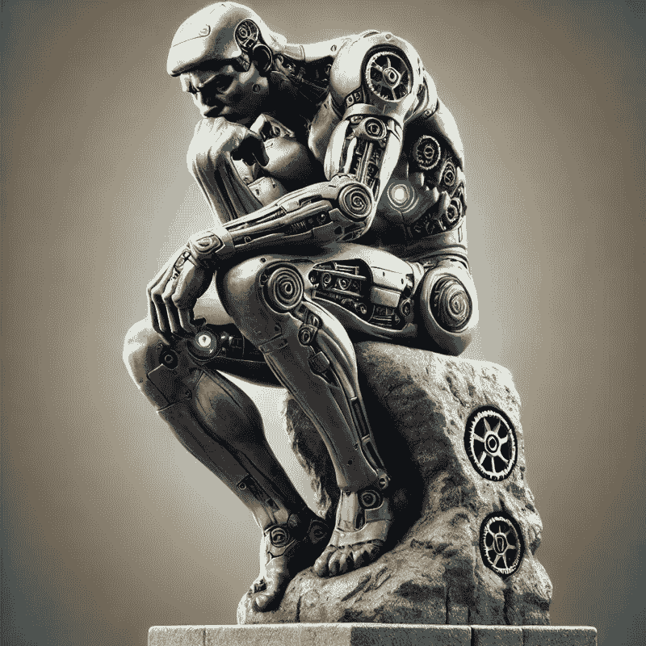

# 为什么“AI 无法推理”是一个偏见

> 原文：[`towardsdatascience.com/why-ai-cant-reason-is-a-bias-3c582bba1aeb?source=collection_archive---------2-----------------------#2024-12-12`](https://towardsdatascience.com/why-ai-cant-reason-is-a-bias-3c582bba1aeb?source=collection_archive---------2-----------------------#2024-12-12)

## 观点

## 我们人类是自豪的生物

 [Rafe Brena, Ph.D.](https://rafebrena.medium.com/?source=post_page---byline--3c582bba1aeb--------------------------------)

·发布于 [Towards Data Science](https://towardsdatascience.com/?source=post_page---byline--3c582bba1aeb--------------------------------) ·9 分钟阅读·2024 年 12 月 12 日

--

图片由作者使用 ChatGPT 生成

最近，关于 AI 是否能够推理的争论愈演愈烈。几个月前发布的[OpenAI 的 o1 模型](https://www.theverge.com/2024/9/12/24242439/openai-o1-model-reasoning-strawberry-chatgpt)，受到了[各种反应](https://medium.com/towards-artificial-intelligence/openais-o1-is-it-a-new-reasoning-paradigm-or-just-smoke-and-mirrors-bd0d110e581d?sk=5538db01e35836ac090f6d835536b392)的欢迎，反应从“这只是虚张声势”到“AI 的新范式”不等。

AI 的推理能力（或缺乏推理能力）似乎触动了许多人敏感的神经。我怀疑，承认 AI 可以“推理”会被视为对人类自豪感的打击，因为推理不再是人类独有的。

在十九世纪，算术被认为是一种智力上的才能（嘿，你什么时候见过一头牛能加两个数字？）。然而，我们还是得习惯使用比我们更强大的计算器。

我曾经见过一些令人震惊的说法，从“我们即将实现通用人工智能”或“AI 已经达到了博士水平”到对 AI 推理能力的彻底否定，比如“苹果公司对 AI 革命表示质疑”。

在其他文章中，我评论过埃隆·马斯克的粉丝们所提出的 AGI（通用人工智能）声明有多么不合逻辑。在这篇文章中，我将探讨另一端的观点：那些宣称 AI 根本无法推理的人。

[Gary Marcus](https://x.com/garymarcus)，是最直言不讳的 AI 否定者之一（我不称他们为...）
