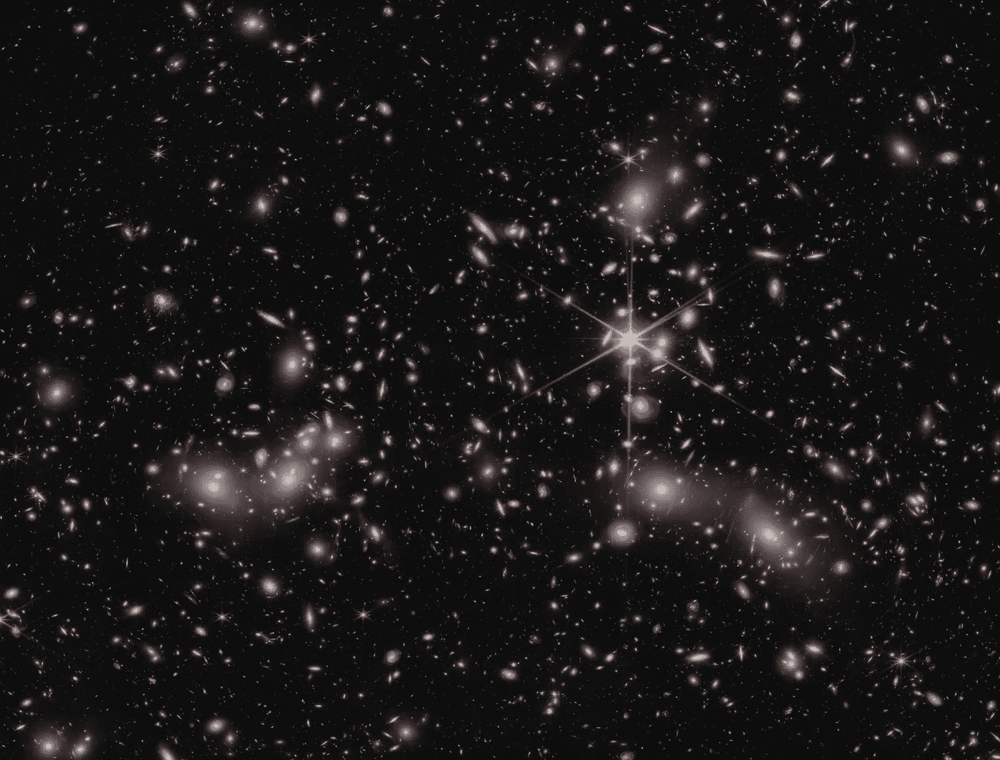

# 为什么聚类失败

> 原文：[`towardsdatascience.com/why-clustering-fails-31d8916f6fbb?source=collection_archive---------2-----------------------#2024-07-06`](https://towardsdatascience.com/why-clustering-fails-31d8916f6fbb?source=collection_archive---------2-----------------------#2024-07-06)

## 以及如何解决

 [Ryan Feather](https://medium.com/@ryan.feather?source=post_page---byline--31d8916f6fbb--------------------------------)

·发表于[Towards Data Science](https://towardsdatascience.com/?source=post_page---byline--31d8916f6fbb--------------------------------) ·阅读时间 9 分钟·2024 年 7 月 6 日

--

你遇到了数据解释问题，于是尝试了聚类。现在你又面临一个聚类解释的问题！曾经怀疑数据中可能存在某些模式。可以理解的是，大家希望通过无监督学习加入一些结构，从而获得一些洞察。聚类是发现数据结构的首选工具。因此，你开始了这段旅程。你在计算上花费了相当多的钱。你投入了大量精力去调试聚类参数。为了确保准确，你尝试了几种算法。但最终你得到的只是一些聚类数据的彩虹图，它们可能有某种意义——可能吧——如果你使劲眯眼看。你带着一种不安的怀疑回家，觉得这一切似乎都是徒劳的。可悲的是，这种情况太常见了。那么，为什么会这样呢？

一些真实的聚类。图片由 NASA 和 STScI 发布，属于公共领域。

聚类项目未能产生价值通常由几个原因造成：对数据理解不足、对期望结果关注不够、以及工具选择不当。我们将逐一探讨这些原因。为了激发讨论，理解聚类技术存在的原因是很有启发性的。为了理解这一点，我们将回顾聚类是什么，以及促使聚类技术发展的几个问题。

# 什么是聚类？
