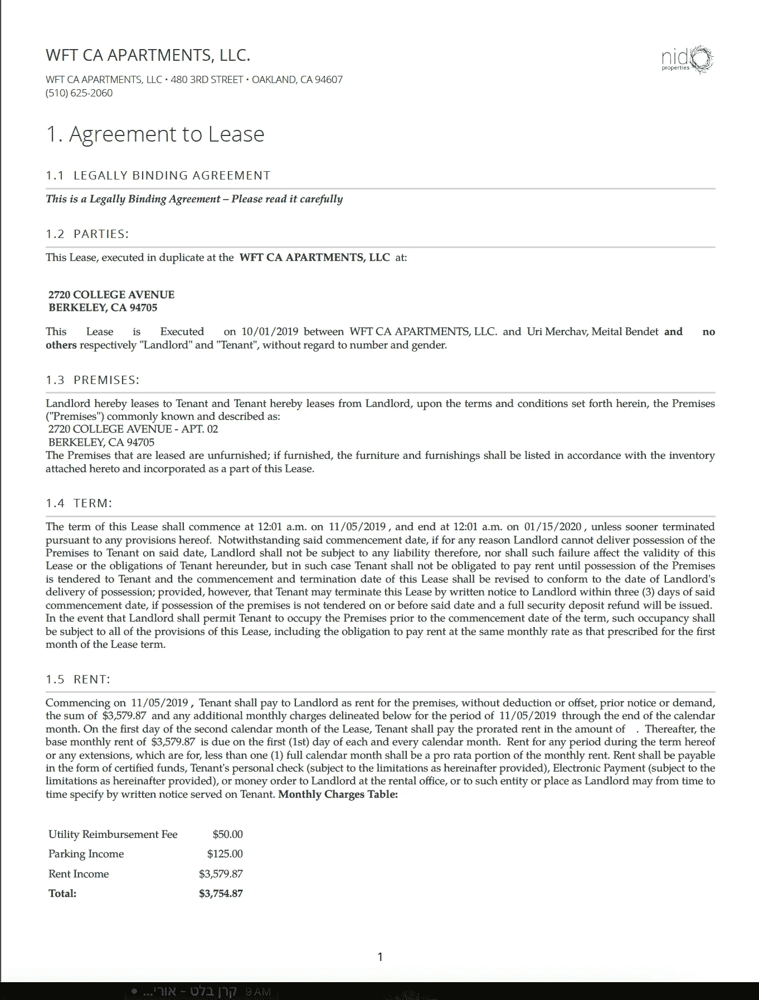
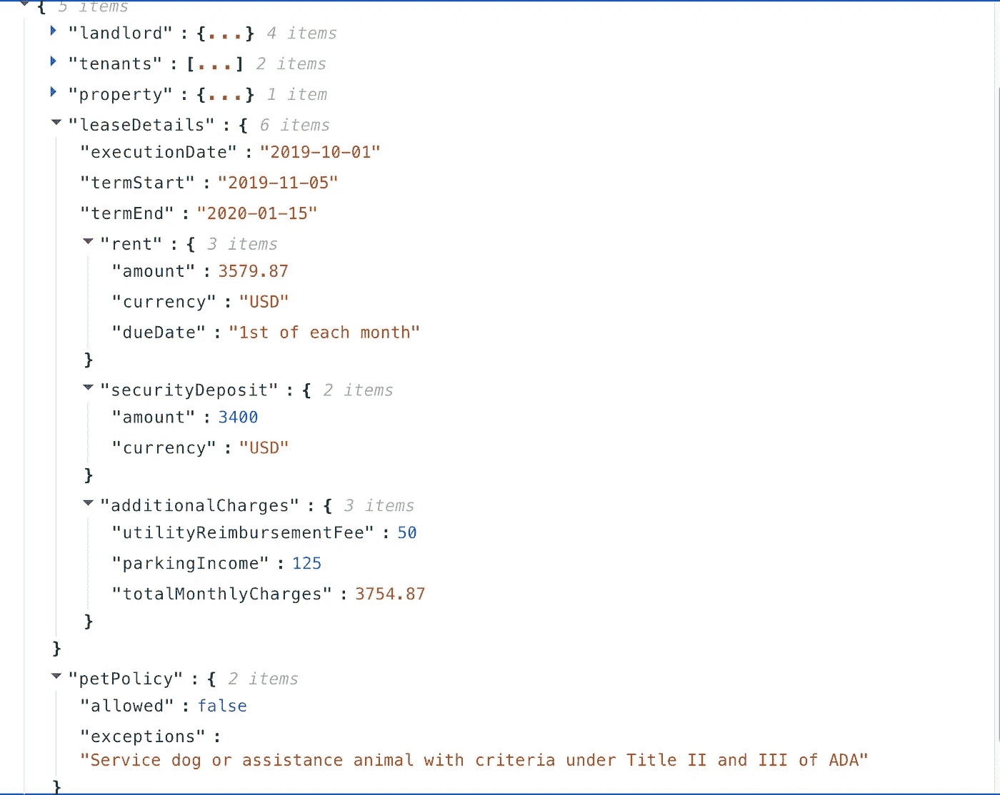

# 为什么解释性在人工智能中很重要

> 原文：[`towardsdatascience.com/why-explainability-matters-in-ai-840144df418e?source=collection_archive---------1-----------------------#2024-10-20`](https://towardsdatascience.com/why-explainability-matters-in-ai-840144df418e?source=collection_archive---------1-----------------------#2024-10-20)

## 不是因为我们好奇，而是因为我们需要完成任务。

 [Uri Merhav](https://urimerhav.medium.com/?source=post_page---byline--840144df418e--------------------------------)

·发表于 [Towards Data Science](https://towardsdatascience.com/?source=post_page---byline--840144df418e--------------------------------) ·阅读时间 5 分钟·2024 年 10 月 20 日

--

人工智能模型输出的解释重要吗？

我对此的第一个回答是：**其实不重要**。

当解释只是为了通过修辞手法给我留下深刻印象，让我觉得你有理由做出某个决定时，我会把它称为“花里胡哨”，并且没有实际影响。如果我在等待基于我的 MRI 的癌症诊断，我更关心的是把准确度从 80%提高到 99%，而不是看一张吸引眼球的图片，告诉我证据在哪里。毕竟，可能需要专家才能识别出证据。更糟糕的是，证据可能是分散的，散布在数百万个像素中，以至于人类的大脑根本无法理解。为了仅仅让自己对 AI 的信任感到安心而追求解释是没有意义的。我们应该衡量正确性，如果数学表明结果超过了人类的表现，那么解释就是多余的。

但是，有时解释不仅仅是一个修辞练习。以下是解释重要的时刻：

1.  当准确性至关重要，而人类可以*验证*结果时。此时，解释可以帮助你降低错误水平，例如，从 1%降低到 0.01%。

1.  当原始预测不是你最关心的，解释却能产生有用的行动时。例如，单纯地说“这个合同中有不公平条款”并没有多大用处，但如果能明确指出不公平条款在哪里，才是有意义的。高亮显示不公平条款让我们可以采取行动，比如提出修改合同的建议。

# 当解释比答案更重要时

让我们以我共同创办的[DocuPanda](https://www.docupanda.io/)为例。简而言之，我们所做的就是让用户将复杂的文档映射成一个包含一致、正确输出的 JSON 负载。

所以也许我们扫描整个租赁合同，然后输出一个简短的 JSON：{"monthlyRentAmount": 2000, "dogsAllowed": true}。

为了让它更加具体，[这是我在加利福尼亚伯克利期间的租赁合同的全部 51 页](https://docupanda-marketing-assets.s3.amazonaws.com/lease2.pdf)。

是的，湾区的租金真是疯狂，谢谢你的提问

如果你不是美国人，你可能会对需要 51 页来明确写出“你每个月要支付 3700 美元，作为交换，你可以住这里”感到震惊。我认为这可能在[法律上](https://scholarship.law.tamu.edu/facscholar/302/)并非必要，但我扯远了。

现在，使用 DocuPanda，我们可以得到诸如——租金多少，我可以带狗去住那里吗，开始日期是什么等明确的答案。

让我们来看看我们提取的 JSON 数据

所以显然 Roxy 不能和我一起住

如果你看到底部，我们有一个标记来指示不允许宠物，并附有合同中列出的例外说明。

解释性在这里有两个有用的原因：

1.  也许我们必须确保这一点正确无误。通过审阅这一段，我可以确保我们正确理解了政策。

1.  也许我想提出一个修改建议。仅仅知道在这 51 页中某处有宠物禁令并没有什么帮助——我仍然需要翻阅所有页面来提出修改建议。

这是我们解决问题的方式。我们并不是仅仅给你一个包含美元金额、真假结果等的黑盒子——我们设计了 DocuPanda，使其能够将预测与精确的像素数据相结合。你可以点击一个结果，滚动到精确的页面和部分，找到支持我们预测的依据。

点击“宠物允许 = false”会立即滚动到相关页面，上面写着“禁止哺乳动物宠物”等等。

# 解释驱动的工作流

在 DocuPanda，我们观察到了解释性使用的三种总体范式。

## 解释推动准确性

第一个范式是我们从一开始就预期到的，即解释性可以减少错误并验证预测。当你有一张 12,000 美元的发票时，你真的希望有一个人来确保这个数字是有效的，并且没有被断章取义，因为如果这个数字进入了会计自动化软件，风险太大。

这就是文档处理的一个伟大特性——人类在这方面非常擅长。我们成本很高，但我们知道自己在做什么。这让我们处于一个令人愉快的区间，人类可以非常高效地**验证结果**，通常能显著减少错误率。

## 解释推动高知识工作者的生产力

这一范式自然地从我们的用户群体中产生，我们一开始并没有完全预料到它。事实证明，有时我们比起想要得到一个问题的直接答案，更希望利用 AI 将正确的信息呈现在眼前。如果你考虑类似{“unfair payment terms”: true}这样的输出，我之前已经暗示过这一用例——与直接展示合同中使其不公平的语言相比，这几乎没有什么用处。

作为一个更完整的例子，考虑一个生物研究公司，它希望扫描所有生物学出版物，找出那些增加马铃薯糖分生产的过程。他们使用 DocuPanda 来回答类似的问题：

{sugarProductionLowered: true, sugarProductionGenes: [“AP2a”,”TAGL1"]}

他们的目标**不是**盲目地信任 DocuPanda，并统计有多少篇论文提到某个基因或类似的内容。使这一结果有用的关键是，研究人员可以点击查看论文的核心内容。通过点击基因名称，研究人员可以立即跳转到该基因被提及的上下文中——并判断这篇论文中涉及该基因与糖分生产的过程是否与他们的研究目标相关。这是一个说明解释比直接答案更重要的例子，并且能够提高高知识工作者的生产力。

## 责任解释

使用解释并利用它们让人类参与其中还有另一个原因。除了降低错误率（通常是这样），它们还让你能够证明你有一个**合理的、符合法律要求的流程**。

管理者关注过程。一个会犯错误的黑匣子不是一个可靠的过程。能够将每个提取的数据点追溯到原始来源，使你能够让人类参与其中，审查和批准结果。即使人类不能减少错误，参与其中也可能在法律上有帮助。这将过程从盲目的自动化转变为由人类驱动的过程，人类对文书错误有一个可接受的容忍率，且这由公司负责。一个相关的例子是，似乎在讨论全自动化系统时，监管者和公众舆论容忍的致命车祸率（按每英里计算）要低得多，而当涉及到人类驾驶辅助工具时，致命车祸率容忍度则较高。我个人认为这是道德上无法辩解的，但我并不制定规则，我们必须遵守这些规则。

通过使你能够让人类参与其中，你可以从一个完全自动化的法律风险领域转变为一个更为熟悉的法律领域，其中人类分析师使用 10 倍速率和生产力工具（并偶尔犯错，就像我们所有的罪人一样）。

> 所有图片均为作者所有
