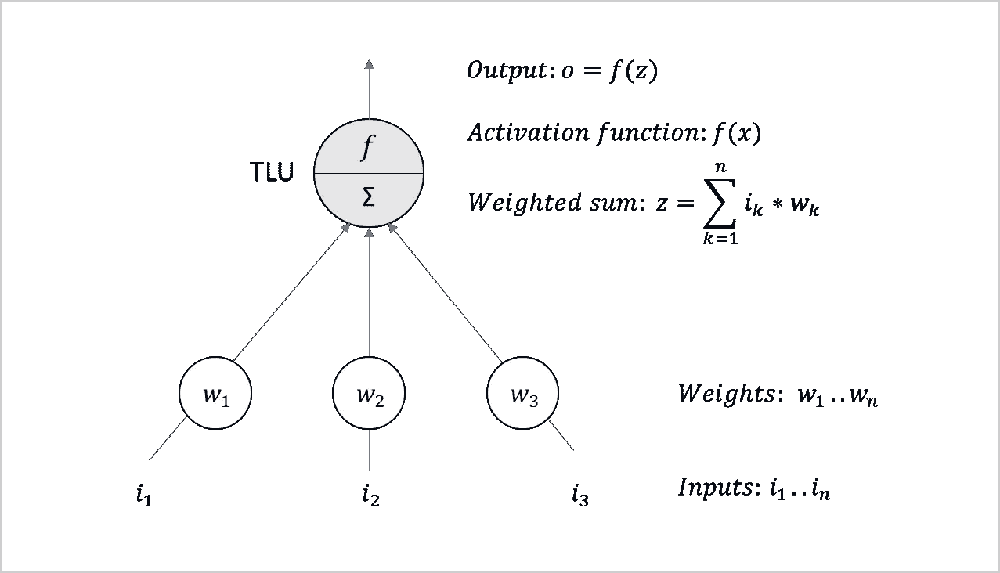
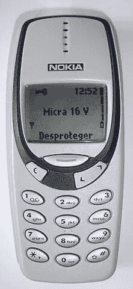
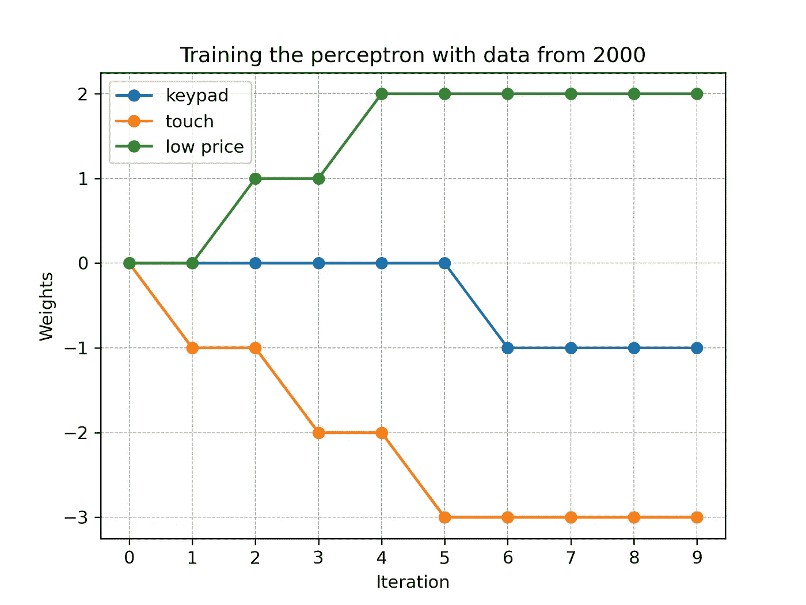
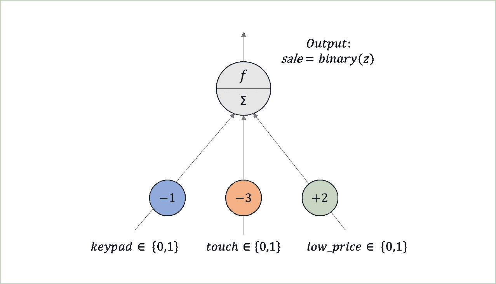
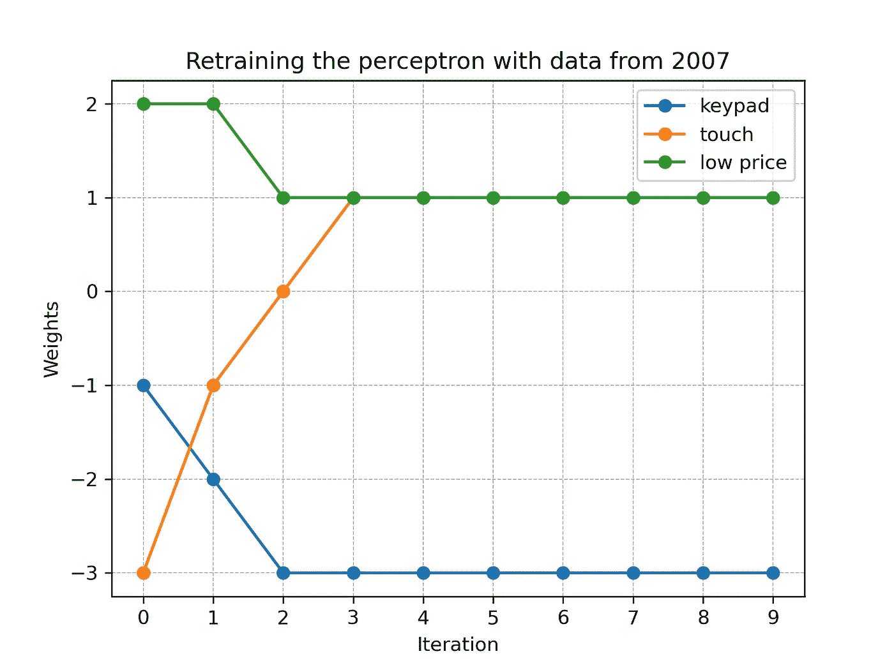
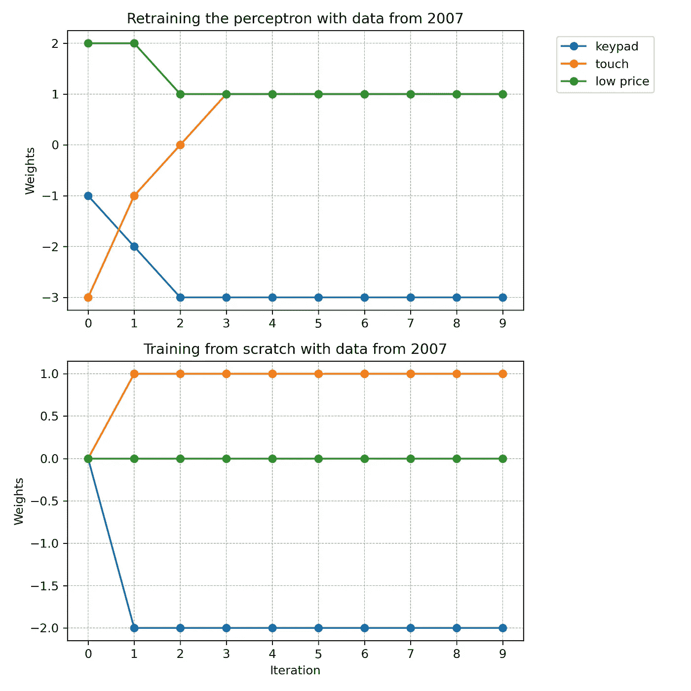

# 为什么再训练比训练更难

> 原文：[`towardsdatascience.com/why-retraining-can-be-harder-than-training-489b3bc6ae02?source=collection_archive---------11-----------------------#2024-01-23`](https://towardsdatascience.com/why-retraining-can-be-harder-than-training-489b3bc6ae02?source=collection_archive---------11-----------------------#2024-01-23)

## 从神经网络的角度看学习、去学习和再学习

[](https://medium.com/@c4ristian?source=post_page---byline--489b3bc6ae02--------------------------------)[](https://towardsdatascience.com/?source=post_page---byline--489b3bc6ae02--------------------------------) [Christian Koch](https://medium.com/@c4ristian?source=post_page---byline--489b3bc6ae02--------------------------------)

·发布于 [Towards Data Science](https://towardsdatascience.com/?source=post_page---byline--489b3bc6ae02--------------------------------) ·12 分钟阅读·2024 年 1 月 23 日

--


图片由 [Mary Blackwey](https://unsplash.com/@belokonenko?utm_source=medium&utm_medium=referral) 提供，来源 [Unsplash](https://unsplash.com/?utm_source=medium&utm_medium=referral)

在这个快速变化的世界里，人类需要快速适应新的环境。神经网络展示了为什么这一点说起来容易做起来难。我们的文章通过感知机展示了为什么“去学习”和“再学习”可能比从零开始学习更具成本。

# 引言

人工智能（AI）的一个积极副作用是，它可以帮助我们更好地理解我们自己的人的智能。具有讽刺意味的是，AI 也是挑战我们认知能力的技术之一。与其他创新技术一起，它以惊人的速度转变现代社会。在他的书《Think Again》中，亚当·格兰特指出，在动荡的环境中，重新思考和去学习可能比思考和学习更为重要[1]。

对于老龄化社会来说，这可能是一个挑战。在德国有一句话：“Was Hänschen nicht lernt, lernt Hans nimmermehr。”英语中类似的说法是：“A tree must be bent while it is young” 或者更不客气地说：“You can’t teach an old dog new tricks。”本质上，这些说法都暗示着年轻人比老年人更容易学习。但这真的正确吗？如果是，背后的原因是什么？

显然，从生理学角度来看，年轻人与年长者的大脑结构是不同的。然而，在个体层面上，这些差异变化很大[2]。根据 Creasy 和 Rapoport 的研究，"即使在年老时，大脑的整体功能也可以保持在高效的水平"[3]。除了生理学因素，动机和情感似乎在学习过程中扮演着至关重要的角色[4][5]。Kim 和 Marriam 在一家退休机构的研究表明，认知兴趣和社会互动是强大的学习动力[6]。

我们的文章从数学和计算机科学的角度讨论了这个问题。受到 Hinton 和 Sejnowski [7]的启发，我们进行了一项关于人工神经网络（ANN）的实验。我们的测试表明，在变化的环境中，重新训练比从头开始训练更具挑战性。原因在于，网络必须先忘记之前学到的概念，才能适应新的训练数据。假设人工智能与人类智能有相似之处，我们可以从这一洞察中得出一些有趣的结论。

# 人工神经网络

人工神经网络类似于我们大脑神经元的结构和行为。通常，人工神经网络由接收外界信号的输入单元组成。通过处理这些信号，网络能够对接收到的输入做出响应。感知器是人工神经网络的一个简单变体[8]。它由 Rosenblatt 于 1958 年提出[9]。图 1 概述了感知器的基本结构。在最近几十年里，已经开发出了更为先进的人工神经网络类型。然而，针对我们的实验，感知器非常适用，因为它容易解释和理解。



图 1：单层感知器的结构。基于[8，第 284 页]的自定义表示。

图 1 显示了单层感知器的架构。作为输入，网络接收*n n*umbers（*i₁..iₙ*）。与学习到的权重（*w₁..wₙ*）一起，这些输入被传递到一个阈值逻辑单元（TLU）。该 TLU 通过将输入（*i*）与权重（*w*）相乘来计算加权和（*z*）。在下一步，激活函数（*f*）根据加权和（*z*）来确定输出（*o*）。最后，输出（*o*）使得网络能够做出响应接收到的输入的决策。Rosenblatt 已证明，这种简单形式的人工神经网络能够解决多种问题。

感知器可以使用不同的激活函数来决定其输出（*o*）。常见的函数有*二进制阶跃函数*和*符号*函数，如图 2 所示。顾名思义，二进制函数生成一个二进制输出*{0,1*}，可以用来做是/否决策。为此，二进制函数检查给定输入的加权和（*z*）是否小于或等于零。如果是这种情况，则输出（*o*）为零，否则为一。相比之下，符号函数区分三个不同的输出值*{-1,0,+1*}。


图 2：激活函数的示例。根据[8, p. 285]的内容制作。

为了基于给定数据集训练感知器，我们需要提供一个样本，其中包括与期望输出（目标）相关联的输入信号（特征）。在训练过程中，算法反复处理输入数据，以学习最适合的权重，从而生成输出。训练所需的迭代次数是衡量学习努力的标准。对于我们的实验，我们训练一个感知器来判断客户是否会购买某款手机。源代码可在[GitHub](https://github.com/c4ristian/retrain) [10]上找到。我们使用的是 Python v3.10 和 scikit-learn v1.2.2 版本。

# 学习客户偏好

我们的实验灵感来源于一个著名的（失败的）重新学习案例。假设我们在 2000 年为一家手机制造商工作。我们的目标是训练一个感知器，学习客户是否会购买某款手机型号。在 2000 年，触摸屏仍然是一项不成熟的技术。因此，客户更喜欢带有键盘的设备。此外，客户关注价格，并选择价格较低的型号，而不是更昂贵的手机。这些特征使得诺基亚 3310 成为 2000 年全球销量最高的手机[11]。



图 3：诺基亚 3310，由 LucaLuca 拍摄，CC BY-SA 3.0，[维基共享资源](https://commons.wikimedia.org/w/index.php?curid=6349715)

在训练感知器时，我们使用如表 1 所示的假设数据集。每一行代表一个特定的手机型号，“keypad”、“touch”和“low_price”列表示其特征。为了简化，我们使用二进制变量。客户是否会购买设备在“sale”列中定义。如上所述，客户会购买带有键盘且价格低的手机（*keypad=1* 和 *low_price=1*）。相反，他们会拒绝高价的型号（*low_price=0*）和带触摸屏的手机（*touch=1*）。

```py
 +----+--------+-------+-----------+------+
| ID | keypad | touch | low_price | sale |
+----+--------+-------+-----------+------+
|  0 |      1 |     0 |         1 |    1 |
|  1 |      1 |     0 |         0 |    0 |
|  2 |      0 |     1 |         0 |    0 |
|  3 |      0 |     1 |         1 |    0 |
+----+--------+-------+-----------+------+

Table 1: Hypothetical phone sales dataset from 2000
```

为了训练感知器，我们多次输入上述数据集。从 scikit-learn 的角度来看，我们反复调用函数 `partial_fit`（源代码见[这里](https://github.com/c4ristian/retrain/blob/master/retrain_phones.ipynb)）。在每次迭代中，算法会尝试逐渐调整网络的权重，以最小化预测“sale”变量的误差。图 4 展示了前十次迭代中的训练过程。



图 4：使用来自 2000 年的数据训练手机销售感知器

正如上述图示所示，感知器的权重逐渐被优化，以适应数据集。在第六次迭代中，网络学习到了最佳的拟合权重，随后数字保持稳定。图 5 可视化了学习过程后的感知器。



图 5：使用来自 2000 年的数据训练的手机销售感知器

让我们基于训练好的感知器考虑一些例子。一款带有按键的低价手机，其加权和为 *z=-1*1–3*0+2*1=1*。应用二值步进函数后，生成的输出为 *sale=1*。因此，网络预测客户会购买该手机。相反，一款带有按键的高价设备，其加权和为 *z=-1*1–3*0+2*0=1=-1*。这一次，网络预测客户会拒绝购买该设备。对于一款带有触摸屏的手机也是如此。（在我们的实验中，我们忽略了设备既没有按键也没有触摸屏的情况，因为客户必须以某种方式操作设备。）

# 使用变化的偏好进行重新训练

现在让我们设想，随着时间的推移，客户的偏好发生了变化。到 2007 年，技术进步使触摸屏变得更加易于使用。因此，客户现在更倾向于选择触摸屏而不是按键。随着手机成为身份象征，客户也愿意支付更高的价格。这些新的偏好体现在表 2 所示的假设数据集中。

```py
 +----+--------+-------+-----------+------+
| ID | keypad | touch | low_price | sale |
+----+--------+-------+-----------+------+
|  0 |      1 |     0 |         1 |    0 |
|  1 |      1 |     0 |         0 |    0 |
|  2 |      0 |     1 |         0 |    1 |
|  3 |      0 |     1 |         1 |    1 |
+----+--------+-------+-----------+------+

Table 2: Hypothetical phone sales dataset from 2007
```

根据表 2，客户会购买带有触摸屏的手机（*touch=1*），并且不太关注价格。相反，他们拒绝购买带有按键的设备。实际上，苹果公司于 2007 年进入了手机市场，推出了其 iPhone。凭借高质量的触摸屏，它挑战了传统品牌。到 2014 年，iPhone 最终成为了全球销量最高的手机，推动诺基亚退出市场[11]。


图 6：iPhone 第一代，Carl Berkeley — CC BY-SA 2.0，[维基共享资源](https://commons.wikimedia.org/w/index.php?curid=41718431)

为了将之前训练的感知器调整到新的客户偏好，我们必须使用 2007 年的数据集重新训练它。图 7 展示了在前十次迭代中的重新训练过程。



图 7：使用来自 2007 年的数据重新训练手机销售感知器

如图 7 所示，重新训练需要三次迭代。然后，找到最佳的拟合权重，网络就学习到了 2007 年的新客户偏好。图 8 展示了重新学习后的网络。


图 8：经过 2007 年数据重新训练后的手机销售感知机

让我们考虑一些基于重新训练的感知机的例子。一部具有触摸屏（*touch=1*）且价格低廉（*low_price=1*）的手机，现在的加权和为 *z=-3*0+1*1+1*1=2*。因此，网络预测客户会购买具有这些特征的手机。同样，对于一部具有触摸屏（*touch=1*）但价格较高（*low_price=0*）的设备，网络也做出类似预测。相反，网络现在预测客户会拒绝配有键盘的设备。

从图 7 中我们可以看出，使用 2007 年数据进行重新训练需要三次迭代。但是如果我们从零开始训练一个新的感知机呢？图 9 比较了使用 2007 年数据集重新训练旧网络与完全从零开始训练一个新感知机的情况。



图 9：基于 2007 年数据的重新训练与从零开始训练的对比

在我们的例子中，从零开始训练一个新的感知机比重新训练旧网络更加高效。根据图 9，训练只需要一次迭代，而重新训练需要三倍的步骤。原因在于，旧感知机必须首先“遗忘”2000 年时学习的权重，只有这样，它才能调整到 2007 年新的训练数据。以“触摸”特征的权重为例，旧网络必须将其从 -3 调整到 +1。相比之下，新的感知机可以从零开始，直接将权重从 0 增加到 +1。因此，新的网络学习速度更快，并且最终会达到一个略有不同的设置。

# 结果讨论

我们的实验从数学角度展示了为什么重新训练一个人工神经网络（ANN）可能比从零开始训练一个新网络更加昂贵。当数据发生变化时，旧的权重必须先被“遗忘”，才能学习新的权重。如果我们假设这同样适用于人类大脑的结构，那么我们可以将这一见解应用于一些实际问题。

在他的著作《创新者的窘境》中，Christensen 研究了曾经在其行业中是创新者的公司为何未能适应新技术 [12]。他通过硬盘和挖掘机市场的例子支撑了他的研究。在几个案例中，市场领导者未能调整以适应激进的变化，反而被市场新进入者超越。根据 Christensen 的观点，进入市场的新公司能够更快且更成功地适应转变后的环境。他认为，经济因素是这种现象的主要原因。我们的实验表明，可能也存在数学上的原因。从人工神经网络的角度来看，市场新进入者有从零开始学习的优势，而现有的供应商必须首先反学习他们的传统观念。特别是在颠覆性创新的情况下，这对现有公司来说可能是一个重大缺点。

激进的变革不仅是企业面临的挑战，也是整个社会面临的挑战。在他们的著作《第二次机器时代》中，Brynjolfsson 和 McAfee 指出，颠覆性技术可以引发痛苦的社会调整过程 [13]。作者将我们这个时代的数字化与 18 世纪和 19 世纪的工业革命作比较。在那个时代，像蒸汽机和电力这样的激进创新导致了社会的深刻变革。像卢德派这样的运动试图通过暴力抗拒这种进化。它们的适应斗争不仅可能是意志的问题，也可能是能力的问题。正如我们上面所见，与从零开始学习相比，反学习和再学习可能需要相当大的努力。

# 结论

显然，我们的实验建立在简化的现实模型基础上。生物神经网络比感知机更加复杂。移动电话市场中的客户偏好也一样。诺基亚的兴衰有许多原因，除了我们数据集中包含的特征。由于我们只讨论了一个特定的场景，另一个有趣的研究问题是，在哪些情况下，重新训练实际上比训练更难。像 Hinton 和 Sejnowski [7] 以及 Chen 等人 [14] 等作者提供了对这一主题的差异化看法。希望我们的文章能为这些更技术性的出版物提供一个起点。

承认我们工作的局限性，我们可以从中提取一些关键的教训。当人们未能适应变化的环境时，未必是由于缺乏智慧或动机。在涉及数字化转型时，我们应该牢记这一点。与数字原住民不同，老一代人首先必须反学习“模拟”概念。这需要努力和时间。对他们施加过多的压力可能会导致否认的态度，进而转化为阴谋论和要求强有力的领导者阻止进步。相反，我们应该开发成功反学习和再学习的概念。教授技术至少与开发技术一样重要。否则，我们将把我们旨在支持的社会抛在身后。

除非另有说明，所有图片均由作者提供。

# 关于作者

*Christian Koch* 是 BWI GmbH 的企业首席架构师，并且是纽伦堡理工学院乔治·西蒙·欧姆学院的讲师。

*Markus Stadi* 是 Dehn SE 的高级云数据工程师，多年来一直在数据工程、数据科学和数据分析领域工作。

# 参考文献

1.  Grant, A. (2023). *再思考：了解你不知道的事情的力量*. Penguin。

1.  Reuter-Lorenz, P. A., & Lustig, C. (2005). 脑部衰老：重组关于衰老心智的发现。*神经生物学当前意见*, *15*(2), 245–251.

1.  Creasey, H., & Rapoport, S. I. (1985). 衰老的人脑。*神经学年鉴：美国神经学会与儿童神经学学会的官方期刊*, *17*(1), 2–10.

1.  Welford AT. Motivation, Capacity, Learning and Age. *国际老龄化与人类发展期刊*. 1976;7(3):189–199.

1.  Carstensen, L. L., Mikels, J. A., & Mather, M. (2006). 衰老与认知、动机、情感的交集。见 *老年心理学手册* (第 343–362 页)。学术出版社。

1.  Kim, A., & Merriam, S. B. (2004). 退休学习机构中老年人学习动机。*教育老年学*, *30*(6), 441–455.

1.  Hinton, G. E., & Sejnowski, T. J. (1986). 学习与重学在玻尔兹曼机中的应用。*并行分布式处理：认知微观结构的探索*, *1*(282–317), 2.

1.  Géron, A. (2022). *动手学习机器学习：使用 Scikit-Learn、Keras 和 TensorFlow*. O'Reilly Media, Inc.

1.  Rosenblatt, F. (1958). The perceptron: a probabilistic model for information storage and organization in the brain. *心理学评论*, *65*(6), 386.

1.  Koch, C. (2024). Retrain Python 项目。网址：[`github.com/c4ristian/retrain`](https://github.com/c4ristian/retrain)。访问时间：2024 年 1 月 11 日。

1.  Wikipedia. 热销手机列表。网址：[`en.wikipedia.org/wiki/List_of_best-selling_mobile_phones`](https://en.wikipedia.org/wiki/List_of_best-selling_mobile_phones)。访问时间：2024 年 1 月 11 日。

1.  Christensen, C. M. (2013). *创新者的窘境：当新技术导致大公司失败时*. 哈佛商业评论出版社。

1.  Brynjolfsson, E., & McAfee, A. (2014). *第二次机器时代：在辉煌技术时代的工作、进步与繁荣*. WW Norton & Company。

1.  Chen, M., Zhang, Z., Wang, T., Backes, M., Humbert, M., & Zhang, Y. (2022, November). 图形反学习。见 *2022 年 ACM SIGSAC 计算机与通信安全大会论文集* (第 499–513 页)。
