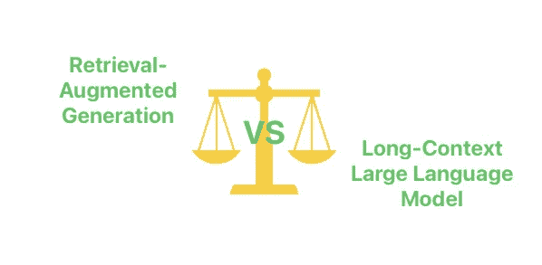

# 为什么检索增强生成在长上下文语言模型时代依然重要

> 原文：[`towardsdatascience.com/why-retrieval-augmented-generation-is-still-relevant-in-the-era-of-long-context-language-models-e36f509abac5?source=collection_archive---------5-----------------------#2024-12-12`](https://towardsdatascience.com/why-retrieval-augmented-generation-is-still-relevant-in-the-era-of-long-context-language-models-e36f509abac5?source=collection_archive---------5-----------------------#2024-12-12)

## 在本文中，我们将探讨为什么 128K tokens（甚至更多）模型无法完全取代使用 RAG。

 [Jérôme DIAZ](https://medium.com/@jerome.o.diaz?source=post_page---byline--e36f509abac5--------------------------------)

·发表于[Towards Data Science](https://towardsdatascience.com/?source=post_page---byline--e36f509abac5--------------------------------) ·阅读时间 7 分钟·2024 年 12 月 12 日

--

我们将从简要回顾 RAG 可以解决的问题开始，然后再讨论 LLM 的改进及其对**使用**RAG 需求的影响。

插图由作者提供。

# 让我们从一点历史背景开始

## RAG 其实并不是什么新鲜事物

向语言模型注入上下文，以让其获取最新数据的想法在 LLM 层面上其实并不“新”。这一概念最早由 Facebook AI/Meta 的研究员在 2020 年的论文《[面向知识密集型 NLP 任务的检索增强生成](https://arxiv.org/abs/2005.11401)》中提出。相比之下，ChatGPT 的第一个版本直到 2022 年 11 月才发布。

在这篇论文中，他们区分了两种类型的记忆：

+   *参数化*的记忆，指的是 LLM 固有的记忆，**它所学到的**内容，在训练期间通过大量文本的喂入获得。

+   *非参数化*的记忆，指的是你通过*向提示提供上下文*来实现的记忆。
