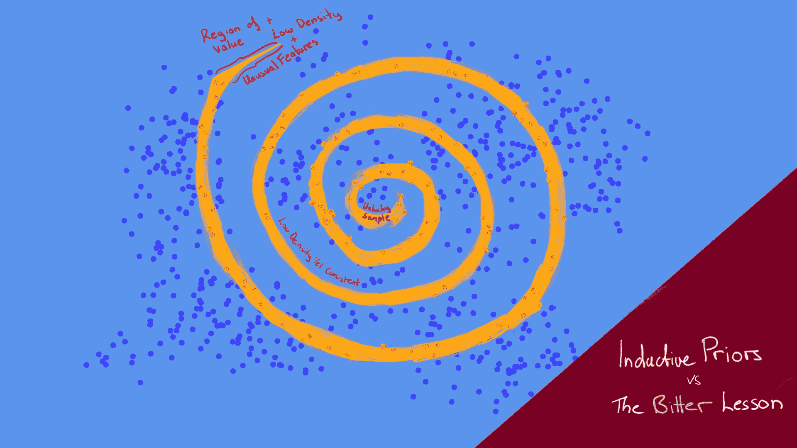
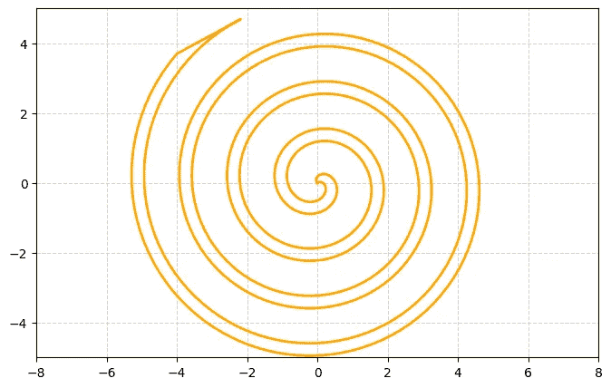
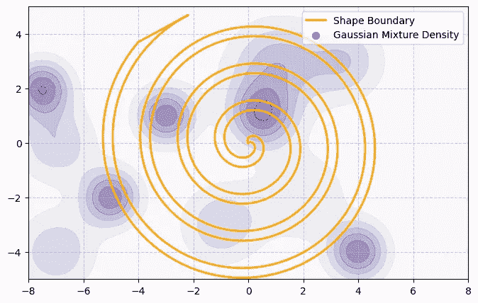
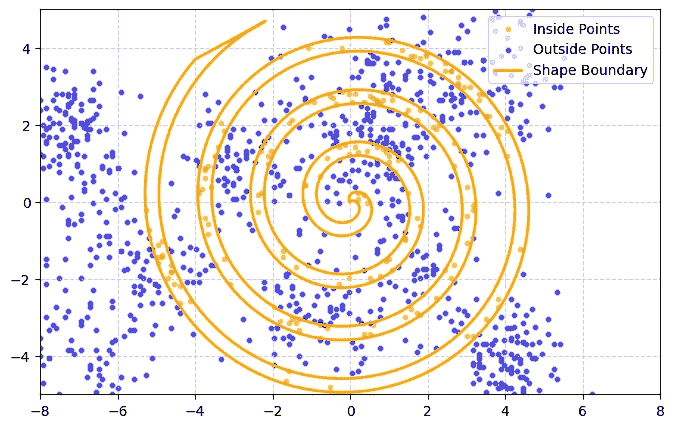
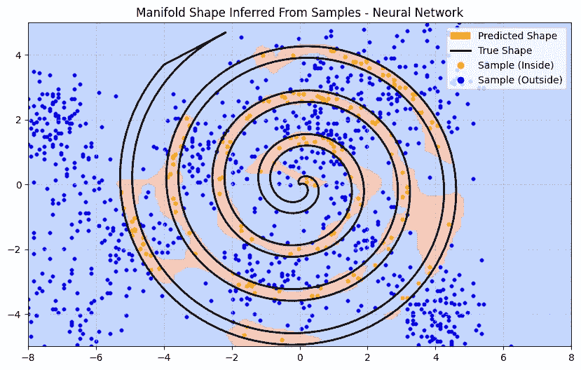
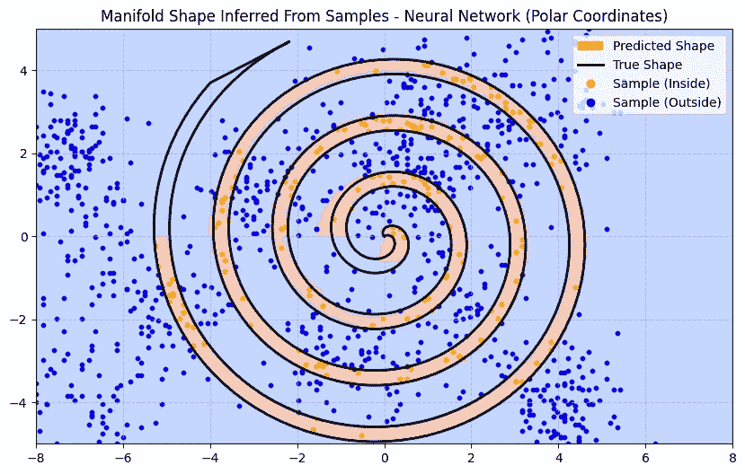
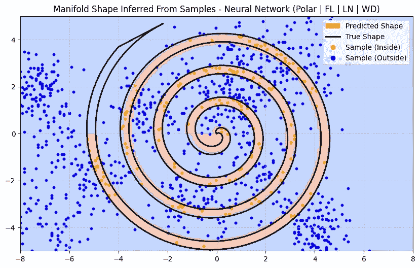
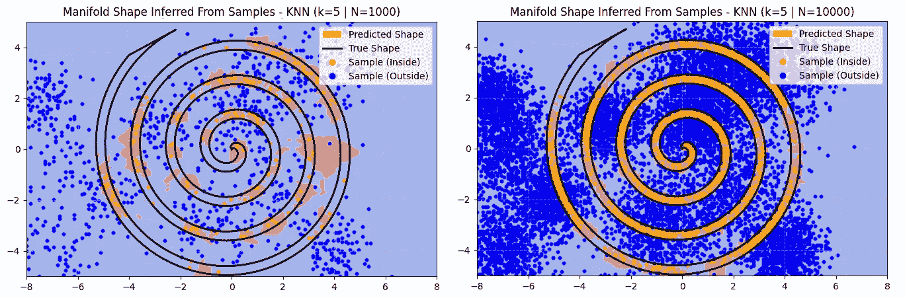
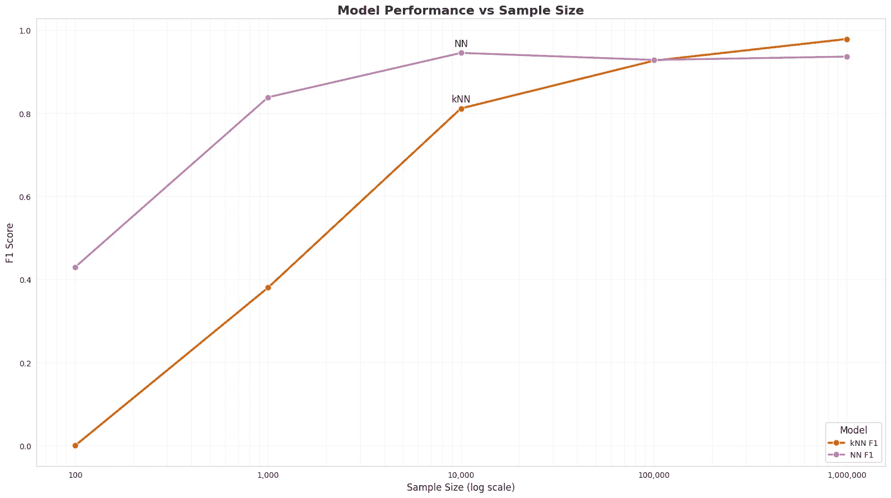
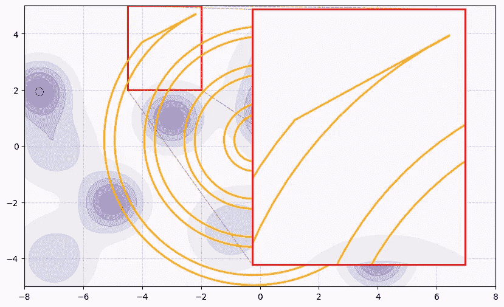

# 为什么规模化有效：归纳偏差与痛苦的教训

> 原文：[`towardsdatascience.com/why-scaling-works-inductive-biases-vs-the-bitter-lesson-9c2782f99b18?source=collection_archive---------8-----------------------#2024-10-22`](https://towardsdatascience.com/why-scaling-works-inductive-biases-vs-the-bitter-lesson-9c2782f99b18?source=collection_archive---------8-----------------------#2024-10-22)

## 用一个玩具问题构建深刻的洞见

 [Tarik Dzekman](https://medium.com/@TarikDzekman?source=post_page---byline--9c2782f99b18--------------------------------)

·发布于 [Towards Data Science](https://towardsdatascience.com/?source=post_page---byline--9c2782f99b18--------------------------------) ·10 分钟阅读·2024 年 10 月 22 日

--

来源：所有图片由作者提供

在过去的十年里，我们见证了深度学习模型规模化的强大力量。大型模型通过在海量数据上训练，持续在语言建模、图像生成、游戏对弈甚至蛋白质折叠等任务中超越了以往的方法。为了理解为什么规模化有效，我们来看看一个玩具问题。

# 引入一个玩具问题

我们从一个一维流形开始，它穿越二维平面并形成一个螺旋：

现在我们添加一个热图，表示采样特定二维点的概率密度。值得注意的是，这个概率密度是*独立*于流形的形状的：

假设流形两侧的数据总是完全可分离的（即没有噪声）。流形外部的数据点为蓝色，内部的数据点为橙色。如果我们抽取 N=1000 个数据点，它可能看起来是这样的：

> 玩具问题：我们如何构建一个基于二维坐标预测点的颜色的模型？

在现实世界中，我们通常不能从特征空间的所有部分均匀地采样。例如，在图像分类中，找到树的图像相对容易，但要找到许多特定树种的例子则较为困难。因此，模型可能会更难学会区分那些没有很多例子的物种。类似地，在我们的玩具问题中，空间的不同部分将变得难以预测，仅仅因为它们更难采样。

# 解决玩具问题

首先，我们构建一个简单的三层神经网络，训练 1000 个 epoch。神经网络的预测受到样本特性的强烈影响。因此，训练后的模型很难推断出流形的形状，仅仅因为采样的稀疏性：

即使知道这些点是完全可分的，也有无数种方式可以围绕采样点绘制边界。基于样本数据，为什么应该认为某一边界比其他边界更优？

使用正则化技术，我们可以鼓励模型生成更平滑的边界，而不是紧密围绕预测点弯曲。这在一定程度上有所帮助，但在稀疏区域无法解决我们的問題。

> 既然我们已经知道流形是一个螺旋形，我们能否鼓励模型做出螺旋形的预测？

我们可以添加一个叫做“[归纳先验](https://en.wikipedia.org/wiki/Inductive_bias)”的东西：我们在模型架构或训练过程中加入的，包含有关问题空间的信息。在这个玩具问题中，我们可以做一些[特征工程](https://en.wikipedia.org/wiki/Feature_engineering)，调整我们呈现给模型的输入方式。我们将输入从二维（x，y）坐标转换为[极坐标](https://en.wikipedia.org/wiki/Polar_coordinate_system)（r，θ）。

现在，神经网络可以基于与原点的距离和角度做出预测。这使得模型倾向于产生更加弯曲的决策边界。以下是新训练的模型预测的决策边界：

注意，在输入空间的无样本部分，模型表现得有多好。那些缺失点的特征仍然与观察到的点的特征相似，因此模型可以在没有额外数据的情况下预测有效的边界。

*显然，归纳先验是有用的。*

大多数架构决策都会引入归纳先验。让我们尝试一些增强方法，并思考它们引入了什么样的归纳先验：

1.  Focal Loss — 增加模型在难以预测的数据点上的损失。这可能会提高准确性，但代价是增加这些点周围的模型复杂度（正如我们从偏差-方差权衡中所期望的那样）。为了减少方差增加的影响，我们可以添加一些正则化。

1.  Weight Decay — 对权重大小施加 L2 范数，防止模型对任何单一样本学习出过于强烈的特征。

1.  Layer Norm — 有许多微妙的效果，其中之一可能是模型更多地关注点与点之间的关系，而不是它们的大小，这可能有助于抵消使用 Focal Loss 所增加的方差。

在做出所有这些改进后，我们预测的流形效果有多好？

**一点都不更好**。事实上，它在螺旋的中心附近引入了一个伪影。并且它仍然没有预测到螺旋末端（左上象限）没有数据的地方。话虽如此，它成功地捕捉到了接近原点的曲线，这也是一个进步。

# 苦涩的教训

现在假设另一个研究团队完全不知道单一连续螺旋形状中有一个硬边界。对于他们来说，形状内部可能存在多个带有模糊概率边界的口袋。

然而，这个团队能够收集到 10,000 个样本，而不是 1,000 个。对于他们的模型，他们仅使用 k 近邻(kNN)方法，k=5。

*附注：这里 k=5 是一个不好的归纳先验。对于这个问题，通常 k=1 会更好。C****hallenge:*** *你能弄明白为什么吗？在文章中留下你的答案。*

现在，kNN 与神经网络相比并不是一个特别强大的算法。然而，即使有一个不好的归纳先验，下面是 kNN 在使用 10 倍更多数据时的表现：

使用 10 倍更多数据后，kNN 方法的表现接近于神经网络。特别是在螺旋形状的尾部预测上，它表现得更好，尽管它仍然无法捕捉到那个难以采样的左上象限。它也会犯一些错误，通常会产生一个模糊的边界。

如果我们增加 100 倍或 1000 倍的数据会怎样？让我们看看当我们扩大使用的数据量时，kNN 与神经网络方法的表现如何对比：

当我们增加训练数据的大小时，使用哪种模型基本上不再重要。而且，考虑到足够的数据，低级的 kNN 实际上开始表现得比我们精心设计的、拥有深思熟虑的归纳先验的神经网络更好。

> 这是一个重要的教训。作为一个领域，我们至今仍没有完全领会这一点，因为我们仍在犯同样的错误。为了看清这一点，并有效抵制它，我们必须理解这些错误的诱惑。我们必须学习到那个苦涩的教训：在长期来看，构建我们认为的思维方式是行不通的。这个苦涩的教训基于历史观察：1) AI 研究人员通常尝试将知识内置到他们的智能体中；2) 这在短期内总是有效，并且会让研究人员感到个人满足；但 3) 从长远来看，这种方法会进入瓶颈，甚至会抑制进一步的进展；4) 突破性进展最终是通过基于计算扩展的搜索和学习的对立方法实现的。最终的成功带有一丝苦涩，且往往未被完全消化，因为它是战胜了一种偏向人类中心的做法。
> 
> 来自 Rich Sutton 的文章“[The Bitter Lesson](http://www.incompleteideas.net/IncIdeas/BitterLesson.html)”

优越的归纳先验无法与单纯使用更多计算来解决问题相提并论。在这种情况下，“更多计算”仅仅涉及在内存中存储更多的数据样本，并使用 kNN 匹配最近邻。我们已经在基于变换器的大型语言模型（LLM）中看到这种情况的发生。它们通过不断训练更大、更强的模型，配备更多的 GPU，并使用越来越多的文本数据，持续超越其他自然语言处理技术。

# 但是，肯定…？

这个玩具示例有一个微妙的问题，我们在这两种模型中都曾见过：未能预测到左上象限中螺旋的稀疏部分。这与大型语言模型、训练推理能力以及我们追求“人工通用智能”（AGI）息息相关。为了更好地理解我的意思，让我们放大看一下左上角那个形状独特的尾部。

这个区域的采样密度特别低，边界与其余的流形有很大的不同。假设这个区域是我们非常关心的，例如：从大型语言模型（LLM）生成“推理”。这样的数据不仅稀缺（如果是随机抽样的话），而且与其余数据有足够的不同，这意味着来自空间其他部分的特征在此处进行预测时并不有用。此外，注意到边界是多么尖锐和具体——在尖端附近采样的点很容易落在外部。

让我们看看这与基于文本推理训练大型语言模型（LLM）的简化视图有何不同：

1.  推理是复杂的，我们可能无法通过拟合一条“平滑”的线来平均几个样本，从而找到解决方案。要解决推理问题，单纯遵循一个显而易见的模式是不够的，而是必须真正理解问题。训练一个能够进行推理的模型可能需要大量的数据。

1.  从互联网上随机抽取数据并不能为我们提供很多人类解释复杂思维推理步骤的样本。支付人们显式生成推理数据可能有助于提高数据的密度。但这是一个缓慢的过程，而且所需的数据量实际上相当庞大。

1.  我们非常重视正确的推理能力，因为它将为人工智能开辟更多的应用场景。

当然，推理比预测螺旋的尖端要复杂得多。通常有多种方法可以得出正确答案，可能有多个正确答案，而且有时边界可能模糊。然而，在深度学习架构中，我们也并非没有归纳先验，包括使用强化学习的技术。

在我们的玩具问题中，边界形状具有规律性，因此我们使用了归纳先验来鼓励模型学习这种形状。在建模推理时，如果我们能够构建一个[更高维空间中的流形](https://en.wikipedia.org/wiki/Manifold_hypothesis)来表示概念和思想，那么它的形状会有某种规律性，这可以用作归纳先验。如果*《苦涩的教训》*继续成立，那么我们将假设寻找这样的归纳先验不是前进的道路。我们只需要扩展计算能力。到目前为止，做到这一点的最佳方法就是收集更多的数据，并将其投入更大的模型中。

但你肯定会说，transformer 之所以如此成功，是因为*注意力机制*为语言建模引入了强大的归纳先验？论文“[我们只需要 RNN 吗](https://arxiv.org/pdf/2410.01201)”表明，如果规模足够大，简化版的循环神经网络（RNN）也能表现得很好。这不是归纳先验的作用。它是因为论文提高了我们在大数据上训练 RNN 的速度。这就是 transformer 如此有效的原因——并行性使我们能够利用更多的计算资源。这是一种直接来源于*《苦涩的教训》*的架构。

# 数据耗尽了吗？

数据永远不够。合成数据或强化学习技术（如自我对弈）可以生成无限的数据。尽管如果与现实世界没有关联，这些数据的有效性可能会变得模糊。这就是为什么像 RLHF 这样的技术以手工制作的数据为基础——以便尽可能准确地建模人类偏好。此外，鉴于推理通常是数学化的，因此可能很容易通过自动化方法生成这些数据。

现在的问题是：考虑到我们目前拥有的归纳先验，需要多少数据才能训练出具有真正推理能力的模型？

如果*《苦涩的教训》*继续适用，答案是：没关系，找到更好的方法来利用更多的计算资源，所能带来的收益将继续大于试图寻找更优的归纳先验^。这意味着，寻找更强大的 AI 将坚决掌握在预算最大的公司手中。

写完这一切后……我仍然希望这不是真的。

# 关于我

我是[Affinda](https://www.affinda.com/)的首席 AI 工程师。请查看我们的[AI 文档自动化案例研究](https://www.affinda.com/case-studies)了解更多信息。

**一些我的长文：**

+   [大语言模型“理解”什么？](https://medium.com/towards-data-science/what-do-large-language-models-understand-befdb4411b77)

+   [通过网格世界探索 AI 对齐问题](https://medium.com/towards-data-science/exploring-the-ai-alignment-problem-with-gridworlds-2683f2f5af38)

**更多实用阅读：**

+   [部署生成性 AI 的五大隐性风险](https://medium.com/management-matters/managing-risks-in-deploying-generative-ai-393254259497)

+   [我在人工智能初创公司如何应对幻觉](https://medium.com/towards-data-science/how-i-deal-with-hallucinations-at-an-ai-startup-9fc4121295cc)

# 附录

^ 值得注意的是，文章《苦涩的教训》并非明确讨论归纳偏差与收集更多数据的问题。将更多数据投入更大的模型是利用更多计算资源的一种方式。而在深度学习中，这通常意味着找到更好的方式来提高训练中的并行性。最近，这也涉及到利用更多推理时间的计算（例如 o1-preview）。可能还有其他方法。这个话题比我在这篇短文中呈现的要更为微妙。
