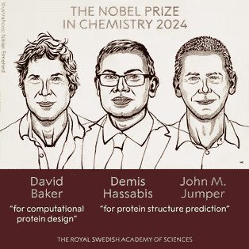

# 为什么 2024 年诺贝尔化学奖（人工智能化学奖）如此重要

> 原文：[`towardsdatascience.com/why-the-2024-nobel-prize-in-ai-for-chemistry-matters-so-much-a06126cb5ca3?source=collection_archive---------5-----------------------#2024-10-12`](https://towardsdatascience.com/why-the-2024-nobel-prize-in-ai-for-chemistry-matters-so-much-a06126cb5ca3?source=collection_archive---------5-----------------------#2024-10-12)

## 致 DeepMind 的 Demis Hassabis 和 John Jumper，以及蛋白质设计研究所的领导者 David Baker

 [LucianoSphere (Luciano Abriata, PhD)](https://lucianosphere.medium.com/?source=post_page---byline--a06126cb5ca3--------------------------------)

·发表于[Towards Data Science](https://towardsdatascience.com/?source=post_page---byline--a06126cb5ca3--------------------------------) ·阅读时间 5 分钟·2024 年 10 月 12 日

--

图表来自瑞典皇家科学院（公有领域）

**总结：因为这一诺贝尔奖背后的研究和开发不仅解锁了新的生物学，还解锁了新的计算机科学，这一切都直接推动了人类在各个领域的进步。**

2024 年诺贝尔化学奖授予使用人工智能进行蛋白质结构预测和设计的开创性进展，反映了我们（处于化学与生物学交界处的科学家）正在经历的变革性时刻。而且，这一奖项的颁发尤为值得注意，因为就在前一天，另一项诺贝尔奖颁给了那些开发了人工智能基础的人。

从本质上讲，利用人工智能可靠预测蛋白质结构的能力正在重塑基础和应用生物学研究。此外，DeepMind 和贝克教授的蛋白质设计研究所的工作为许多人建立了支柱，实际上是一个庞大的社区可以在此基础上继续发展。你在我上面的总结中已经窥见了一些，但让我们深入探讨一下，我会将你引导到其他博客文章中，在那里我会更深入地展开这些子话题。

## **解锁基础生物学研究**
