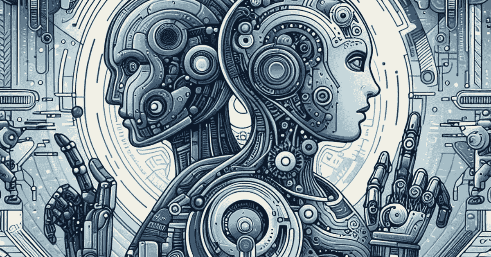

# 为什么图灵测试变得过时

> 原文：[`towardsdatascience.com/why-the-turing-test-became-obsolete-efe941cb7aec?source=collection_archive---------3-----------------------#2024-02-01`](https://towardsdatascience.com/why-the-turing-test-became-obsolete-efe941cb7aec?source=collection_archive---------3-----------------------#2024-02-01)

## 以及应该使用的替代方法

 [Rafe Brena, Ph.D.](https://rafebrena.medium.com/?source=post_page---byline--efe941cb7aec--------------------------------)

·发布于 [Towards Data Science](https://towardsdatascience.com/?source=post_page---byline--efe941cb7aec--------------------------------) ·9 分钟阅读·2024 年 2 月 1 日

--

作者提供的图像，使用了 Microsoft Designer

通常所谓的“图灵测试”是用来区分人类和假装成人类的机器的。区分“人工制造”和“机器制造”的界限似乎每天都更加相关，不是吗？

在这篇文章中，我将简要解释图灵测试如何获得了终极证明人类水平智能的地位，然后是这个地位如何丧失的。接着，我会提到一些值得使用的替代方法，用于测试人类甚至超人类的认知能力。

对机器认知能力的有效测量对于数据专业人员来说至关重要，因为我们被各种“智能”甚至“意识”的主张淹没，而这些大多数都是噪音和炒作。

# 什么是图灵测试？

图灵本人称他的测试为“模仿游戏”，但事情变得模糊，因为这也是一部关于图灵个人生活和奋斗的电影的名字——这些内容非常重要。

虽然我喜欢[这部电影](https://www.imdb.com/title/tt2084970/?ref_=ext_shr_lnk)，也喜欢本尼迪克特·康伯巴奇饰演主角的表现，但“模仿游戏”并不是“图灵机”，而“图灵机”也不是“恩尼格玛机”。电影把它们搞混了。

看，我在大学教授了超过十年的自动机理论课程，最终的主题……
