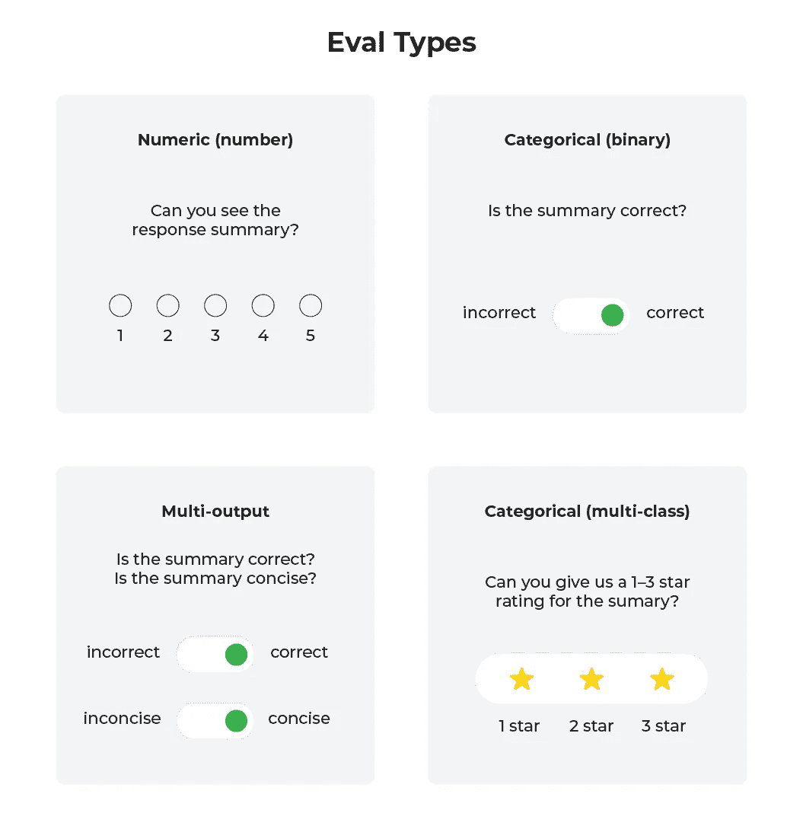
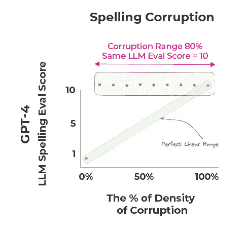
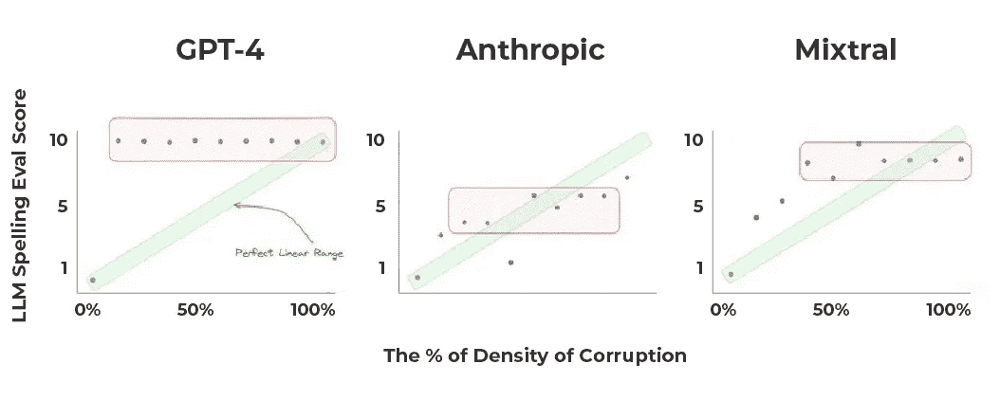
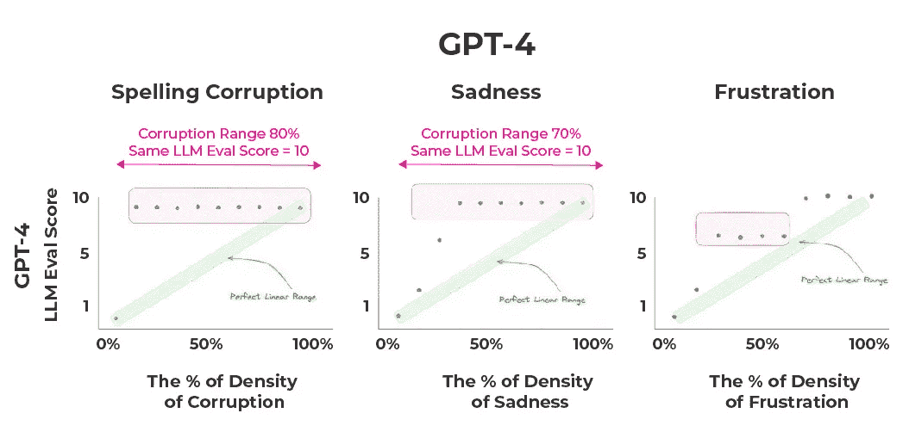
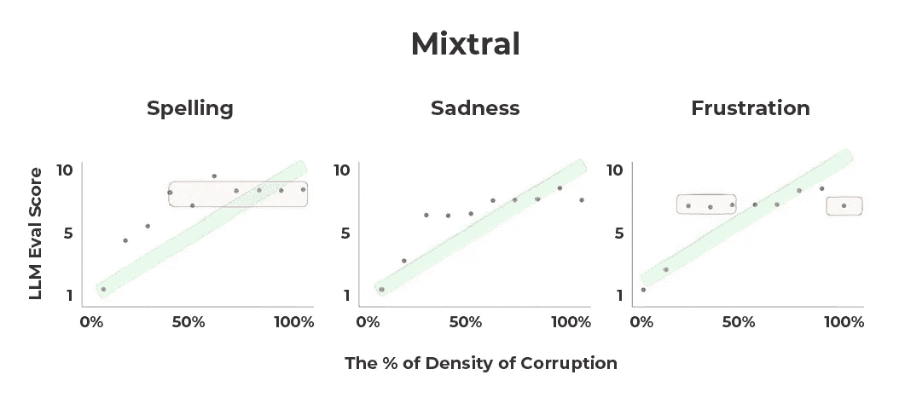
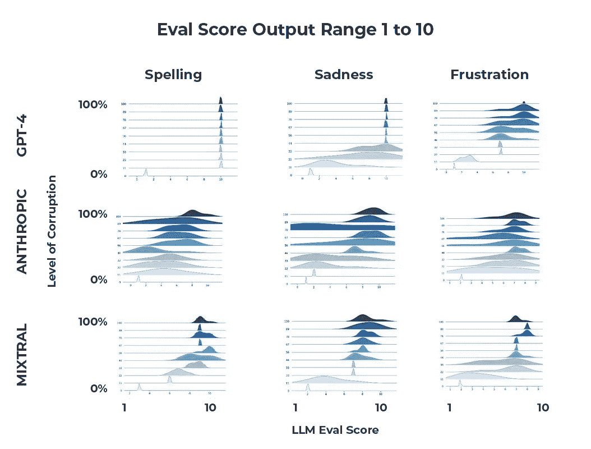

# 为什么你不应该将数值评估用作大语言模型的评判标准

> 原文：[`towardsdatascience.com/why-you-should-not-use-numeric-evals-for-llm-as-a-judge-bf22424f5379?source=collection_archive---------7-----------------------#2024-03-08`](https://towardsdatascience.com/why-you-should-not-use-numeric-evals-for-llm-as-a-judge-bf22424f5379?source=collection_archive---------7-----------------------#2024-03-08)


由作者使用 Dall-E 3 创建的图像

## 测试主要的大语言模型在进行数值评估时的表现

[](https://aparnadhinak.medium.com/?source=post_page---byline--bf22424f5379--------------------------------)[](https://towardsdatascience.com/?source=post_page---byline--bf22424f5379--------------------------------) [Aparna Dhinakaran](https://aparnadhinak.medium.com/?source=post_page---byline--bf22424f5379--------------------------------)

·发布于 [Towards Data Science](https://towardsdatascience.com/?source=post_page---byline--bf22424f5379--------------------------------) ·8 分钟阅读·2024 年 3 月 8 日

--

除了为日益增多的行业应用生成文本外，大语言模型（LLMs）现在广泛[被用作](https://medium.com/towards-data-science/llm-evals-setup-and-the-metrics-that-matter-2cc27e8e35f3)评估工具。模型可以量化检索系统中文档的相关性，评估评论和帖子的情感等——评估人类和 AI 生成的文本。这些评估通常是数值型或类别型的。



不同类型的大语言模型评估（由作者提供的图示）

数值评估涉及大语言模型根据一组评估标准返回一个数字。例如，模型可能会被要求在 1 到 10 的尺度上评估一个文档与用户查询的相关性。

类别评估则有所不同，它允许大语言模型从一组预定义的、通常是基于文本的选项中进行选择来进行评估。例如，一个提示可能会询问一个段落是“快乐的”，“悲伤的”还是“中立的”，而不是试图量化段落的快乐程度。

本文展示了对几种主要大语言模型（OpenAI 的 GPT-4、Anthropic 的 Claude 和 Mistral AI 的 Mixtral-8x7b）进行的测试结果，测试它们在进行数值评估时的表现。完成这些测试所使用的所有代码可以在[这个 GitHub 仓库](https://github.com/Arize-ai/LLMTest_NeedleInAHaystack)中找到。

# 主要结论

+   在大语言模型（LLMs）中的数值评分评估并不一致，即使是微小的提示模板差异也可能导致结果出现巨大的偏差。

+   即使保持所有独立变量（模型、提示模板、上下文）不变，也可能导致在多轮测试中结果有所不同。LLM 不是确定性的，有些模型在其数值判断上完全不一致。

+   有充分的理由怀疑，GPT-4、Claude 或 Mixtral 能够处理足够精确的连续范围，足以在现实世界的用例中用于数值评分评估。

# 研究

## 拼写错误实验

第一个实验旨在评估 LLM 根据文档中包含拼写错误单词的百分比，在 0 到 10 之间为文档评分的能力。

我们选取了一段拼写正确的文字，将文本编辑为在不同频率下包含拼写错误的单词，然后使用以下提示模板将这些错误文本输入给 LLM：

```py
SIMPLE_TEMPLATE_SPELLING = """
  You are a helpful AI bot that checks for grammatic, spelling and typing errors in a document context. 
  You are going to score the document based on the percent of grammatical and typing errors. The score should be between {templ_high} and {templ_low}. 
  A {templ_low} score will be no grammatical errors in any word, a score of {templ_20_perc} will be 20% of words have errors, a {templ_50_perc} score will be 50% errors, a score of {templ_70_perc} is 70%, and a {templ_high} will be all words in context have grammatical errors. 
  The following is the document context.

  #CONTEXT
  {context}
  #ENDCONTEXT

  #QUESTION
  Please return a score between {templ_high} and {templ_low}, with a case of {templ_high} being all words have a grammatical error and {templ_low} being no words have grammatical or spelling errors. 
  You will return no other text or language besides the score. Only return the score.
  Please
```

然后我们要求模型返回一个数字评估，表示文章中拼写错误单词的百分比（3 → 30% 拼写错误，8 → 80% 拼写错误，依此类推）。理想情况下，得分为 10 表示文档中的每个单词都拼写错误，而得分为 0 表示没有拼写错误。针对三种大型语言模型（LLM）——GPT-4、Claude 和 Mixtral——的实验结果并不理想。



GPT-4 拼写错误结果（图片来源：作者）

观察到的结果与预期的完美线性范围相差甚远；评分系统并未始终如一地反映文档中拼写错误的比例。实际上，GPT-4（如上所示）在每个拼写错误密度为 10% 或以上的文档中都返回了 10（表示 100% 错误率）。报告的得分是多次试验的中位数，试验是在每个指定的错误级别进行的。



GPT-4、Claude、Mixtral 拼写错误结果（图片来源：作者）

Claude 的结果稍微好一些，但仍然不完美，也没有达到可能接受用于部署的水平。Mixtral，作为这三种模型中最小的，表现最好。

那么，为什么这很重要呢？考虑到在各种环境中使用 LLM 数值评估器的兴趣，有充分的理由相信，以这种方式使用 LLM 可能会在性能和客户满意度上遇到障碍。

## 情感定性实验

第二个和第三个实验旨在评估 LLM 根据文本中包含表明悲伤或沮丧的单词的句子数量，在 0 到 10 之间为文档评分的能力。

在这些测试中，我们将带有悲伤/沮丧情感的短语和单词嵌入文本中。然后要求模型量化文本中情感的普遍性，1 表示没有句子表达该情感，10 表示 100% 的句子都传达了这种情感。

这些实验与拼写测试一起进行，目的是确定将模型的关注点从字数转向句子数是否会影响结果。拼写测试根据拼写错误的词语百分比进行评分，而悲伤/沮丧测试则是根据情感句子的百分比来评分的。

提示模板开头的指令在不同的测试中有所不同，而所有以上下文开始的内容保持不变，通过省略号表示：

```py
SIMPLE_TEMPLATE_FRUSTRATION = """
  You are a helpful AI bot that detects frustrated conversations. You are going to score the document based on the percent of sentences where the writer expresses frustration.
  The score should be between {templ_high} and {templ_low}.
  A {templ_low} will indicate almost no frustrated sentences, a score of {templ_20_perc} will be 20% of sentences express frustration, a {templ_50_perc} will be 50% of sentences express frustration, a score of {templ_70_perc} is 70%, and a {templ_high} score will be all the sentences express frustration. 

...
"""
```

```py
SIMPLE_TEMPLATE_SADNESS = """
  You are a helpful AI bot that detects sadness and sorrow in writing. You are going to score the document based on the percent of sentences where the writer expresses sadness or sorrow.
  The score should be between {templ_high} and {templ_low}.
  A {templ_low} will indicate almost no sentences that have sadness or sorrow, a score of {templ_20_perc} will be 20% of sentences express sadness or sorrow, a {templ_50_perc} will be 50% of sentences express sadness or sorrow, a score of {templ_70_perc} is 70%, and a {templ_high} score will be all the sentences express sadness or sorrow.

...
"""
```

再次强调，得分为 10 应表明文档中的每个句子都包含悲伤或沮丧的修饰词，而得分为 0 则意味着完全没有此类修饰词。得分介于两者之间的情况对应于不同程度的情感频率，得分越高，情感句子的比例越大。



GPT-4 拼写错误、悲伤、沮丧结果（图像由作者提供）

与拼写错误实验类似，结果显示与预期结果存在显著差异。GPT-4 对于悲伤率超过 30% 或沮丧率约为 70% 的每个文档都给出了 10 分的评分。值得注意的是，在所有与 GPT-4 进行的测试中，只有在完全没有修饰词或拼写错误时，中位答案才能满足完美的线性范围。



Mixtral 拼写错误、悲伤、沮丧结果（图像由作者提供）

[Mixtral AI](https://arize.com/blog/mistral-ai) 在情感修饰符实验中表现相对较好。虽然有充分的理由怀疑这些模型目前是否能足够好地处理连续范围，以便用于数字评分评估，但 Mixtral 是最接近实现这一目标的模型。

根据这些结果，我们不建议在生产代码中使用得分评估。

## 结果差异

值得注意的是，我们对每个模型进行了多次测试，并绘制了它们的响应分布图。



跨多个测试的评估结果比较，得分范围为 1 到 10（图像由作者提供）

理想的分布应在低端和高端周围较为集中（如果所有或没有词语/句子被计入，信心较高），而中间可能会有一个较长的过渡区间（例如，区分 4 和 5 时信心较低）。

有两点特别突出。首先，各个模型和任务的分布密度差异很大。Claude 的分布在我们的测试中变化较大；例如，在 80% 拼写错误的情况下，我们有模型始终给出 1 到 4 的评分。另一方面，GPT-4 的分布要紧凑得多——尽管大部分情况下其得分未能满足合理的预期。

其次，一些模型比其他模型更擅长处理连续范围中的过渡。Mixtral 的分布看起来接近于可能的可接受性能，但这三种模型似乎仍然有一段路要走，才能准备好投入生产。

# LLM 评估的影响

目前有大量关于[LLM 评估](https://arize.com/blog-course/llm-evaluation-the-definitive-guide/)的研究正在进行。例如，微软的 GPT 估算指标评估（[GEMBA](https://arxiv.org/pdf/2302.14520.pdf)）考察了不同大型语言模型评估不同翻译段落质量的能力。虽然一些研究论文将概率和数字分数作为评估输出的一部分——包括 GEMBA 在内的研究报告了有希望的结果——但我们看到客户在现实世界中应用分数评估的方式往往与当前的研究大不相同。

有鉴于此，我们试图将我们的研究调整为更具实践性、面向现实世界的应用——结果突出显示了直接使用分数做决策可能存在的问题。考虑到我们在评分评估研究中对 GPT-4 回答的分析，似乎该模型倾向于选择两个选项之一：1 或 10，要么全选，要么不选。

最终，类别评估（无论是二元还是多类）很可能具有很大潜力，未来在这一领域的进展值得关注。

# 结论

使用 LLM 进行数字评估非常挑剔且不可靠。模型之间的切换以及提示模板的微小变化可能会导致截然不同的结果，这使得很难将 LLM 作为数字评估标准的一致可靠的裁决者。此外，跨多次测试的大量结果分布表明，这些模型在回答时往往不一致，即使独立变量保持不变。构建 LLM 评估的读者应谨慎，避免以[这篇文章](https://arize.com/blog-course/numeric-evals-for-llm-as-a-judge/)中概述的方式使用数字评估。

*有问题吗？请随时通过* [*X*](https://twitter.com/aparnadhinak)*，* [*LinkedIn*](https://www.linkedin.com/in/aparnadhinakaran/)*，或* [*Slack*](https://join.slack.com/t/arize-ai/shared_invite/zt-26zg4u3lw-OjUNoLvKQ2Yv53EfvxW6Kg)*联系我们！*
