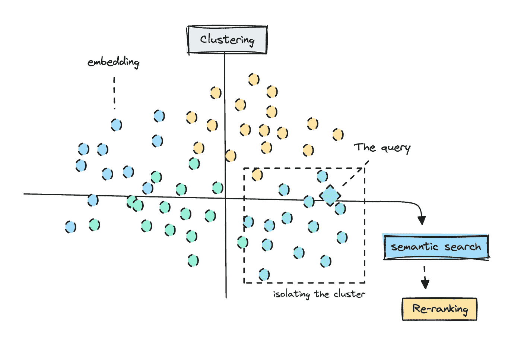
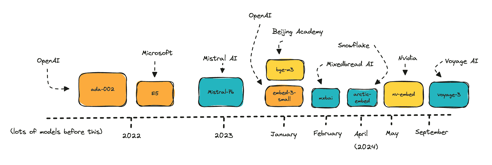

# 与嵌入的工作：闭源与开源的对比

> 原文：[`towardsdatascience.com/working-with-embeddings-closed-versus-open-source-39491f0b95c2?source=collection_archive---------2-----------------------#2024-09-26`](https://towardsdatascience.com/working-with-embeddings-closed-versus-open-source-39491f0b95c2?source=collection_archive---------2-----------------------#2024-09-26)

## 与检索的工作

## 使用技术来改进语义搜索

 [Ida Silfverskiöld](https://medium.com/@ilsilfverskiold?source=post_page---byline--39491f0b95c2--------------------------------)

·发布于 [Towards Data Science](https://towardsdatascience.com/?source=post_page---byline--39491f0b95c2--------------------------------) ·17 分钟阅读·2024 年 9 月 26 日

--

在执行语义搜索之前演示聚类 | 图片来自作者

*如果你不是会员但想阅读这篇文章，请查看此朋友链接* [*这里*](https://medium.com/@ilsilfverskiold/39491f0b95c2?sk=d94cfe5675e1c8810edb5ecfaa86ebc0)*。*

嵌入是自然语言处理的基石。你可以使用嵌入做很多事情，但其中一个更常见的用途是语义搜索，常用于检索应用中。

尽管整个技术社区都在热议如何理解知识图谱检索管道的工作原理，但使用标准的向量检索仍然没有过时。

你会看到多篇文章向你展示如何从语义搜索中过滤掉无关的结果，我们在这里也会关注这一点，并使用聚类和重新排序等技术。

本文的**主要焦点**是**比较开源和闭源嵌入模型**，并涵盖各种模型的规模。

将重点介绍的模型 — 还有更多可用的模型 | 图片来自作者

我们将比较多达 9 种在 MTEB [排行榜](https://huggingface.co/spaces/mteb/leaderboard)上排名靠前的不同嵌入模型。这将帮助你了解大模型与小模型在表现上的差异，以及随着你…
