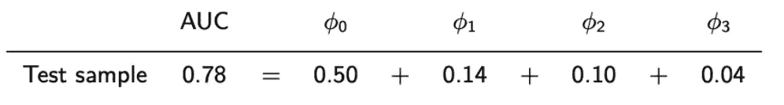
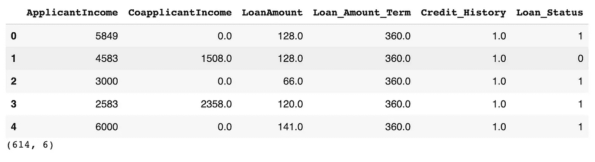
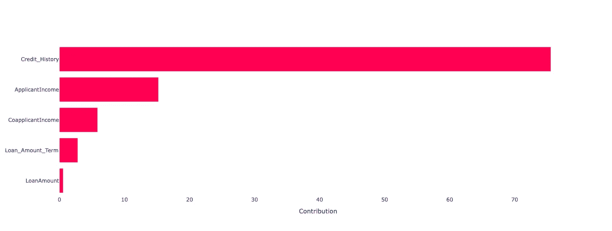
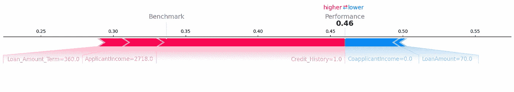
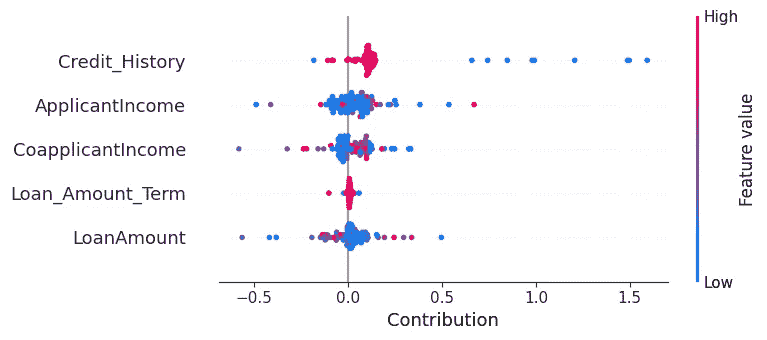

# XPER：揭示预测性能的驱动因素

> 原文：[`towardsdatascience.com/xper-unveiling-the-driving-forces-of-predictive-performance-309ce4f10b0a?source=collection_archive---------12-----------------------#2024-09-10`](https://towardsdatascience.com/xper-unveiling-the-driving-forces-of-predictive-performance-309ce4f10b0a?source=collection_archive---------12-----------------------#2024-09-10)

## 一种分解您喜爱性能指标的新方法

[](https://medium.com/@seb.saurin?source=post_page---byline--309ce4f10b0a--------------------------------)[](https://towardsdatascience.com/?source=post_page---byline--309ce4f10b0a--------------------------------) [Sébastien Saurin](https://medium.com/@seb.saurin?source=post_page---byline--309ce4f10b0a--------------------------------)

·发表于[Towards Data Science](https://towardsdatascience.com/?source=post_page---byline--309ce4f10b0a--------------------------------) ·9 分钟阅读·2024 年 9 月 10 日

--


图片由[Sira Anamwong](https://www.123rf.com/profile_siraanamwong)提供，来源于[123RF](https://www.123rf.com/)

与 S. Hué、C. Hurlin 和 C. Pérignon 共同撰写。

# I - 从解释模型预测到解释模型性能

敏感的人工智能系统的可信度和可接受性在很大程度上取决于用户理解相关模型的能力，或者至少能够理解其预测结果。为了揭开不透明人工智能应用的面纱，当前常用的可解释人工智能（XAI）方法，如事后可解释性工具（例如 SHAP、LIME），能够帮助我们理解其输出生成的洞察，这些洞察现在已经被广泛理解。

除了单一预测外，本文展示了如何使用可解释性能（XPER）方法识别任何分类或回归模型的性能指标（例如 AUC、R2）的驱动因素。能够识别预测模型统计或经济性能的驱动因素是建模的核心，对于数据科学家以及根据这些模型做决策的专家来说都具有重要意义。下文所述的 XPER 库已被证明是一个高效的工具，可以将性能指标分解为各个特征的贡献。

虽然 XPER 和 SHAP 都基于相同的数学原理，但它们在本质上是不同的，目标也各不相同。SHAP 重点识别显著影响模型单个预测的特征，而 XPER 则识别对模型性能贡献最大的特征。后者的分析可以在全局（模型）层面或局部（实例）层面进行。实际上，单个预测中影响最大的特征（例如特征 A）可能不是对性能影响最大的特征。实际上，当模型做出正确预测时，特征 A 会驱动单个决策，但当模型发生错误时也会如此。从概念上讲，如果特征 A 主要影响错误预测，那么在 XPER 中的排名可能低于在 SHAP 中的排名。

性能分解用于什么？首先，它可以通过提供更全面的模型内部工作原理洞察来增强任何后期可解释性分析。这使得我们能更深入地理解模型为何有效或无效。其次，XPER 可以帮助识别并解决异质性问题。通过分析单个 XPER 值，能够找出特征对性能有相似影响的子样本。然后，可以为每个子样本估算一个单独的模型，以提升预测性能。第三，XPER 有助于理解过拟合的来源。实际上，XPER 允许我们识别在训练样本中对模型性能贡献更大的特征，而这些特征在测试样本中贡献较小。

# **II - XPER 值**

XPER 框架是一种理论上有依据的方法，基于 Shapley 值（Shapley, 1953），Shapley 值是一种源自联盟博弈论的分解方法。虽然 Shapley 值将博弈中的收益分配给玩家，XPER 值则将模型中各特征的性能度量（例如 AUC，R2）进行分解。

假设我们使用三个特征训练一个分类模型，并通过 AUC 为 0.78 来衡量其预测性能。以下是 XPER 分解的一个例子：



第一个 XPER 值 𝜙₀ 被称为基准值，代表模型在三个特征未提供任何相关信息来预测目标变量时的表现。当使用 AUC 来评估模型的预测性能时，基准值对应于随机分类。由于模型的 AUC 大于 0.50，这意味着至少有一个特征包含了有用的信息来预测目标变量。模型的 AUC 与基准值之间的差异表示特征对模型性能的贡献，而这种贡献可以通过 XPER 值进行分解。在这个示例中，分解结果表明，第一个特征是模型预测性能的主要驱动因素，因为它解释了模型的 AUC 与随机分类之间差异的一半（𝜙₁），其次是第二个特征（𝜙₂）和第三个特征（𝜙₃）。这些结果衡量了每个特征对模型预测性能的全球性影响，并按重要性从最不重要的特征（第三个特征）到最重要的特征（第一个特征）进行排名。

虽然 XPER 框架可以用来进行模型预测性能的全局分析，但它也可以用于提供实例级别的局部分析。在局部层面，XPER 值表示给定实例和特征对模型预测性能的贡献。基准值则代表在目标变量与特征独立的情况下，给定观察值对预测性能的贡献，而个别贡献与基准值之间的差异由个体 XPER 值解释。因此，个体 XPER 值可以帮助我们理解为什么某些观察值比其他观察值对模型的预测性能贡献更大，并且可以通过识别特征对不同个体的影响相似的群体，来解决异质性问题。

还需要注意的是，XPER 是模型和度量无关的。这意味着 XPER 值可以用来解释任何计量经济学模型或机器学习模型的预测性能，并分解任何性能指标，如预测准确度（AUC、准确率）、统计损失函数（MSE、MAE）或经济性能衡量（盈亏函数）。

# III - Python 中的 XPER

**01 — 下载库 ⚙️**

XPER 方法通过 [XPER 库](https://github.com/hi-paris/XPER/tree/main)在 Python 中实现。要计算 XPER 值，首先需要按照以下步骤安装 XPER 库：

```py
pip install XPER
```

**02 — 导入库 📦**

```py
import XPER
import pandas as pd
```

**03 — 加载示例数据集 💽**

为了说明如何在 Python 中使用 XPER 值，让我们通过一个具体的例子来说明。考虑一个分类问题，其主要目标是预测信用违约。数据集可以直接从 XPER 库中导入，例如：

```py
import XPER
from XPER.datasets.load_data import loan_status
loan = loan_status().iloc[:, :6]

display(loan.head())
display(loan.shape)
```



由于包含的变量，这个数据集的主要目标似乎是构建一个预测模型来确定潜在借款人的“贷款状态”。换句话说，我们想要根据申请人提供的信息预测贷款申请是否会被批准（“1”）或不批准（“0”）。

```py
# Remove 'Loan_Status' column from 'loan' dataframe and assign it to 'X'
X = loan.drop(columns='Loan_Status')

# Create a new dataframe 'Y' containing only the 'Loan_Status' column from 'loan' dataframe
Y = pd.Series(loan['Loan_Status'])
```

**04 — 估计模型 ⚙️**

然后，我们需要训练一个预测模型并衡量其性能，以计算相关的 XPER 值。为了说明，我们将初始数据集拆分为训练集和测试集，并在训练集上拟合一个 XGBoost 分类器：

```py
from sklearn.model_selection import train_test_split

# Split the data into training and testing sets
# X: input features
# Y: target variable
# test_size: the proportion of the dataset to include in the testing set (in this case, 15%)
# random_state: the seed value used by the random number generator for reproducible results
X_train, X_test, y_train, y_test = train_test_split(X, Y, test_size=0.15, random_state=3)

import xgboost as xgb

# Create an XGBoost classifier object
gridXGBOOST = xgb.XGBClassifier(eval_metric="error")

# Train the XGBoost classifier on the training data
model = gridXGBOOST.fit(X_train, y_train)
```

**05 — 评估性能 🎯**

XPER 库提供了一种直观且简单的方法来计算预测模型的预测性能。考虑到我们关心的性能度量是 ROC 曲线下的面积（AUC），可以通过以下方式在测试集上进行测量：

```py
from XPER.compute.Performance import ModelPerformance

# Define the evaluation metric(s) to be used
XPER = ModelPerformance(X_train.values, 
                        y_train.values, 
                        X_test.values, 
                        y_test.values, 
                        model)

# Evaluate the model performance using the specified metric(s)
PM = XPER.evaluate(["AUC"])

# Print the performance metrics
print("Performance Metrics: ", round(PM, 3))
```

**06 — 计算 XPER 值 ⭐️**

最后，为了解释 AUC 的驱动因素，可以计算 XPER 值，如下所示：

```py
# Calculate XPER values for the model's performance
XPER_values = XPER.calculate_XPER_values(["AUC"],kernel=False)
```

“XPER_values”是一个元组，包括两个元素：XPER 值和各特征的单独 XPER 值。

对于特征变量超过 10 个的用例，建议使用默认选项 kernel=True，以提高计算效率 ➡️

**07 — 可视化 📊**

```py
from XPER.viz.Visualisation import visualizationClass as viz

labels = list(loan.drop(columns='Loan_Status').columns)
```

为了分析全局层面的驱动力，XPER 库提供了 XPER 值的**条形图**表示。

```py
viz.bar_plot(XPER_values=XPER_values, X_test=X_test, labels=labels, p=5,percentage=True)
```



为了简化展示，特征贡献以 AUC 和其基准（即 0.5）之间的差距百分比表示，并按从大到小的顺序排列。从这张图中，我们可以看到，模型相对于随机预测器的过度表现中，超过 78% 来自于*信用历史*，其次是*申请人收入*，贡献约为 16%，*共同申请人收入*和*贷款金额期限*的贡献分别不到 6%。另一方面，我们可以看到，变量*贷款金额*几乎对模型预测违约概率没有帮助，其贡献接近于 0。

XPER 库还提供了图形化表示，以在局部层面分析 XPER 值。首先，可以使用**力图**分析给定观测的性能驱动因素：

```py
viz.force_plot(XPER_values=XPER_values, instance=1, X_test=X_test, variable_name=labels, figsize=(16,4))
```



上述代码绘制了观测 #10 的正（负）XPER 值，其中正值用红色（负值用蓝色）表示，同时还显示了该观测对模型 AUC 的基准（0.33）和贡献（0.46）。借款人 #10 的过度表现归因于*贷款金额期限*、*申请人收入*和*信用历史*的正 XPER 值。另一方面，*共同申请人收入*和*贷款金额*产生了负面影响，减少了该借款人的贡献。

我们可以看到，虽然*申请人收入*和*贷款金额*在全球层面上对 AUC 有正向影响，但这些变量对借款人#10 有负面影响。因此，分析单个 XPER 值可以识别出特征对性能有不同影响的观测值组，可能揭示异质性问题。

其次，可以在单个图中表示每个观测值和特征的 XPER 值。为此，可以依赖于**蜂群图**，该图将每个特征的 XPER 值作为特征值的函数进行表示。

```py
viz.beeswarn_plot(XPER_values=XPER_values,X_test=X_test,labels=labels)
```



在此图中，每个点代表一个观测值。横轴表示每个观测值对模型性能的贡献，而纵轴表示特征值的大小。与之前展示的条形图类似，特征按其对模型性能的贡献从大到小排列。然而，通过蜂群图，还可以分析特征值对 XPER 值的影响。在这个例子中，我们可以看到较大的*信用历史*值与相对较小的贡献（绝对值）相关，而较低的值则导致较大的贡献（绝对值）。

*除非另有说明，否则所有图片均由作者提供。*

# IV - 致谢

本库的贡献者包括：

+   [Sullivan Hué](https://www.amse-aixmarseille.fr/fr/membres/hu%C3%A9)

+   [Christophe Hurlin](https://sites.google.com/view/christophe-hurlin/home)

+   [Christophe Pérignon](https://people.hec.edu/perignon/)

+   [Sébastien Saurin](https://papers.ssrn.com/sol3/cf_dev/AbsByAuth.cfm?per_id=4582330)

+   [Awais Sani](https://www.linkedin.com/in/awais-hussain-sani-87a35757/)

+   [Gaëtan Brison](https://www.linkedin.com/in/gaetan-brison/)

# V - 参考文献

[1] L. Shapley, [**n 人博弈的价值**](https://www.degruyter.com/document/doi/10.1515/9781400829156-012/pdf?licenseType=restricted) **(1953),** 博弈论贡献，2:307–317

[2] S. Lundberg, S. Lee, [**统一的模型预测解释方法**](https://dl.acm.org/doi/10.5555/3295222.3295230) **(2017)**, 神经信息处理系统进展

[3] S. Hué, C. Hurlin, C. Pérignon, S. Saurin, [**衡量预测性能的驱动因素：应用于信用评分**](https://papers.ssrn.com/sol3/papers.cfm?abstract_id=4280563) **(2023),** HEC 巴黎研究论文编号 FIN-2022–1463
