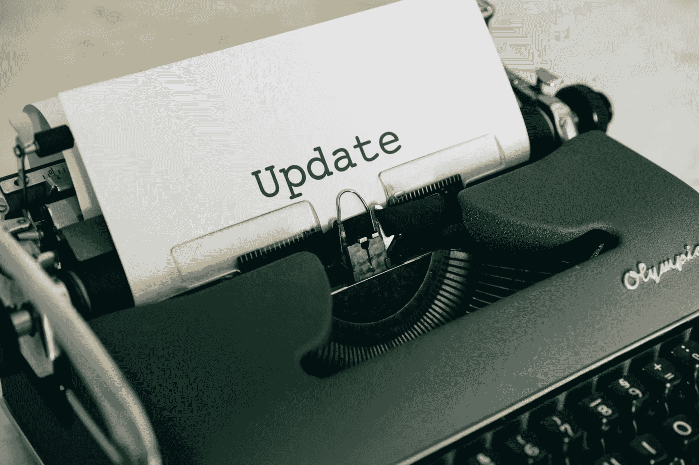

# 是的，你在“ChatGPT 时代”依然需要 NLP 技能

> 原文：[`towardsdatascience.com/yes-you-still-need-old-school-nlp-skills-in-the-age-of-chatgpt-a26a47dc23d7?source=collection_archive---------9-----------------------#2024-02-12`](https://towardsdatascience.com/yes-you-still-need-old-school-nlp-skills-in-the-age-of-chatgpt-a26a47dc23d7?source=collection_archive---------9-----------------------#2024-02-12)

## 大型语言模型有其优势，但对于许多生产问题，简单的 NLP 技术更快、更便宜，且同样有效。

 [Katherine Munro](https://katherineamunro.medium.com/?source=post_page---byline--a26a47dc23d7--------------------------------)

·发布于 [Towards Data Science](https://towardsdatascience.com/?source=post_page---byline--a26a47dc23d7--------------------------------) ·7 分钟阅读·2024 年 2 月 12 日

--

大型语言模型需要新的技能，但同样重要的是不要忘记那些老技能，比如如何准备 LLM 需要使用的文本数据。来源：[Markus Winkler](https://unsplash.com/@markuswinkler) 在 Unsplash。

当我开始攻读计算语言学硕士时，我认识的任何人都不知道什么是自然语言处理（NLP）。就连我自己也不清楚 [1]。四年后，当我说我从事 NLP 工作时，只有一半的时间能得到一些理解 [2]。得益于媒体的广泛宣传，大多数人知道有一种叫做大型语言模型的东西，它们可以用文本做很多惊人的有用的事情。现在，我向别人解释我的工作变得容易多了（前提是我告诉他们“它基本上就是 ChatGPT”）。但最近，这也让我陷入了沉思。

我是一本 [数据科学与人工智能教科书](https://www.amazon.com/Handbook-Data-Science-AI-Analytics/dp/1569908869)的编辑，这本书早在 2022 年就已出版（说真的，在人工智能领域，那大约有 20 年的历史了）。为了准备今年出版的第三版，我需要更新我的自然语言处理章节。当我坐下来阅读自己当时写的关于神经网络、序列到序列模型以及这个叫做“Transformers”的新技术时，我注意到一件值得注意的事：这一切都显得如此*老派*。那些关于统计机器学习方法的内容？真是过时了。而我写的小段代码……
