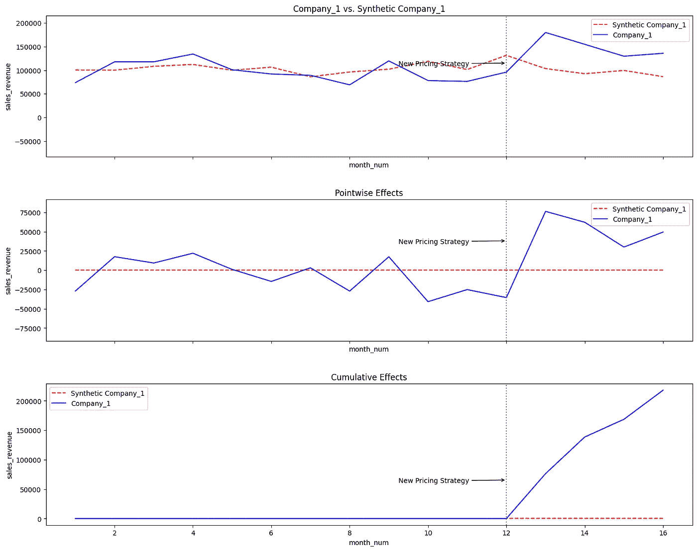

# 你没有进行 A/B 测试。你仍然可以追溯性地模拟一次。

> 原文：[`towardsdatascience.com/you-didnt-conduct-an-a-b-test-you-can-still-simulate-one-retrospectively-21a2dd60f88f?source=collection_archive---------12-----------------------#2024-07-29`](https://towardsdatascience.com/you-didnt-conduct-an-a-b-test-you-can-still-simulate-one-retrospectively-21a2dd60f88f?source=collection_archive---------12-----------------------#2024-07-29)

## 将合成（但高质量的）控制组建模为基准，以推断你在业务中所做的改变是否值得。

 [Tomas Jancovic (It's AI Thomas)](https://medium.com/@itsaithomas?source=post_page---byline--21a2dd60f88f--------------------------------)

·发表于[Towards Data Science](https://towardsdatascience.com/?source=post_page---byline--21a2dd60f88f--------------------------------) ·15 分钟阅读·2024 年 7 月 29 日

--

作者：[Tomas Jancovic (It's AI Thomas)](https://medium.com/u/fbf5eb668bee?source=post_page---user_mention--21a2dd60f88f--------------------------------)

2024 年 7 月 28 日（更新于 2024 年 8 月 3 日）

B2B 业务中新定价策略的合成控制组实验（来源：Python 自制）

我们每个人都经历过这种情况。

尽管我们知道 A/B 测试是检验变化是否有效的最佳方式，但我们还是跳过了它。

> 幸运的是，你仍然可以通过创建合成控制组作为已实施治疗的基准，来进行所谓的准实验。

[2015 年，哈佛和斯坦福的研究人员](https://web.stanford.edu/~jhain/Paper/AJPS2015a.pdf)成功使用合成控制方法来估算 1990 年德国统一对西德的经济影响。

然而，这让我在思考——是否可以在商业环境中使用类似的方法？——可以。

[谷歌公司研究人员已使用](https://static.googleusercontent.com/media/research.google.com/en//pubs/archive/41854.pdf)类似的技术，通过应用贝叶斯模型创建合成控制组，预测在没有他们…
