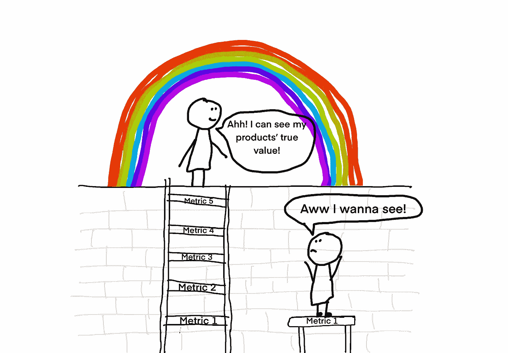
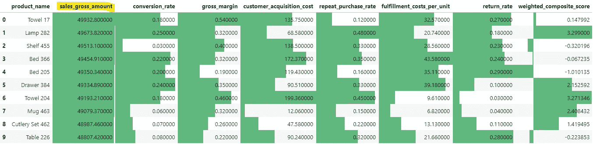
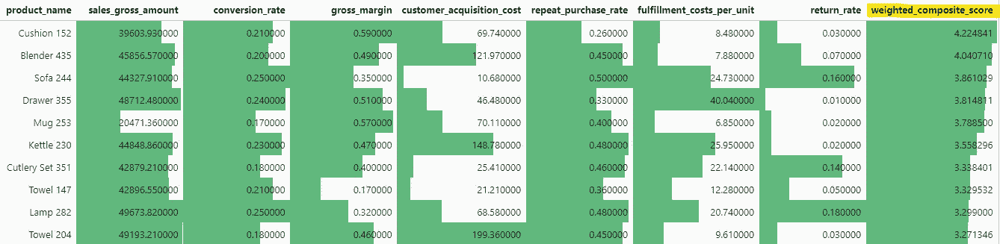
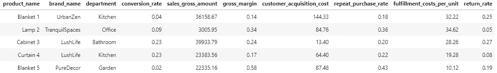
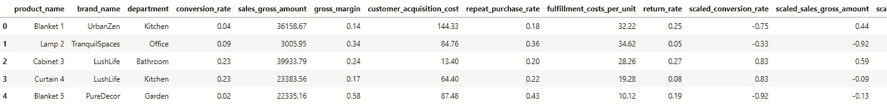
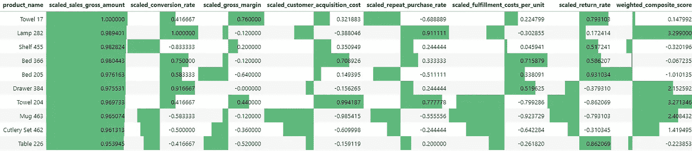
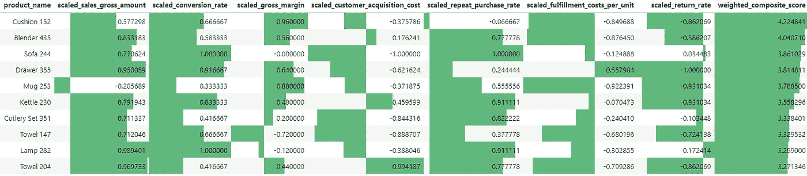
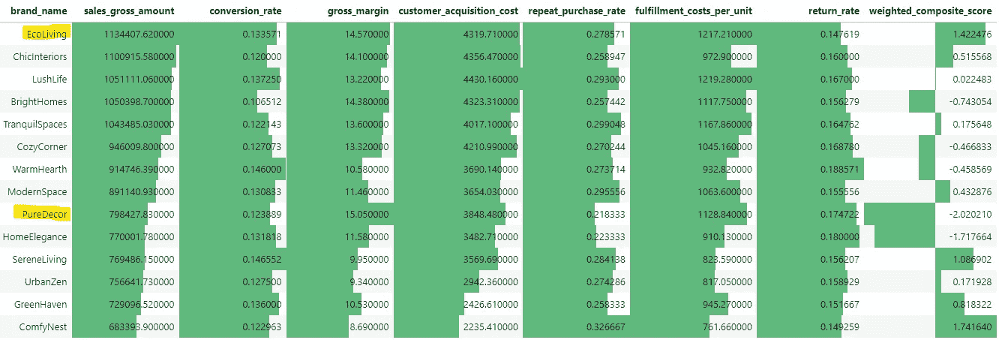

# 您的电子商务产品表现报告可能会误导您

> 原文：[`towardsdatascience.com/your-ecommerce-product-performance-reports-are-probably-misleading-you-d6146734639c?source=collection_archive---------9-----------------------#2024-10-14`](https://towardsdatascience.com/your-ecommerce-product-performance-reports-are-probably-misleading-you-d6146734639c?source=collection_archive---------9-----------------------#2024-10-14)

## 为什么单一指标无法全面反映问题，以及加权复合评分如何转变您的商业洞察

[](https://datagatorsolutions.medium.com/?source=post_page---byline--d6146734639c--------------------------------)[](https://towardsdatascience.com/?source=post_page---byline--d6146734639c--------------------------------) [Hattie Biddlecombe](https://datagatorsolutions.medium.com/?source=post_page---byline--d6146734639c--------------------------------)

·发布于 [Towards Data Science](https://towardsdatascience.com/?source=post_page---byline--d6146734639c--------------------------------) ·阅读时间 7 分钟·2024 年 10 月 14 日

--



# **单一指标评估的问题**

在电子商务的世界中，单独依赖某一指标来评估产品和品牌的表现可能会产生误导。单一指标在孤立的情况下，可能会制造出一种虚假的成功感，导致对看似盈利但实际上在消耗企业资源的产品过度投资，或者相反，低估了那些具有潜力但尚未被发掘的商品。

要保持领先，您需要一个*整体视角*——一种评估产品和品牌表现的方式，考虑多个关键指标，如“总收入”、“转化率”、“毛利率”、“客户获取成本”、“复购率”、“履行成本”和“退货率”。

以下是我许多客户使用的一些典型电子商务数据示例。为了保护客户的隐私并确保保密性，这里显示的数据是合成的，通过 AI 生成的。尽管这些数据包含了许多重要指标，但团队通常只关注与其目标最相关的指标，这可能会掩盖整体情况。例如，按 `sales_gross_amount` 排序时，“Towel 17”看起来是表现最好的产品：



表格 1：按总销售额排序的电子商务产品

**然而，** 当我们按一个考虑到**所有**指标的自定义评分进行排序时，我们发现“Cushion 152”成为表现最好的产品，而“Towel 17”显著下降，位列 500 个产品中的第 213 位：



表 2：按加权综合评分排序的电子商务产品

***附注：*** *在实践中，我可能不会同时使用这么多指标，因为这会使决策过程过于复杂。不过，我想给你一个完整的视角，展示你可以考虑的不同因素。此外，你可能已经注意到，我没有在表格中包含“加入购物车”作为指标。虽然它是客户兴趣的早期指标，但并不总能转化为最终销售或长期产品表现。然而，有些人可能仍然会发现追踪这个指标有价值。*

# **引入加权综合评分：** 一种更智能的绩效评估方法

为了避免单一指标评估的局限性，并获得更准确的跨多个指标的产品和品牌表现评估，我们使用一种方法叫做**加权综合评分**。

加权综合评分将多个指标合并成一个有洞察力的指标，提供每个产品在各个维度上的全面价值。可以把它想象成你在学校的最终成绩——每个科目可能采用不同的评分标准，但最终它们会合并成一个整体成绩。

这个综合评分也可以加权，以强调特定的指标，从而使你能够对齐特定的业务目标，比如优先考虑盈利性而非增长，或是降低退货率。

接下来，让我们探索如何使用 Python 实现加权综合评分：

# 1\. 导入 Python 库和数据框：

```py
import pandas as pd
from sklearn.preprocessing import StandardScaler, MinMaxScaler

product_df= pd.read_csv('product_data.csv') # This is a set of artificially generated data
product_df.head()
```



*表 3：电子商务产品数据 CSV*

# 2\. 数据标准化：Z-Score 标准化

有许多标准化技术可以应用，但对于这个数据集而言，**Z-Score 标准化**是最有效的标准化方法。以下是原因：

+   **平衡不同的尺度**：Z-Score 标准化将每个指标转换为均值为 0，标准差为 1 的值。这平衡了那些在尺度上差异较大的指标——无论是几千的收入，还是个位数的转化率。最终，这使得比较不同维度的产品变得更容易。

+   **更好地处理异常值**：与 Min-Max 标准化不同，Z-Score 标准化不会被极端值扭曲，它减少了异常值的影响，确保了所有指标的公平表现。

+   **识别高于/低于平均值的表现**：Z-Score 使我们能够看到一个值是高于还是低于均值，使用正值或负值（如表 4 所示）。正如我们将看到的，这个洞察力将对理解各个产品相对于均值的表现有所帮助。

## 使用 Min-Max 标准化进行优化

虽然单独使用最小-最大缩放（Min-Max scaling）对于缩放此数据集中的原始数据并不适用，但我们在 Z 分数归一化之后应用了它，将所有值转换为-1 到 1 之间的一个一致范围。通过这样做，可以**公平地比较**各个指标，因为所有值现在都在同一尺度上，确保每个指标在最终分析中均等地贡献。

以下代码演示了如何将缩放方法应用于我们的数据框：

```py
# Select numeric columns and create corresponding scaled column names
numeric_cols = product_df.select_dtypes(include=['float64', 'int64']).columns
scaled_cols = ['scaled_' + col for col in numeric_cols]

# Apply Z-Score Normalisation and then Min-Max scaling in one go
scaler = MinMaxScaler(feature_range=(-1, 1))
product_df[scaled_cols] = scaler.fit_transform(StandardScaler().fit_transform(product_df[numeric_cols]))

product_df.head()
```



*表 4：显示缩放后指标的产品数据框*

# 3\. 创建加权综合得分

接下来，我们希望为最终用户提供选项，允许他们对某些指标进行加权。这使得用户可以根据业务优先级或目标对某些指标赋予更高的权重。不同部门可能会根据自己的重点对不同的指标赋予不同的优先级。例如，市场营销团队可能更关注客户获取和转化率，其中**转化率**、**客户获取成本（CAC）**和**重复购买率**是成功的关键指标。

像**履约成本**、**CAC**和**退货率**这样的指标代表了产品表现的负面因素。通过应用负权重，我们确保这些指标的较高值会降低整体综合得分，从而反映出它们的不利影响：

```py
# Example user-provided weights (this can be dynamic based on user input)
user_weights = {
    'scaled_conversion_rate': 0.14,
    'scaled_sales_gross_amount': 0.14,
    'scaled_gross_margin': 0.14,
    'scaled_customer_acquisition_cost': -0.14, #notice negative weight here
    'scaled_fulfillment_costs_per_unit': -0.14, #notice negative weight here
    'scaled_return_rate': -0.14, #notice negative weight here
    'scaled_repeat_purchase_rate': 0.14
}

# Calculate weighted composite score
product_df['weighted_composite_score'] = sum(product_df[col] * weight for col, weight in user_weights.items()) / sum(user_weights.values())
```

## 使用回归分析加权指标

另外值得一提的是，一种更数据驱动的加权分数方法是使用回归分析。这种方法根据每个指标对关键结果的实际影响分配权重，如整体盈利能力或客户保持率。通过这种方式，最具影响力的指标在最终综合得分中自然占据更大比重。

# 4\. 结果

如下表所示（也在本博客的开头展示），当我们按`scaled_sales_gross_amount`排序时，产品‘Towel 17’排在第一位：



表 1：按总销售额排序的电子商务产品

然而，当我们按照新的`weighted_composite_score`排序时，‘Cushion 152’排在第一位，而 Towel 17 则跌至 500 个产品中的第 213 位：



表 2：按加权综合得分排序的电子商务产品

得益于正负 Z 分数，我们可以在表 1 中清晰地看到，尽管**Towel 17**在销售和盈利能力方面表现突出，但它在重复购买方面存在问题，并且退货率较高——这可能是质量或客户满意度问题的潜在指标。解决这些挑战可能会显著提高盈利能力和客户忠诚度。

在表格 2 中，我们可以看到，**Cushion 152**在盈利能力方面表现异常出色（高毛利和低成本），具有稳固的转化率和低退货率。虽然它的销售额不是最高的，但由于其效率和客户满意度，它在整体表现中脱颖而出。我建议该网站通过定向营销活动提高此产品的可见度，并在网站上更加突出地展示它，以推动更多的销售。

# 品牌评估

我还分析了数据集中的***品牌***，通过加权综合得分的方法再次得出了不同的结论。

乍一看，EcoLiving 似乎仅凭`销售总额`就是表现最好的品牌。然而，我们的加权综合得分方法平衡了所有关键指标，揭示了 PureDecor 是整体最有价值的品牌。这种方法使我们能够识别出提供最大整体价值的品牌，而不是仅关注单一指标或绩效维度：



*表格 5:* 按加权综合得分排序的电子商务产品

**总之，** 实施加权综合得分是一种简单但非常有效的方法，用于分析复杂的数据集，并且可以轻松集成到现有的报告工具中。

对我的客户来说，这种方法产生了显著影响——它避免了对那些被错误认为表现不佳的产品和品牌做出不必要的削减。它还帮助将资源从那些消耗预算却未能提供相应价值的产品和品牌中重新分配出去。

加权综合评分可以应用于任何需要平衡多个重要指标的领域。例如，它可以帮助优化网站内容、增强 SEO 策略和改善客户细分，从而成为推动您业务多个领域转型的有力工具。

*如果您需要帮助实施加权评分系统，或只是想聊聊您的数据问题，欢迎通过电子邮件、我的网站或 LinkedIn 与我联系。*

*除非另有说明，所有图片均为作者提供*
