# 基于 CLIP 风格编码器的零-shot 定位

> 原文：[`towardsdatascience.com/zero-shot-localization-with-clip-style-encoders-2ac3cea172a8?source=collection_archive---------4-----------------------#2024-09-24`](https://towardsdatascience.com/zero-shot-localization-with-clip-style-encoders-2ac3cea172a8?source=collection_archive---------4-----------------------#2024-09-24)

## 我们如何看到视觉编码器所看到的内容？

 [Ruth Crasto](https://medium.com/@crastoru?source=post_page---byline--2ac3cea172a8--------------------------------)

·发布于[Towards Data Science](https://towardsdatascience.com/?source=post_page---byline--2ac3cea172a8--------------------------------) ·10 分钟阅读·2024 年 9 月 24 日

--

图片由[Stephan Widua](https://unsplash.com/@stewi?utm_source=medium&utm_medium=referral)拍摄，来源于[Unsplash](https://unsplash.com/?utm_source=medium&utm_medium=referral)

想象一下你最喜欢的预训练视觉编码器。我假设你选择的是某种 CNN（卷积神经网络）或 ViT（视觉 Transformer）的变体。编码器是一个将图像映射到*d*维向量空间的函数。在这个过程中，图像被转换为一系列特征图：

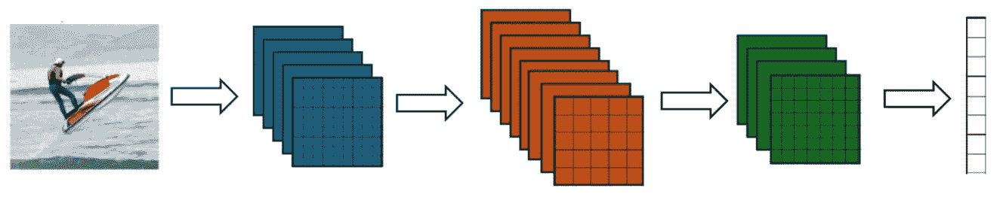

作者提供的图片。

特征图（*w* × *h* × *k*）可以被看作是一个由*k*维度的 patch 嵌入组成的 2D 数组，或者等价地说，它是一个具有*k*个通道*f*₁, … *f*ₖ*的粗略图像（*w* × *h*）。无论是 CNN 还是 ViT，它们都以各自的方式将输入图像转换为一系列特征图。

我们如何看到一个图像在经过视觉编码器的各层时，编码器所看到的内容？零-shot 定位方法旨在从编码器的特征图中生成可供人类解读的可视化效果。这些可视化效果，看起来像热图或粗略的分割掩码，能够区分输入图像中语义相关的区域。术语“零-shot”指的是模型没有明确地在感兴趣的语义类别的掩码注释上进行训练。例如，像 CLIP 这样的视觉编码器，仅仅在图像级的文本描述上进行了训练。

在本文中，我们首先概述了一些早期的技术，用于从监督学习的 CNN 分类器生成可解释的热图，无需额外训练。然后，我们探讨了使用 CLIP 风格编码器实现零-shot 定位的挑战。最后，我们简要介绍了 GEM（Grounding Everything Module）[[1](https://arxiv.org/pdf/2312.00878)]背后的关键思想，GEM 是一种最近提出的用于 CLIP ViT 的无训练、开放词汇定位的方法。

# 1. 使用监督 CNN 分类器进行定位

## 类激活图（2016）

让我们通过考虑一个简单的图像分类监督训练的视觉编码器，来构建关于定位概念的直觉。假设 CNN 使用：

1.  全局平均池化（GAP）将最终特征图通道 *f*₁(*x, y*), …, *f*ₖ(*x, y*) 转换为一个 *k* 维向量。换句话说，每个 *fᵢ* 在宽度和高度维度上进行平均。

1.  一个单一的线性层 **W** 将这个 *k* 维向量映射到一个类别 logit 的向量。

给定类别 *c* 的 logit 可以写为：

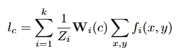

其中 **W***ᵢ*(*c*) 表示特征通道 *i* 在 logit *c* 上的（标量）权重，*Zᵢ* 是用于平均池化的归一化常数。

类激活图背后的关键观察是[[2](https://arxiv.org/pdf/1512.04150)]，上述求和可以重新写为：

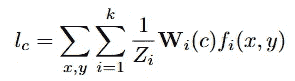

换句话说，logit 可以表示为最终特征通道的加权平均，然后在宽度和高度维度上进行平均。

结果表明，仅仅对 *fᵢ* 的加权平均就能为类别 *c* 提供一个可解释的热图，其中较大的值对应于图像中与该类别语义相关的区域。这个粗略的热图可以上采样以匹配输入图像的维度，它被称为类激活图（CAM）：

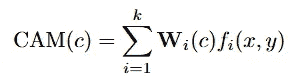

直观地，每个 *f*ᵢ 本身已经是图像中某个潜在概念（或“特征”）的热图——尽管这些特征不一定以任何明显的方式区分人类可解释的类别。权重 **W***ᵢ*(*c*) 捕获了 *f*ᵢ 在预测类别 *c* 时的重要性。因此，加权平均值突出了与类别 *c* 最相关的图像特征。通过这种方式，我们可以在没有额外训练的情况下实现类别 *c* 的区分性定位。

## Grad-CAM（2017）

类激活图的挑战在于，它们只有在假设 CNN 编码器架构满足某些条件下才有意义。2019 年提出的 Grad-CAM [[3](https://arxiv.org/pdf/1610.02391)] 是类激活图的一种优雅推广，可以应用于任何 CNN 架构，只要最终特征图通道 *f*₁, …, *f*ₖ 到 logit 向量的映射是可微分的。

与 CAM 方法类似，Grad-CAM 计算特征通道 *fᵢ* 的加权和，以生成类别 *c* 的可解释热图，但每个 *fᵢ* 的权重是通过以下方式计算的：

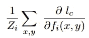

Grad-CAM 将每个 *f*ᵢ 的重要性与预测类别 *c* 的 logit 进行成比例加权的思想进行了推广，这个重要性由 logit 相对于元素 *fᵢ* (*x*, *y*) 的平均池化梯度来衡量。实际上，可以证明，对于一个符合前一节假设 1–2 的卷积神经网络（CNN），计算 Grad-CAM 权重将得到与我们之前看到的 CAM(*c*) 表达式相同，直到一个归一化常数（证明见 [[3](https://arxiv.org/pdf/1610.02391)]）。

Grad-CAM 进一步通过在加权特征通道 *fᵢ* 的平均值上应用 ReLU 来进一步改进。其理念是，仅可视化那些若其强度 *增加*，会增强对类别 *c* 预测信心的特征。再次地，输出结果可以上采样，以生成与原始输入图像尺寸匹配的热图。

# 2\. 使用 CLIP 进行定位

这些早期的方法能推广到 CLIP 风格的编码器吗？考虑 CLIP 时需要考虑两个额外的复杂因素：

1.  CLIP 采用对比学习在一个大规模的开放词汇集上进行训练，因此没有固定的类别集。

1.  CLIP 图像编码器可以是 ViT 或 CNN。

也就是说，如果我们能够通过 CLIP 实现零-shot 定位，那么我们就能解锁执行零-shot、*开放词汇* 定位的能力：换句话说，我们可以为任意语义类别生成热图。这也是为 CLIP 风格编码器开发定位方法的动机。

让我们首先尝试一些看似合理的方法来解决这个问题，基于我们使用监督式 CNN 进行定位的知识。

对于给定的输入图像，类别 *c* 的 logit 可以通过计算类别名称的 CLIP 文本嵌入与 CLIP 图像嵌入之间的余弦相似度来获得。该 logit 相对于图像编码器最终特征图的梯度是可处理的。因此，一种可能的方法是直接应用 Grad-CAM —— 不论图像编码器是 ViT 还是 CNN，这种方法都可以有效。

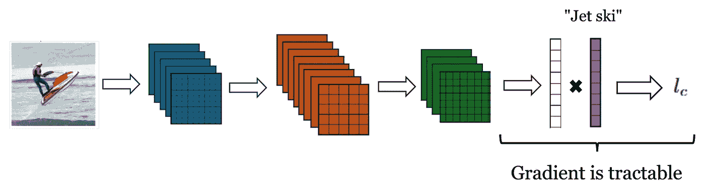

图片来自作者。

另一种看似合理的方法可能是考虑图像补丁嵌入与类别文本嵌入之间的对齐。回想一下，CLIP 是通过最大化 *图像级* 嵌入（特别是 CLS token 嵌入）与相应文本嵌入之间的对齐进行训练的。那么，是否有可能该目标在嵌入空间中隐式地将 *图像补丁* 与与其相关的文本对齐得更紧密呢？如果是这种情况，我们可以通过简单地可视化类别文本嵌入与每个图像补丁嵌入之间的相似度，来生成一个判别性热图。

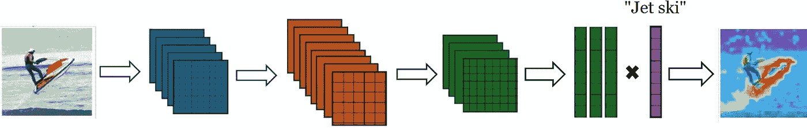

图片由作者提供。

## 对立的可视化

有趣的是，这两种方法不仅都失败了，而且生成的热力图与我们的预期完全*相反*。这一现象首次在论文“Exploring Visual Explanations for Contrastive Language-Image Pre-training”[[4](https://arxiv.org/pdf/2209.07046)]中描述，并且在不同的 CLIP 架构和不同的类别中被一致观察到。要查看这些“对立可视化”的示例，包括图像块-文本相似度图和 Grad-CAM，可参考预印本《A Closer Look at the Explainability of Contrastive Language-Image Pre-training》[[5](https://arxiv.org/pdf/2304.05653)]的第 19 页。截至目前，尚未有完整的解释这一现象的单一理论，尽管已经提出了一些部分假设。

## 自注意力图

其中一个假设在前述论文[[5](https://arxiv.org/pdf/2304.05653)]中有详细描述。该研究将范围限定在 ViT 架构，并检查 CLIP ViT 最后一个自注意力模块中的注意力图。对于给定的输入图像和文本类别，这些注意力图（*w* × *h*）的计算方式如下：

1.  具有最高余弦相似度的图像块嵌入（一个*d*维向量——与图像级嵌入的输出维度相同）被选为锚点图像块。

1.  注意力图通过计算锚点图像块查询嵌入*Q*和所有键嵌入*K*的查询-键注意力权重来获得，这些权重可以被重塑为一个* w * × * h *大小的热力图。注意力权重计算公式如下：

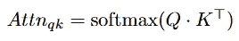

你可能会期望锚点图像块主要关注与感兴趣类别语义相关的图像块。然而，这些查询-键注意力图表明，锚点图像块与其他无关图像块的关注程度相同。因此，查询-键注意力图呈现斑驳状，难以解释（有关示例，请参见论文[[5](https://arxiv.org/pdf/2304.05653)]）。作者提出，这或许能够解释在 CLIP ViT 中观察到的噪声图像块-文本相似度图。

另一方面，作者发现值-值注意力图更有前景。通过实验证明，值-值注意力权重仅在与锚点语义相关的图像块附近较大。值-值注意力图并不是完整的判别性热力图，但它们是一个更有前景的起点。

# 3\. 基础一切模块（2024）

希望你现在能明白为什么对于 CLIP，训练无关的定位不像在有监督的 CNN 中那样直观——而且目前还不完全理解为什么。也就是说，2024 年提出的 CLIP ViT 的新定位方法，称为万物定位模块（GEM）[[1](https://arxiv.org/pdf/2312.00878)]，取得了显著的成功。GEM 本质上是一种无训练的方法，用于修正我们在前一节中看到的噪声查询-键注意力图。通过这种方式，GEM 修改后的 CLIP 编码器可以用于零-shot、开放词汇的定位。让我们来看看它是如何工作的。

## 自我自我注意力

GEM 背后的主要思想称为自我自我注意力，它是值-值注意力概念的推广。

给定查询 *Q*、键 *K* 和值 *V*，自我自我注意力模块的输出是通过对 *t =* 0, …, *n* 进行查询-查询、键-键和值-值的注意力迭代计算得到的：

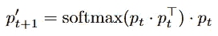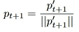

其中 *p*₀ ∈{*Q, K, V*} 和 *n*，迭代次数，是一个超参数。这个迭代过程可以被认为是基于点积相似性对初始 tokens *p*₀进行聚类。在这个过程的末尾，生成的 tokens *p*ₙ 是初始 tokens *p*₀的“中心”集。

生成的自我自我注意力权重然后被集合起来，以产生自我自我注意力模块的输出：

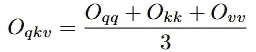

其中：

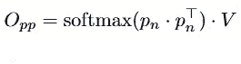

这与传统的查询-键注意力模块不同，后者的输出仅通过以下方式计算：

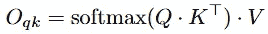

## 万物定位模块

现在考虑我们在前一节中生成值-值注意力图的方法，首先我们根据与类文本嵌入的相似性选择了一个锚点补丁，然后计算了值-值注意力图。GEM 可以看作是这个过程的逆过程，其中：

1.  第一步是对 ViT 中最后 *m* 个注意力块应用 *qkv-* 集成的自我自我注意力，而不是常规的注意力（*m* 是另一个超参数）。直观地说，这是一种计算值嵌入 *V* 的集成聚类分配的方法，从而修正原始的查询-键注意力图。

1.  第二步是通过计算从修改后的 ViT 输出的补丁嵌入与类文本嵌入之间的余弦相似性来生成热图。这实际上为每个集群提供了一个类别 logit。

这组 logits 可以被重新形状化，以生成所选类别的判别热图，该热图可以采用任何任意文本的形式！以下是针对不同类别提示的 GEM 热图示例（红色表示与类别提示的相似性较高）：

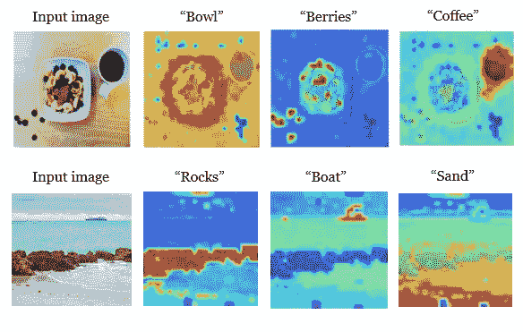

作者生成的不同文本类别的 GEM 热图 | (**顶部**) 图片由[Nirzar Pangarkar](https://unsplash.com/@nirzar)提供，来源于[Unsplash](https://unsplash.com/?utm_source=medium&utm_medium=referral) | (**底部**) 图片由[Arnav Das](https://unsplash.com/@arnavdas)提供，来源于[Unsplash](https://unsplash.com/?utm_source=medium&utm_medium=referral)

区分性定位可以将图像级编码器转变为一种可以用于语义分割的模型，无需昂贵的标注掩膜。此外，无需训练的定位是一种强大的方法，使得视觉编码器更具可解释性，允许我们看到它们所看到的内容。

对于监督式视觉模型，零-shot 定位最早是通过类激活图（class activation maps）这一针对特定类型 CNN 架构的技术开始的。随后，提出了这一方法的推广，使其适用于任何监督式 CNN 架构。然而，对于 CLIP 风格的编码器，训练-free 定位则不那么直接：相反的可视化现象仍然未被充分解释，并且在不同的 CLIP 编码器架构中普遍存在。到今天为止，像 GEM 这样的 CLIP ViT 定位技术已取得成功。是否有一种更广泛的技术等待被发现？

# 参考文献

1.  W. Bousselham, F. Petersen, V. Ferrari, H. Kuehne, [全面定位：视觉-语言变换器中的新兴定位特性](https://arxiv.org/pdf/2312.00878) (2024)，2024 年 IEEE 计算机视觉与模式识别大会（CVPR）

1.  B. Zhou, A. Khosla, A. Lapedriza, A. Oliva, A. Torralba, [学习深度特征用于区分性定位](https://arxiv.org/pdf/1512.04150) (2016)，2016 年 IEEE 计算机视觉与模式识别大会（CVPR）

1.  R. R. Selvaraju, M. Cogswell, A. Das, R. Vedantam, D. Parikh, D. Batra, [Grad-CAM：通过基于梯度的定位从深度网络获得视觉解释](https://arxiv.org/pdf/1610.02391) (2017)，2017 年 IEEE 国际计算机视觉大会（ICCV）

1.  Y. Li, H. Wang, Y. Duan, H. Xu, X. Li, [探索对比语言-图像预训练的视觉解释](https://arxiv.org/pdf/2209.07046) (2022)

1.  Y. Li, H. Wang, Y. Duan, J. Zhang, X. Li, [更深入地探讨对比语言-图像预训练的可解释性](https://arxiv.org/pdf/2304.05653) (2024)
